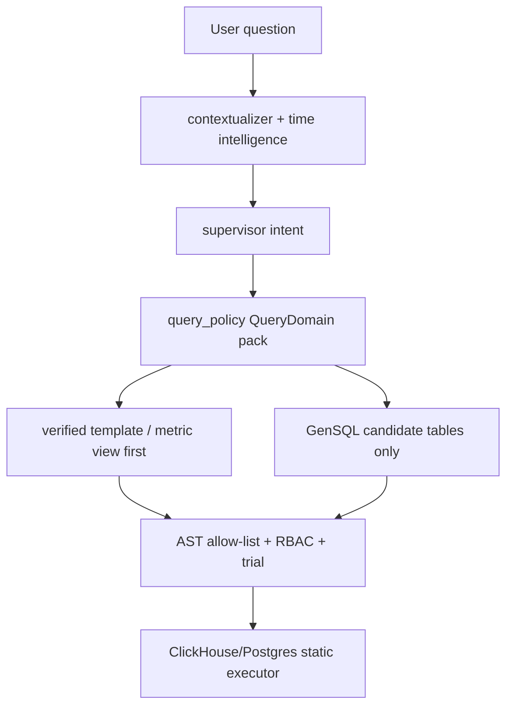

# Kiến Trúc Dữ Liệu — ai-query-service (Option B: CDC + ClickHouse)

> Tài liệu này mô tả đường đi dữ liệu từ lúc user tạo order/payment/payroll cho đến khi ai-query-service trả lời câu hỏi.
> Review kiến trúc AI Query theo market pattern 2026 nằm ở `docs/market_architecture_2026.md`.

---

## 1. Câu Hỏi Quan Trọng: Có Phải "Ghi Đồng Thời"?

**KHÔNG.** Spring services CHỈ ghi PostgreSQL. ClickHouse được sync **bất đồng bộ** qua CDC pipeline.

```
KHÔNG PHẢI:
  Spring service ──┬──► Postgres (sync)
                   └──► ClickHouse (sync)        ← KHÔNG có dual-write

THỰC TẾ:
  Spring service ──► Postgres ─[WAL]─► Debezium ─► Kafka ─► CH Sink ─► ClickHouse
                     (sync)            (async, eventual consistency 2-10s)
```

### Lý do không dual-write

1. **Spring services không biết ClickHouse tồn tại** — không cần coupling
2. **Transaction integrity** — chỉ Postgres giữ ACID. Dual-write 2 DB → distributed transaction phức tạp
3. **Failure isolation** — ClickHouse down không block POS bán hàng
4. **CDC = single source of truth** — Postgres luôn correct, ClickHouse mirror

### Trade-off: Eventual consistency

- ai-query-service trả số liệu **lag 2-10s** so với Postgres
- F&B analytics chấp nhận được (không phải payment processing)
- "Doanh thu hôm nay" với 10s lag vẫn dùng được

---

## 2. Tổng Quan Pipeline

```
┌──────────────────────────────────────────────────────────────────────────┐
│                         WRITE PATH (Synchronous)                         │
│                                                                          │
│  POS App / Web UI                                                        │
│        │ HTTPS                                                           │
│        ▼                                                                 │
│  Gateway (port 8080)                                                     │
│        │ JWT validated, X-Internal-* headers injected                   │
│        ▼                                                                 │
│  Spring Service (sales / inventory / payroll / ...)                     │
│        │                                                                 │
│        ├─► Validate business rules                                      │
│        ├─► BEGIN TRANSACTION                                             │
│        ├─► INSERT/UPDATE core.* tables                                  │
│        ├─► INSERT outbox event (for domain events)                      │
│        └─► COMMIT                                                        │
│              │                                                           │
│              ▼ (response 200 OK to user)                                │
└──────────────┼───────────────────────────────────────────────────────────┘
               │
               │ WAL flushed to disk
               │
┌──────────────┼───────────────────────────────────────────────────────────┐
│              ▼          READ PATH (Async CDC)                            │
│                                                                          │
│  PostgreSQL Primary (5432) ─── streaming replication ──► Replica (5433) │
│        │                                                                 │
│        │ pgoutput logical replication slot                              │
│        ▼                                                                 │
│  Debezium PostgreSQL Source Connector (Kafka Connect)                   │
│        │ Reads WAL → emits row-change events                            │
│        ▼                                                                 │
│  Kafka Topics:                                                           │
│    fern.cdc.core.sale_record           (key = outlet_id)                │
│    fern.cdc.core.sale_item                                              │
│    fern.cdc.core.payment                                                │
│    fern.cdc.core.inventory_transaction                                  │
│    fern.cdc.core.payroll                                                │
│    fern.cdc.core.outlet, fern.cdc.core.product (dimensions)             │
│        │                                                                 │
│        ▼                                                                 │
│  ClickHouse Sink Connector                                               │
│    - SMT: compute business_date (logic ca đêm 02:00)                   │
│    - SMT: denormalize product_name, category_name                       │
│    - Type cast: BIGINT → Int64                                           │
│    - Batch 1000 rows / 5s                                                │
│        │                                                                 │
│        ▼                                                                 │
│  ClickHouse fern.* (raw layer)                                           │
│    fact_sale, fact_inventory_movement, dim_outlet, dim_product, ...      │
│        │                                                                 │
│        │ Materialized View triggers tự động                              │
│        ▼                                                                 │
│  ClickHouse analytics.* (aggregated + AI metric layer)                  │
│    fct_sales_daily, fct_sales_by_category, fct_daily_pnl, ...           │
│    ai_sales_daily, ai_product_daily, ai_pnl_daily, ai_payment_daily      │
│        │                                                                 │
│        ▼                                                                 │
│  ai-query-service (port 8093)                                            │
│    User question → LangGraph → SQL → answer                             │
└──────────────────────────────────────────────────────────────────────────┘
```

### 2.1. AI Query Semantic Layer Cho DB Nhiều Bảng

FERN có nhiều bảng operational trong PostgreSQL (`core.*`) và nhiều lớp raw/event trong ClickHouse. `ai-query-service` **không** cho LLM tự chọn trực tiếp trên toàn bộ schema đó.

Kiến trúc hiện tại dùng 3 lớp giảm độ phức tạp:



Nguyên tắc:

- PostgreSQL `core.*` nhiều bảng không được đưa vào prompt tổng quát. HR đi qua static Postgres lane đã bind params và RBAC riêng.
- ClickHouse là serving layer chính cho analytics. LLM thấy **domain pack nhỏ** theo intent, ví dụ sales/product/payment/inventory/finance/lookup, thay vì toàn bộ allow-list.
- Mỗi domain ưu tiên metric view phẳng (`analytics.ai_sales_daily`, `analytics.ai_product_daily`, `analytics.ai_payment_daily`, `analytics.ai_pnl_daily`) trước fallback fact/raw.
- GenSQL nếu bật chỉ nhận `codegen_candidate_tables` theo domain; nếu SQL dùng bảng ngoài candidate pack thì structure guard reject, dù bảng đó vẫn nằm trong allow-list chung.
- Hard guard vẫn dùng `ALLOWED_FULL_TABLES` đầy đủ để kiểm soát an toàn, không tin LLM.

Điều này phù hợp với database nhiều bảng: model không phải join 10-15 bảng raw, mà chọn từ data mart đã curate; backend mới chịu trách nhiệm scope, quyền và thực thi.

---

## 3. Flow Cụ Thể Theo Loại Transaction

### 3.1. Tạo Order (Sale)

**T=0ms — User nhấn "Thanh toán" tại POS:**
```
POST /api/v1/sales/orders
{
  "outlet_id": 5,
  "items": [{"product_id": 101, "qty": 2, "unit_price": 35000}, ...],
  "payment": {"method": "CARD", "amount": 70000}
}
```

**T=2-50ms — sales-service xử lý:**
```sql
BEGIN;
INSERT INTO core.sale_record (id, outlet_id, total_amount, status, ...)
  VALUES (snowflake_id(), 5, 70000, 'completed', now());

INSERT INTO core.sale_item (sale_id, product_id, qty, unit_price, line_total)
  VALUES (sale_id, 101, 2, 35000, 70000);

INSERT INTO core.payment (sale_id, method, amount, captured_at)
  VALUES (sale_id, 'CARD', 70000, now());

INSERT INTO core.outbox (event_type, payload)
  VALUES ('SALE_COMPLETED', '{...}');  -- domain event
COMMIT;
```
→ **Response 200 OK trả về POS** (user thấy ngay)

**T=5-20ms — Postgres WAL flushed, replica catch up.**

**T=50-500ms — Debezium đọc WAL:**
- Phát hiện 3 row INSERT (sale_record, sale_item, payment)
- Emit 3 messages tới 3 Kafka topics:
  - `fern.cdc.core.sale_record` partition=hash(outlet_id=5)%12
  - `fern.cdc.core.sale_item`
  - `fern.cdc.core.payment`

**T=200ms-2s — ClickHouse sink consume:**
- Batch buffer (max 1000 rows / 5s timeout)
- Apply SMT:
  - Compute `business_date = toDate(if(toHour(created_at) < 2, created_at - 1 DAY, created_at))`
  - Lookup `dim_product` để denormalize `product_name`, `category_name`
- Bulk INSERT vào `fern.fact_sale`

**T=2-5s — Materialized view tự refresh:**
- AggregatingMergeTree trigger trên INSERT raw
- Update partition `analytics.fct_sales_daily WHERE outlet_id=5 AND business_date=today()`
- Merge với existing aggregate state (incremental, không full rebuild)

**T=5s+ — Available cho ai-query-service:**
- User hỏi "Doanh thu outlet Q1 hôm nay"
- ai-query-service → ClickHouse → trả số liệu

### 3.2. Tạo Inventory Transaction (Goods Receipt / Stock Move)

**T=0ms — Manager nhập "Nhận hàng":**
```
POST /api/v1/procurement/goods-receipts
{
  "outlet_id": 5,
  "items": [{"item_id": 5001, "qty": 50, "unit_cost": 12000}]
}
```

**T=2-30ms — procurement-service:**
```sql
BEGIN;
INSERT INTO core.goods_receipt (id, outlet_id, supplier_id, total_amount, ...)
  VALUES (...);

-- Inventory transaction tự động cho mỗi item
INSERT INTO core.inventory_transaction (outlet_id, item_id, qty_change, txn_type, txn_time)
  VALUES (5, 5001, 50, 'GOODS_RECEIPT', now());

INSERT INTO core.outbox VALUES ('GOODS_RECEIPT_POSTED', '{...}');
COMMIT;
```

**T=200ms-2s — CDC flow:**
- `fern.cdc.core.inventory_transaction` → ClickHouse `fern.fact_inventory_movement`
- `fern.cdc.core.goods_receipt` → ClickHouse `fern.events_goods_receipt_posted`
- Outbox event → `fern.procurement.goods-receipt-posted` (cho services khác consume)

**T=2-5s:**
- `analytics.fct_inventory_snapshot` MV update qty_on_hand cho (outlet=5, item=5001)
- `analytics.fct_daily_pnl` update cogs cho ngày hôm nay

### 3.3. Tạo Kỳ Lương (Payroll Period)

**T=0ms — HR Manager phê duyệt kỳ lương:**
```
POST /api/v1/payroll/payroll-periods/{id}/approve
```

**T=10-100ms — payroll-service:**
```sql
BEGIN;
UPDATE core.payroll_period SET status='APPROVED', approved_at=now() WHERE id=...;

-- Mỗi nhân viên 1 row
INSERT INTO core.payroll (period_id, user_id, outlet_id, gross_salary, deductions, net_salary, ...)
  SELECT period_id, user_id, outlet_id, ...
  FROM core.payroll_calculation_temp;

INSERT INTO core.outbox VALUES ('PAYROLL_APPROVED', '{...}');
COMMIT;
```

**T=200ms-3s — CDC + outbox:**
- `fern.cdc.core.payroll` (raw rows) → ClickHouse `fern.fact_payroll` (nếu có)
- Outbox `fern.payroll.payroll-approved` → ClickHouse `fern.events_payroll_approved`

**T=3-10s:**
- `analytics.fct_daily_pnl` MV update `payroll_cost` cho mỗi outlet trong kỳ lương
- ai-query-service trả lời "Chi phí lương tháng này outlet Q1?" với data mới

---

## 4. Tại Sao Dùng CDC Thay Vì Dual-Write

### Dual-write (KHÔNG dùng) — vấn đề:

```
sales-service:
  postgres.commit()      ← thành công
  clickhouse.insert()    ← timeout / lỗi
  // Bây giờ data inconsistent giữa 2 DB
  // Rollback Postgres? User đã thấy 200 OK rồi
  // Retry ClickHouse? Idempotent? Phức tạp
```

### CDC (đang dùng) — ưu điểm:

```
sales-service:
  postgres.commit()      ← single transaction, ACID
  // Done, return 200 OK

  // CDC tự động pickup, retry built-in
  // ClickHouse down → Kafka buffer → catch up khi up lại
  // Không bao giờ mất data (RF=3, retention 7 days)
```

### So sánh

| Aspect | Dual-Write | CDC |
|--------|-----------|-----|
| Coupling | Service ↔ ClickHouse | Service KHÔNG biết ClickHouse |
| Failure handling | Distributed txn / saga | Auto retry built-in |
| Consistency | Có thể inconsistent | Eventual (2-10s lag) |
| Schema change | Update tất cả services | Update Debezium config |
| Add new sink | Update tất cả services | Subscribe Kafka topic mới |
| Latency POS | Cao (chờ 2 DB) | Thấp (chỉ Postgres) |

---

## 5. Lag Expectation

### Steady state (idle hour)

| Stage | Latency |
|-------|---------|
| Spring service write | 5-50ms |
| Postgres WAL flush | <10ms |
| Debezium pickup | <100ms |
| Kafka publish | <50ms |
| Sink batch wait | 0-5000ms (5s timeout) |
| ClickHouse INSERT | 10-100ms |
| MV refresh | 50-500ms |
| **Total** | **~2-10s** |

### Peak load (giờ vàng F&B 11h-13h, 18h-20h)

- 100+ orders/giây across chain
- Sink batch fill nhanh hơn → flush 1-2s
- **Lag thực tế: 1-3s**

### Disaster (ClickHouse down 1 giờ)

- Spring services KHÔNG bị ảnh hưởng (vẫn ghi Postgres)
- Kafka buffer accumulate (RF=3, retention 7 days = thừa sức)
- ClickHouse up lại → sink catch up từ Kafka offset
- **No data loss**, lag temporary tăng → giảm về normal

---

## 6. Outbox vs CDC — Hai Loại Event

FERN dùng **CẢ HAI** loại stream song song:

### CDC stream (`fern.cdc.core.*`)
- Auto-generated từ Debezium
- 1 row change → 1 message
- Dùng cho: sync data tới ClickHouse, search index, etc.
- KHÔNG có business semantic

### Outbox / Domain events (`fern.sales.*`, `fern.payroll.*`, ...)
- Application code emit thủ công
- 1 business action → 1+ messages
- Dùng cho: cross-service communication, business logic
- CÓ business semantic ("PAYROLL_APPROVED", "STOCK_LOW")

ai-query-service dùng **chủ yếu CDC** (cho fact tables), kết hợp **outbox** (cho events_* tables).

---

## 7. ClickHouse Layers

### Layer 1: `fern.*` (raw mirror của Postgres)
```sql
fern.fact_sale           ← mirror core.sale_record + sale_item join
fern.fact_inventory_movement ← mirror core.inventory_transaction
fern.dim_outlet          ← mirror core.outlet (ReplacingMergeTree)
fern.dim_product         ← mirror core.product
fern.events_*            ← from outbox topics
```

Mục đích: source of truth trong ClickHouse, query được trực tiếp nhưng chậm hơn.

### Layer 2: `analytics.*` (aggregated, query fast)
```sql
analytics.fct_sales_daily       ← AggregatingMergeTree, partition by month
analytics.fct_sales_by_category ← pre-joined with dim_product
analytics.fct_sales_by_product
analytics.fct_inventory_snapshot
analytics.fct_daily_pnl         ← revenue - cogs - payroll
analytics.fct_payment_split
```

Mục đích: ai-query-service query layer này. 100M rows aggregate → <100ms.

---

## 8. Failure Modes

| Scenario | Impact | Recovery |
|----------|--------|----------|
| Postgres primary down | Service down, không bán được hàng | Replica promote (manual / Patroni) |
| Postgres replica down | Other read services lag | Restart, catch up từ WAL |
| Debezium connector crash | CDC lag tăng | Auto resume từ replication slot |
| Kafka broker down (1/3) | RF=3 nên vẫn run | Auto re-replicate |
| Kafka broker down (2/3) | min_isr=2 → write blocked | Restart broker |
| ClickHouse sink crash | Lag tăng | Auto resume từ Kafka offset |
| ClickHouse server down | ai-query-service 503 | Restart, MV rebuild from raw |
| MV corruption | Wrong numbers | DROP + INSERT INTO ... SELECT từ raw |
| ai-query-service down | Q&A unavailable | Restart, không ảnh hưởng data |

**No data loss scenario nào** vì Kafka retention 7 days + Postgres là source of truth.

---

## 9. Type Mapping (Postgres → ClickHouse)

| Postgres | ClickHouse | Notes |
|----------|-----------|-------|
| `bigint` (snowflake ID) | `Int64` | KHÔNG dùng UInt32 — overflow |
| `numeric(18,2)` | `Decimal(18,2)` | Exact financial |
| `text` | `String` | LZ4 compression |
| `varchar(N)` (status enum) | `LowCardinality(String)` | Dictionary encoding |
| `timestamp with time zone` | `DateTime64(3, 'Asia/Ho_Chi_Minh')` | Preserve TZ |
| `date` | `Date` | |
| `boolean` | `Bool` | |
| `uuid` | `UUID` | |
| `jsonb` | `String` (JSON) | Query qua JSONExtract |

---

## 10. Business Date Logic

F&B ca đêm kết thúc 02:00 sáng hôm sau. Tất cả views dùng:

```sql
toDate(if(toHour(created_at) < 2,
          created_at - INTERVAL 1 DAY,
          created_at)) AS business_date
```

Áp dụng tại sink SMT, KHÔNG để application compute.

Ví dụ:
- Sale tạo lúc `2026-05-03 23:30:00` → `business_date = 2026-05-03`
- Sale tạo lúc `2026-05-04 01:30:00` → `business_date = 2026-05-03` (vẫn ca tối hôm trước)
- Sale tạo lúc `2026-05-04 02:30:00` → `business_date = 2026-05-04`

---

## 11. Retention Strategy

| Layer | Hot (3 months) | Warm (1 year) | Cold (5+ years) |
|-------|----------------|---------------|-----------------|
| Postgres `core.*` | All in primary | Partitioned (auto) | Detach old partitions, archive S3 |
| Kafka topics | 7 days | DLQ only | — |
| ClickHouse `fern.*` (raw) | All | All compressed | TTL move to S3 |
| ClickHouse `analytics.*` (agg) | All | All | All (small size, keep forever) |

---

## 12. Câu Trả Lời Tóm Tắt

> **Q: Khi tạo order/transaction/kỳ lương sẽ được ghi đồng thời vào ClickHouse luôn đúng không?**
>
> **A: KHÔNG.**
>
> Spring services CHỈ ghi Postgres (single transaction, ACID).
>
> ClickHouse nhận data **bất đồng bộ** qua CDC pipeline (Debezium → Kafka → ClickHouse Sink).
>
> Lag steady-state: **2-10 giây**. Peak load: 1-3s. Không bao giờ mất data (Kafka RF=3 + Postgres source of truth).
>
> Lý do: tách coupling, failure isolation, ACID integrity, no distributed transaction.

---

## 13. Chu trình LangGraph (`ai-query-service`) — lớp “tư duy” & đối chiếu query

Tài liệu trên là **đường dữ liệu CDC**. Riêng cổng hỏi đáp BI, sau khi request đến `ai-query-service`, graph thực hiện thêm các bước **có cấu trúc** để giảm sai lệch template/SQL **trước** khi ClickHouse chạy query:

Thiết kế này học theo pattern công khai của Uber Finch/FINT: tách **Supervisor / domain routing / SQL writer / RBAC hard check / self-correction / execution** thành boundary rõ, thêm semantic metadata retrieval để giảm hallucination, và chỉ cho LLM quyết định trong vùng được policy kiểm soát.

1. **preprocess → contextualizer → supervisor** — chuẩn hóa câu hỏi, viết lại follow-up ngắn thành `contextualized_question` nếu có ngữ cảnh, rồi route rõ `data_query`, `docs_question`, `hr_staff`, `export_request`, `visualization_request`, `greeting/thanks`.
2. **social/doc/HR early lanes** — greeting/thanks đi `social_reply`; docs đi `metadata_context → doc_reader` và không truy DB; HR đi `entity_resolver → hr_query` với static Postgres SELECT.
3. **`entity_resolver → catalog_digest → metadata_context`** — resolve outlet/entity, lấy digest cột allow-list và semantic metadata (`ai_metadata`, metric/value aliases, preferred metric tables). Đây là semantic layer, không phải quyền truy cập schema tùy ý.
4. **`query_reasoner` (tùy ENV)** — một hop LLM chỉ trả **outline JSON** (`reasoning_outline`): diễn giải bài toán, domain, grain/metric *dự đoán*, điểm cần làm rõ. **Không sinh SQL**.
5. **`template_matcher`** — chọn 1 template trong registry + params; prompt kèm outline, catalog digest, metadata context và lexicon. Nếu LLM trả `null`/confidence thấp cho câu hỏi phổ biến đã đủ thời gian + metric rõ, node có **deterministic recovery** conservative (vd doanh thu theo cửa hàng/ngày, payment method, AOV, transaction count) để tránh matcher dao động thành clarification sai.
6. **validator → `rbac_injector`** — render Jinja2 template với `outlet_ids` an toàn → `final_sql`.
7. **`sql_logical_check` (tùy ENV)** — hop LLM **mềm**: so sánh câu hỏi với SQL đã render (`corrected_sql` nếu có). Kết quả chỉ dùng làm **cảnh báo** trong câu trả lời; **không** thay RBAC hay `sql_ast`.
8. **`sql_guard`** — kiểm chứng cứng bằng AST (`sqlglot`), chính sách read-only/outlet.
9. **`executor` → `visualizer` (nếu cần)** — chạy ClickHouse. Lỗi syntax (trong giới hạn) → **`self_correction`** → quay lại **`sql_logical_check`** → **`sql_guard`**. Với `visualization_request`, backend trả `chart_spec` nhẹ, chưa render chart server-side.
10. **`answer_formatter`** — tạo answer facts từ `raw_result` trước, rồi tóm tắt tiếng Việt theo strict grounding; có thể ghép gợi ý từ (7). Các template phổ biến (`T01`, `T02`, `T04`, `T22`, `T32`) và `chart_spec` được format deterministic từ rows/facts thay vì để LLM suy luận từ preview ngắn.

Mặc định v1 ưu tiên **accuracy-first**: `QUERY_REASONING_ENABLED=true`, `SQL_LOGICAL_CHECK_ENABLED=true`, `DETERMINISTIC_SUPERVISOR_ENABLED=true`, `TEMPLATE_FAST_PATH_ENABLED=true`, `OPENAI_TIMEOUT_SECONDS=120`. Deterministic supervisor/fast-path chỉ áp dụng pattern rõ ràng và vẫn đi qua RBAC/AST/executor; các hop LLM mềm còn lại dùng cho câu phức tạp hoặc đối chiếu logic.

### 13.1 Hai mode: Template vs GenSQL (experimental)

**Template/Verified-first** — đường đi (1)–(8) như trên; latency thấp, SQL cố định trong Jinja. Đây vẫn là lane ưu tiên khi câu hỏi đã khớp verified query / learned template scenario / template an toàn.

**SQL Writer / GenSQL** — bật `CODEGEN_SQL_ENABLED=true` và `CODEGEN_ROUTE_MODE`:

- **`low_confidence`**: sau `template_matcher`, nếu có `template_key` nhưng `template_confidence` dưới `CODEGEN_CONFIDENCE_THRESHOLD`, graph vào subgraph GenSQL.
- **`no_template_or_low_confidence`**: production Finch-style fallback. Verified/template/learned scenario vẫn thắng; nếu không chọn được template nhưng Supervisor/Planner đã có time/entity/metric đủ rõ, hoặc template confidence thấp, graph vào SQL Writer Agent. Nếu đang thiếu slot quan trọng thì hỏi lại, không sinh SQL.
- **`always_try`**: mọi lần matcher chọn được template với `response_kind=answer` (không clarification/unsupported) đều thử GenSQL trước — chi phí LLM cao; dùng trong lab hoặc policy có chủ đích.

Pipeline GenSQL (hai agent LLM trước khi có SQL thực thi: **Planner** chỉ JSON kế hoạch; **Generator** sinh SELECT):

1. **`codegen_sql_planner`** (tùy `CODEGEN_SQL_PLAN_ENABLED`) — LLM trả JSON: bảng chính/phụ (đã lọc allow-list), grain, gợi ý metric/JOIN/filter, rủi ro, **không** sinh SQL. Prompt nhận `catalog_digest` + `metadata_context` nên ưu tiên các view `analytics.ai_*`. Nếu `template_matcher` match được **promoted SQL Writer scenario**, planner bỏ LLM planner và dùng blueprint đã promote (`report_spec`, candidate tables, logical steps) để dẫn Generator.
2. **`codegen_generator`** — LLM trả `proposed_sql`, `assumption_vi`, `tables_used` (khớp AST). Tuân kế hoạch Planner + digest + reasoning outline; không tự thêm `outlet_id`; chỉ bảng whitelist (`ALLOWED_FULL_TABLES`).
3. **`validate_sql_phase1`** (trong `codegen_structure_guard`) — SELECT đơn, không WITH/CTE/UNION, schema cho phép + bảng allow-list; **chưa** kiểm outlet (inject sau).
4. **`inject_outlet_filter`** — RBAC programmatic: `compute_allowed_outlets` → `AND … outlet_id IN (...)` trên AST (`sqlglot`), không LLM. Sau inject, **`verify_outlet_in_clause`** (`app/codegen/rbac_policy.py`) xác nhận tập literal khớp scope trước khi guard/reviewer.
5. **`clamp_outer_limit`** — sau inject: thêm hoặc siết `LIMIT` ngoài cùng tới `min(CODEGEN_MAX_OUTER_LIMIT, MAX_ROWS_PER_QUERY)` (không tin LIMIT do generator đặt).
6. **`sql_guard`** — `validate_sql` đầy đủ (outlet + quy tắc subquery lookup/analytics).
7. **`codegen_reviewer`** (tùy `CODEGEN_REVIEW_ENABLED`) — LLM JSON approve / risk / feedback; reject → retry trong giới hạn `MAX_CODEGEN_ATTEMPTS`.
8. **`codegen_trial`** — `EXPLAIN SYNTAX` + **EXPLAIN PIPELINE** + chạy thử read-only với `MAX_CODEGEN_TRIAL_ROWS` và `MAX_CODEGEN_TRIAL_TIMEOUT_SECONDS`.
9. Sau trial OK — xóa cờ `sql_source`, chạy **`sql_logical_check` → `sql_guard` → `executor`** để đồng nhất với nhánh self-correction.

Hết vòng retry → nếu có template ban đầu thì **fallback** về node **`validator`**; nếu không có template thì trả `unsupported` + `escalation_candidate` để UI dùng nút **Kiểm tra lại** gửi Data Team, không bịa số.

An toàn: ClickHouse client vẫn `readonly`; generator không phải cửa cuối — mọi SQL production đều qua AST guard sau inject RBAC; bảng finance-sensitive trong codegen vẫn kiểm role như template (`codegen/policy.py`). Source of truth bảng/cột/grain/role nằm trong `app/query_policy/`.

### 13.1.1 Scenario memory cho SQL Writer

Để agent tự tích lũy kịch bản mà không cần con người viết tay mọi template:

1. Query template thành công emit `scenario_candidate` để promote thành learned template scenario.
2. Query GenSQL/SQL Writer thành công emit `sql_writer_candidate`: intent/domain/task, metric_ids, required slots, report_spec, candidate tables, tables_used, `sql_hash`, reviewer risk, trial status, ví dụ câu hỏi và SQL plan đã sanitize.
3. `scripts/promote_learning_scenarios.py` gom staging JSONL theo `min-occurrences`, rồi ghi `knowledge/learned_scenarios.yaml`.
4. Runtime load registry này theo thứ tự an toàn:
   - verified asset/template scenario trước;
   - promoted SQL Writer scenario nếu không có template và câu hỏi đủ slot;
   - planning decision / fast-path / LLM matcher / GenSQL fallback.
5. SQL Writer scenario **không lưu raw SQL để chạy lại**. Nó chỉ là blueprint cho Generator sinh SELECT mới, sau đó vẫn bắt buộc qua AST allow-list, candidate-pack check, RBAC inject, sql_guard, reviewer và trial. Vì vậy agent có thể tự mở rộng cách hiểu phrasing/case mới, nhưng không tự mở rộng quyền hay schema production.

### 13.2 Controlled HR lane

HR chi tiết không đi qua Template/GenSQL ClickHouse vì dữ liệu nguồn nằm trong Postgres core schema và có PII/payroll sensitivity.

Route:

1. `supervisor` phân loại `intent=hr_staff`, trích thêm `employee_names` nếu câu hỏi có tên/mã nhân viên.
2. `entity_resolver` vẫn resolve outlet nếu có.
3. `hr_query` chạy trước `catalog_digest/template_matcher`: classify nhỏ trong allowlist (`staff_list`, `payroll_total`, `attendance_top`, `employee_work_hours`, `work_hours_total`, `employee_tenure`), compute outlet scope programmatically, rồi chạy **static Postgres SELECT** với bind params.
4. `answer_formatter` chỉ pass-through vì `hr_query` đã format câu trả lời grounded từ rows.

Policy:

- Không cho GenSQL/LLM tự sinh SQL HR.
- Postgres client đặt `default_transaction_read_only=on`, `statement_timeout`, và chỉ nhận `SELECT/WITH`.
- `staff_list`: role `hr`, `finance`, `outlet_manager`, `admin`, `superadmin`.
- `attendance_top` / `employee_work_hours` / `work_hours_total`: role `hr`, `finance`, `outlet_manager`, `region_manager`, `admin`, `superadmin`; tính giờ từ ca `present/late`, ưu tiên actual start/end, fallback giờ ca kế hoạch trừ break.
- `employee_tenure`: role `hr`, `finance`, `outlet_manager`, `admin`, `superadmin`; dùng `employee_contract` để lấy ngày bắt đầu/hire date sớm nhất.
- `payroll_total`: role `hr`, `finance`, `admin`, `superadmin`; luôn filter `payroll_timesheet.outlet_id` theo scope.
- Nếu câu hỏi payroll thiếu nhân viên hoặc câu ranking thiếu thời gian, node hỏi lại một trục thay vì dùng mặc định “hôm nay” một cách âm thầm.
- Learning staging bỏ qua `hr_staff` để tránh ghi tín hiệu nhạy cảm vào RAG loop.

ENV liên quan: `HR_QUERY_ENABLED`, `HR_QUERY_MAX_ROWS`, `POSTGRES_HOST/PORT/DB/USER/PASSWORD`, `POSTGRES_STATEMENT_TIMEOUT_SECONDS`.

### 13.3 Catalog / RAG learning

Catalog hints là allow-list only:

- `app/query_policy/` là single source of truth cho allowed table, outlet column, time column, grain, metric definitions, role sensitivity và lookup-only status. `sql_guard`, RBAC rewrite, catalog digest, GenSQL planner/generator và seed metadata đều đọc policy này.
- `query_policy.DataSourcePolicy` tách riêng trách nhiệm “nguồn dữ liệu/thời gian” khỏi `TablePolicy`: mỗi dataset có `source_system`, `storage`, `preferred_for_metrics`, `time_column`, `time_semantics_vi`, `available_range_strategy`, `freshness_label_vi`. `data_coverage` và formatter dùng contract này để không tự suy cột thời gian từ tên bảng/cột.
- Metric views phẳng trong `infra/clickhouse/migrations/V003__ai_metric_views.sql`: `analytics.ai_sales_daily`, `analytics.ai_product_daily`, `analytics.ai_pnl_daily`, `analytics.ai_payment_daily`. Template/GenSQL ưu tiên các view này; category/inventory vẫn dùng fact view khi chưa có metric view riêng.
- Curated ClickHouse read surface đã mở rộng ngoài metric views nhưng vẫn allow-list: `analytics.fct_*`, `cdc.fact_sale`, `cdc.sale_record`, `cdc.payment`, `cdc.inventory_transaction`, `cdc.outlet/product`, các legacy `fern.fact_*`, `fern.dim_*`, và event tables `fern.events_*` có outlet/time semantics rõ. Không expose arbitrary schema/table. Finance prompt pack hiện có thêm invoice/goods-receipt event tables (`fern.events_invoice_approved`, `fern.events_invoice_issued`, `fern.events_goods_receipt_posted`) khi câu hỏi thật sự thuộc domain finance/invoice.
- SQL Writer guard siết thêm: không cho `SELECT *`; không expose trực tiếp các cột nhạy cảm/free-text như `cdc.outlet.phone`, `cdc.outlet.address`, `cdc.fact_sale.note`, `fern.events_invoice_issued.invoiceNumber`; và mọi raw/detail/event table trong `cdc.*`, `fern.fact_*`, `fern.events_*` phải có filter trên cột thời gian policy (`business_date`, `createdAt`, `invoiceDate`, ...). Nếu thiếu, GenSQL retry/fallback chứ không execute.
- `data_coverage` registry-driven query coverage cho mọi ClickHouse dataset có `time_column` trong policy và HR Postgres sources. Output chuẩn được đưa vào state/API qua `data_source_context`: dataset chính, source system, cột thời gian, semantics, requested/available/actual range, coverage status và caveats.
- Với source kiểu latest snapshot như `analytics.fct_inventory_snapshot`, câu “tồn kho hiện tại” dùng snapshot mới nhất trong scope thay vì coi “hôm nay” là ngoài coverage.
- `catalog_digest` là node tùy chọn (`CATALOG_DIGEST_ENABLED`) đọc `system.columns` cho vài bảng theo intent, chỉ đưa danh sách cột vào prompt; không đọc dữ liệu raw.
- `metadata_context` tìm trong OpenSearch `ai_metadata` + local policy deterministic để inject metric definitions, value aliases và preferred tables trước template/GenSQL. Prompt không tự đoán filter như “USNC”, “GB”, “doanh thu ròng”, “tiền mặt”. Knowledge hiện cũng seed khái niệm HR nhạy cảm (`work_hours`, `attendance_top`, `net_salary`, `employee_tenure`) để doc/agent hiểu thuật ngữ nhưng HR SQL vẫn chỉ chạy qua static Postgres lane.
- `scripts/export_catalog_snapshot.py` xuất snapshot cột allow-list vào `knowledge/catalog_snapshot.yaml`; snapshot hiện gồm toàn bộ curated read surface.
- `scripts/sync_rag_offline.py` gọi tuần tự export snapshot + `seed_knowledge_catalog.py` (cron/K8s Job friendly).
- `scripts/opensearch_setup.py` tạo `ai_aliases`, `ai_templates`, `ai_catalog`, `ai_metadata`; `scripts/seed_knowledge_catalog.py` seed metric docs, value-alias docs, table-policy docs, **data-source/time-contract docs**, và catalog snapshots nếu file snapshot đã có dữ liệu.
- Online learning chỉ là staging: `app/audit/learning.py` có thể emit fingerprint câu hỏi thành công vào `KAFKA_LEARNING_TOPIC` khi `LEARNING_STAGING_EMIT_ENABLED=true`. Với SQL Writer thành công, event có thêm `sql_writer_candidate` gồm intent/domain/task, required slots, report_spec, candidate tables, tables_used, sql_hash, reviewer risk, trial status, SQL plan đã sanitize và ví dụ câu hỏi. Offline promoter biến candidate lặp lại thành **SQL Writer blueprint** versioned trong `knowledge/learned_scenarios.yaml`. Không ghi SQL động trực tiếp vào retrieval index; promote/rollback nằm ngoài service.

### 13.4 Giao tiếp tự nhiên nhưng grounded

Các đường không cần dữ liệu không được gọi ClickHouse:

- `preprocess.detect_standalone_social()` nhận diện greeting/thanks toàn câu, route sang `social_reply`, bỏ qua supervisor/matcher/executor.
- `contextualizer` chạy trước supervisor để xử lý câu tiếp nối: “tuần này”, “năm nay”, “còn outlet 1”, hoặc follow-up tên nhân viên sau câu payroll. Node này chỉ rewrite deterministic vào `contextualized_question`; câu gốc vẫn giữ để audit/debug.
- `template_matcher` chặn câu metric quá mơ hồ kiểu “Doanh thu?” và hỏi lại một trục ưu tiên là khoảng thời gian thay vì để supervisor mặc định “hôm nay” rồi trả số.
- `template_matcher` recovery chỉ chạy **sau** khi LLM matcher fail/low-confidence và chỉ trên pattern rõ ràng; đây là guard chống nondeterminism, không phải fast-path bỏ qua reasoning/review.
- `answer_formatter` được prompt strict-grounding: chỉ diễn đạt số liệu có trong `raw_result`/answer facts; nếu rỗng thì nói không có dữ liệu, không ước lượng. Prompt có grounding summary + answer facts JSON để LLM không kết luận “thiếu ngày/dòng” từ preview 30 dòng; visualization và template phổ biến dùng deterministic answer để giữ chart coverage/chỉ số chính xác.
- `sql_logical_check`/review risk medium-high chỉ được surface như cảnh báo thận trọng, không thay thế AST/RBAC/trial.
- **Quan sát luồng graph**: `POST /query` luôn trả `workflow_steps` user-safe cho UI stepper. `workflow_summary` dùng cho review/debug và không chứa SQL/prompt raw; `workflow_trace` chỉ bật khi `WORKFLOW_DEBUG_IN_RESPONSE=true` hoặc header `X-FERN-AI-Workflow-Debug: 1`.

### 13.5 Status visibility + Human review v1

Public API/UI:

- `QueryResponse.workflow_steps` luôn có danh sách step an toàn: phân tích câu hỏi, tra metadata, chọn nguồn dữ liệu, áp quyền, chạy query, tạo chart spec nếu cần, định dạng trả lời. Không đưa SQL/prompt ra client.
- `QueryResponse.workflow_summary` là summary an toàn cho ticket review/debug; `workflow_trace` vẫn debug-gated.
- Frontend AI module hiển thị stepper thay loading chung, hiển thị `chart_spec` v1, và thêm nút **Kiểm tra lại** trên câu trả lời assistant.
- `POST /api/v1/ai-query/review-request` nhận `correlation_id`, `question`, `answer`, `reason`, `conversation_turns`, `rows_preview`, `workflow_summary`; emit audit event `ai_query_review_requested`, trả `{review_id,status:"queued"}`. V1 chưa có analyst queue đầy đủ.
- LLM gateway vẫn OpenAI-compatible `base_url`, nhưng có model override theo agent: supervisor, SQL planner/generator, reviewer, formatter, doc_reader. Trace ghi model/provider/latency/token, không ghi prompt/raw SQL ra client.

### 13.6 Hướng kiến trúc mục tiêu

Để GenSQL đi xa hơn mà không biến graph thành một khối khó kiểm soát, nên giữ các boundary sau:

1. **Policy/catalog là single source of truth**: gom allow-list table, outlet column, role sensitivity, grain/date column vào một module policy có test derive từ template registry. Prompt chỉ đọc digest từ policy này; guard/rewrite cũng dùng đúng policy này.
2. **Template và GenSQL là hai query modes**: template mode tối ưu latency; GenSQL mode experimental, có retry/fallback. State nên luôn giữ `executed_sql_source` để audit/learning phân biệt kết quả template hay codegen.
3. **RBAC rewrite phải conservative**: chỉ inject khi tìm được bảng scoped có outlet column rõ. Lookup-only table không được làm primary table. Query grain nào chưa chứng minh được thì reject và fallback template.
4. **Guard nhiều lớp nhưng không chồng trách nhiệm**: phase1 guard kiểm structure + allow-list trước RBAC; full guard kiểm outlet sau rewrite; reviewer chỉ kiểm semantic, không cấp quyền; trial chỉ kiểm cú pháp/plan/bounded execution, không thay thế guard.
5. **Learning tách control plane**: service chỉ emit staging fingerprint đã redacted/hash; promote vào OpenSearch/lexicon là batch job có threshold/review/audit/rollback. Không index raw GenSQL động vào retrieval.
6. **UX grounded trước khi friendly**: social/thanks early-exit; câu mơ hồ hỏi một trục; answer formatter chỉ dùng `raw_result`; low-confidence/reviewer risk chỉ hiển thị cảnh báo thận trọng.

GenSQL hiện đã được tách khỏi graph node layer:

- `app/query_modes/codegen/planner.py`: SQL planning agent (JSON plan only).
- `app/query_modes/codegen/generator.py`: prompt/schema generator.
- `app/query_modes/codegen/nodes.py`: entry, structure guard, RBAC rewrite, retry/fallback.
- `app/query_modes/codegen/reviewer.py`: semantic reviewer.
- `app/query_modes/codegen/trial.py`: EXPLAIN/bounded trial.
- `app/query_modes/codegen/routing.py`: route helpers.
- `app/graph/nodes/codegen_flow.py`: compatibility re-export cho import cũ; code mới dùng `app.query_modes.codegen`.

Policy/catalog đã được gom vào `app/query_policy/`. Các bước tiếp theo đáng làm trước khi bật GenSQL production là mở rộng golden-query suite theo từng metric view, thêm analyst queue cho review ticket, và chỉ cân nhắc Trino/Presto abstraction ở phase sau khi có nhu cầu federation thật.
