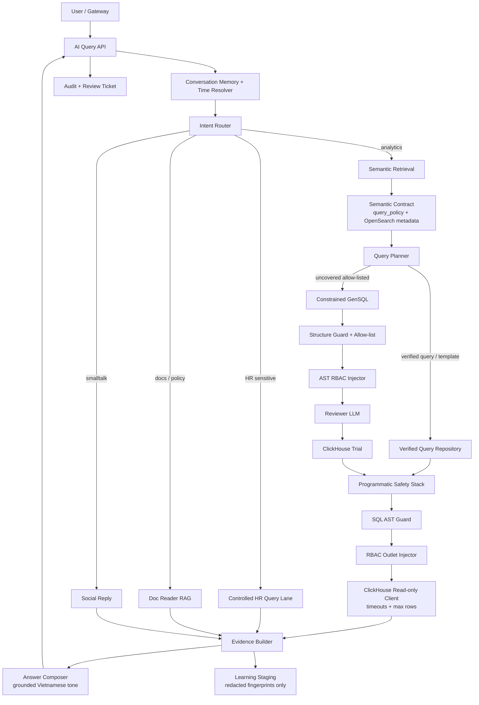

# AI Query Architecture 2026 — Market Review Applied To FERN

This note captures the target architecture for `ai-query-service` after comparing the current FERN graph with public patterns from Uber Finch, Snowflake Cortex Analyst, Databricks AI/BI Genie, Cube semantic layer, LangGraph, and ClickHouse.

## Market Patterns Worth Copying

1. **Curated metric marts before free-form SQL**
   - Keep LLMs away from 10-table operational joins.
   - Prefer flat metric views/tables with business grain, clear time column, and role sensitivity.
   - FERN already started this with `analytics.ai_sales_daily`, `analytics.ai_product_daily`, `analytics.ai_pnl_daily`, `analytics.ai_payment_daily`.

2. **Semantic model as a versioned contract**
   - The model should describe logical datasets, measures, dimensions, synonyms, sample values, canonical filters, and caveats.
   - Prompt context is retrieved from this contract, not guessed from raw schema.
   - OpenSearch is retrieval infrastructure; `app/query_policy/` should remain the local policy source of truth.

3. **Verified queries before generated SQL**
   - For common questions, pick a verified query/template by semantic fingerprint.
   - GenSQL should be a fallback lane for uncovered but allow-listed questions, not the default lane for production metrics.
   - Golden tests compare executed result, not SQL text.

4. **Safety stack is programmatic**
   - LLM review can flag semantic risk, but cannot grant access.
   - RBAC outlet filters, table allow-list, read-only client settings, AST guard, and ClickHouse trial/limits are mandatory before execution.

5. **Answer composition is evidence-based**
   - Build an evidence object from `raw_result`, `time_range`, `data_coverage`, and RBAC scope.
   - Formatter may write natural Vietnamese, but numbers must come only from the evidence object.

## Proposed FERN Target Architecture

## Implementation Priorities

1. **Split control plane vs execution plane**
   - Control plane: semantic contract, route, planner, verified-query selection, GenSQL candidate generation.
   - Execution plane: AST guard, RBAC inject, ClickHouse read-only execution, evidence extraction, answer formatting.

2. **Promote verified-query repository**
   - Current templates should become verified query assets with:
     - `question_patterns`
     - `metric_ids`
     - `required_dimensions`
     - `time_column`
     - `outlet_column`
     - `golden_cases`
   - Template matcher should rank verified assets before asking LLM.

3. **Make ClickHouse trial explicit**
   - Template path can execute after guard.
   - GenSQL path must pass `EXPLAIN SYNTAX` or bounded execution before merge.
   - Client settings stay read-only with `max_execution_time`, `max_result_rows`, and explicit trial caps.

4. **Answer style contract**
   - Open with the answer, not pipeline details.
   - Then show top facts or a short ranked list.
   - End with natural source/scope lines:
     - `Nguồn: ClickHouse analytics cập nhật đến ...`
     - `Phạm vi: ...; ... cửa hàng trong quyền của bạn.`
   - Avoid exposing SQL, template names, prompt, internal reviewer notes, or raw technical warnings.

5. **Evaluation loop**
   - Add golden result tests for top revenue outlet, period revenue, daily trend, top product, payment mix, HR work-hours, HR salary.
   - Track per-lane latency: deterministic template, template+review, GenSQL, HR, docs.
   - Review button remains audit-ticket v1; analyst queue can be phase 2.

## Short-Term Code Direction

- Keep ClickHouse as the analytics serving engine for v1.
- Keep HR in a controlled Postgres lane until HR metric marts are designed with privacy controls.
- Do not enable GenSQL production-wide until:
  - query policy coverage is complete,
  - golden suite is meaningful,
  - trial executor is mandatory for every generated SQL,
  - feedback promotion is staged and audited.

## References

- Uber Finch: https://www.uber.com/en-GB/blog/unlocking-financial-insights-with-finch/
- Snowflake Cortex Analyst semantic models: https://docs.snowflake.com/en/user-guide/snowflake-cortex/cortex-analyst/semantic-model-spec
- Databricks AI/BI Genie: https://docs.databricks.com/aws/en/genie/
- Cube semantic layer: https://cube.dev/docs/product/semantic-layer
- LangGraph multi-agent systems: https://langchain-ai.github.io/langgraph/concepts/multi_agent/
- ClickHouse settings: https://clickhouse.com/docs/operations/settings/settings
