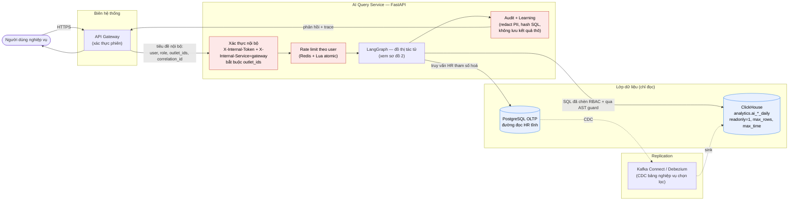
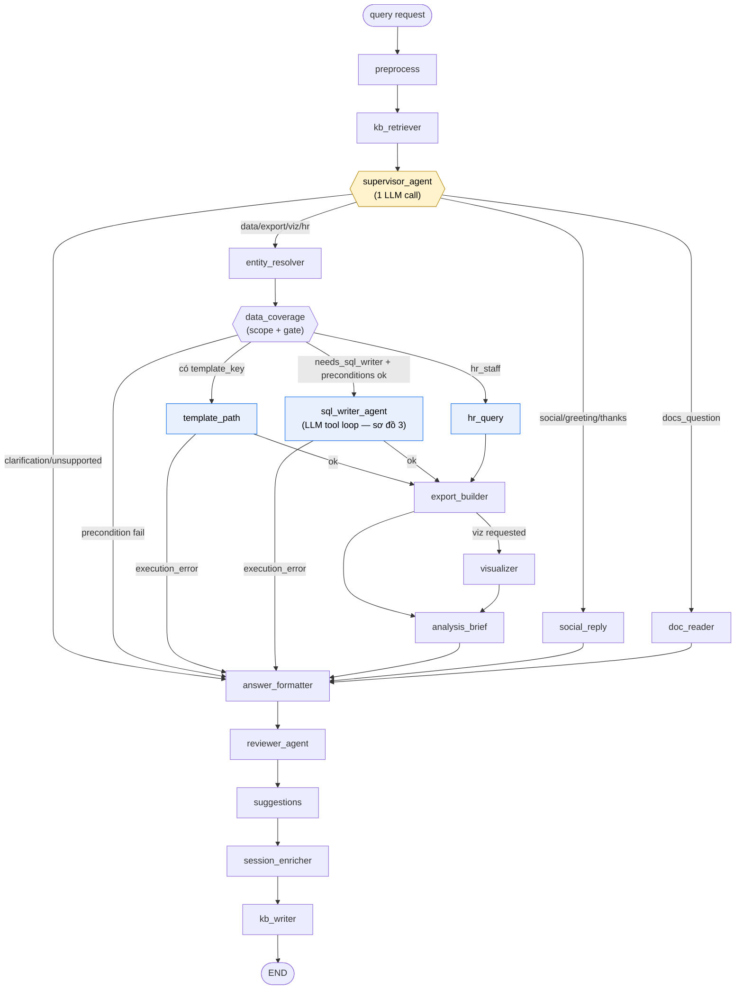
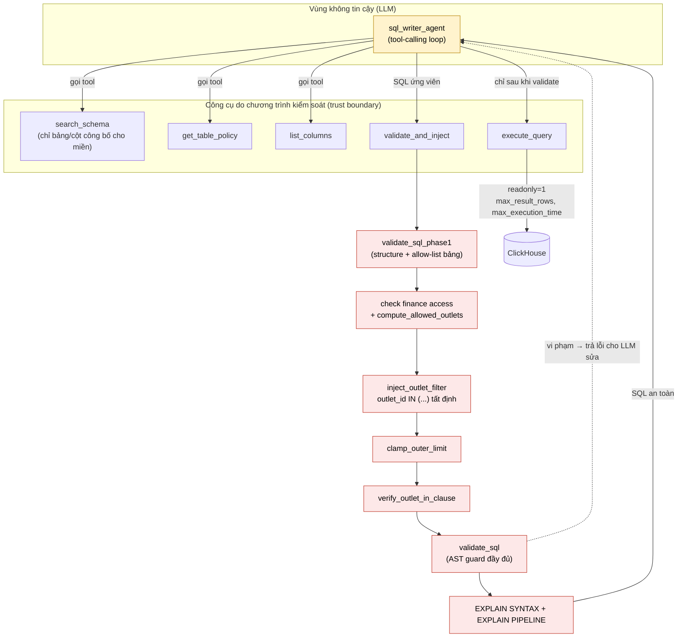

# Kiến trúc AI Query Service — sơ đồ

> Các sơ đồ dưới đây mô tả đúng mã nguồn hiện tại (`AGENT_MODE_ENABLED=true`, đồ thị tác tử Finch-style).
> Nguồn tham chiếu: `app/main.py`, `app/agents/graph_builder.py`, `app/agents/sql_writer_agent.py`,
> `app/agents/tools.py`, `app/guard/sql_ast.py`, `app/codegen/rbac_inject.py`, `app/clients/*`.
>
> Mermaid hiển thị trực tiếp trên GitHub/Cursor. Để đưa vào LaTeX: export PNG/SVG
> (mermaid.live hoặc `mmdc`) rồi `\includegraphics`, hoặc dùng bản TikZ ở cuối file.

---

## 1. Kiến trúc tổng thể và các chốt kiểm soát



**Chốt kiểm soát (màu đỏ):** xác thực nội bộ → giới hạn tần suất → (bên trong đồ thị) chèn RBAC + kiểm tra AST → kiểm toán. Mô hình ngôn ngữ chỉ chạy *bên trong* đồ thị và không bao giờ chạm trực tiếp tới CSDL.

---

## 2. Đồ thị tác tử (LangGraph)



`entity_resolver` và `data_coverage` là bước tất định (không gọi LLM), chạy trước các nhánh dữ liệu để giải thực thể + tính phạm vi RBAC + chặn sớm nếu thiếu điều kiện.

---

## 3. SQL Writer — vòng lặp công cụ và ranh giới tin cậy



**Điểm cốt lõi để phản biện:** mọi đầu ra SQL của LLM đều phải đi qua `validate_and_inject` (chèn RBAC tất định + AST guard + EXPLAIN) trước khi được phép thực thi. LLM không thể tự gọi `execute_query` với SQL chưa kiểm chứng, không nhìn thấy toàn bộ lược đồ, và không tự gắn điều kiện cửa hàng.

---

## 4. Phiên bản TikZ (chèn thẳng vào LaTeX)

```latex
\begin{figure}[H]
\centering
\begin{tikzpicture}[
    node distance=8mm and 14mm,
    box/.style={draw, rounded corners, align=center, minimum height=8mm, inner sep=4pt, font=\small},
    ctrl/.style={box, fill=red!10, draw=red!60},
    store/.style={box, fill=blue!8, draw=blue!60},
    arr/.style={-{Latex[length=2mm]}, thick},
]
% Edge / client
\node[box] (gw) {API Gateway\\(xác thực phiên)};
% Service column
\node[ctrl, right=of gw] (auth) {Xác thực nội bộ\\X-Internal-Token\\+ outlet\_ids};
\node[ctrl, below=of auth] (rl) {Rate limit\\(Redis + Lua)};
\node[box, below=of rl] (graph) {LangGraph\\(đồ thị tác tử)};
\node[ctrl, below=of graph] (audit) {Audit\\(redact PII, hash SQL)};
% Data
\node[store, right=22mm of graph] (ch) {ClickHouse\\analytics.ai\_*\_daily\\readonly=1};
\node[store, below=of ch] (pg) {PostgreSQL\\(đọc HR)};

\draw[arr] (gw) -- (auth);
\draw[arr] (auth) -- (rl);
\draw[arr] (rl) -- (graph);
\draw[arr] (graph) -- (audit);
\draw[arr] (graph) -- node[above, font=\scriptsize]{SQL + RBAC + AST} (ch);
\draw[arr] (graph) -- (pg);
\draw[arr] (audit.south) .. controls +(down:8mm) and +(down:8mm) .. (gw.south);
\end{tikzpicture}
\caption{Kiến trúc AI Query với các chốt kiểm soát}
\label{fig:ch5_ai_query_arch}
\end{figure}
```

Gói TikZ cần: `\usepackage{tikz}` + `\usetikzlibrary{arrows.meta, positioning}` và `\usepackage{float}` cho `[H]`.

---

## 5. Xuất hình từ Mermaid (tuỳ chọn)

```bash
# Cần Node.js
npm i -g @mermaid-js/mermaid-cli
mmdc -i diagram.mmd -o diagram.png -s 3   # -s 3 để ảnh nét cao
```
