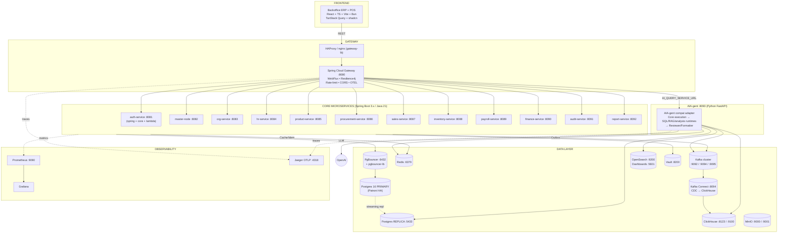

# Kiến trúc tổng thể hệ thống FERN

> ERP + POS trung tâm + AI Analytics cho F&B VN.
> Cập nhật: 2026-05-13 (đã verify với `infra/docker-compose.yml`).

---

## 0. Đính chính so với bản review trước

Bản trước suy đoán port sai. Đây là **port thực tế từ docker-compose.yml**:

| Service | Port (env default) |
|---|---|
| gateway | 8080 |
| auth-service | 8081 |
| master-node | 8082 |
| org-service | 8083 |
| hr-service | 8084 |
| product-service | 8085 |
| procurement-service | 8086 |
| sales-service | 8087 |
| inventory-service | 8088 |
| payroll-service | 8089 |
| finance-service | 8090 |
| audit-service | 8091 |
| report-service | 8092 |
| aia-gent | 8093 |
| kafka-connect | 8094 (host) / 8083 (container) |

→ **Không trùng port** như bản trước nói. Sắp xếp port liên tục 8080–8093, có thiết kế.

Ngoài ra:
- `auth-service` có **submodule** `spring/`, `core/`, `aws-lambda/` → kiến trúc lai: Spring Boot chính + Lambda biến thể, có cả manifest Strimzi Kafka & Redis Sentinel riêng.
- `deploy/helm/` đã có `fern-service` chart và `values/` → **không phải "K8s planned"**, đã có Helm.
- `infra/` có thêm: **Patroni** (`docker-compose.patroni.yml`) cho Postgres HA, **chaos/** scripts, **kafka-connect** đã wire sẵn cho CDC sang ClickHouse.
- AI-query đọc từ **postgres-replica** (không phải primary) → đã có tách OLTP/OLAP path.

---

## 1. Tổng quan

5 tầng:
1. **Frontend** — Backoffice ERP và POS trung tâm.
2. **Gateway** — Spring Cloud Gateway.
3. **Core Services** — 12 microservice Spring Boot (ports 8081–8092).
4. **AI Query** — `AIA-gent` Python FastAPI service (port 8093).
5. **Data & Infra** — Postgres (Patroni HA) + ClickHouse + Kafka cluster (3 broker) + Redis + OpenSearch + MinIO + Vault + observability.

---

## 2. Sơ đồ kiến trúc

---

## 3. Chi tiết theo tầng

### 3.1 Frontend

- `frontend/` React + TS + Vite + **Bun** lockfile + Tailwind/shadcn + TanStack Query + Playwright + Vitest.
- Auth **đồng nhất với backend `auth-service`**: FE có `src/auth/` (auth-context, auth-provider, session, session-timer, authorization, module-access-matrix), gọi API bằng JWT token truyền qua `apiRequest({ token })`.
- Lưu ý: `@supabase/supabase-js` còn trong `package.json` nhưng **không có chỗ nào trong `src/` dùng** → dead dependency, nên gỡ.

### 3.2 Gateway

- Spring Cloud Gateway WebFlux ở 8080.
- `gateway-lb` (HAProxy) phía trước.
- Resilience4j circuit breaker per-route.
- Wire sẵn `AI_QUERY_SERVICE_URL=http://aia-gent:8093`.
- OTEL exporter → Jaeger.

### 3.3 Core Microservices

12 service, schema-per-service pattern, port 8081–8092 liền mạch.

`auth-service` đặc biệt: có 3 submodule
- `spring/` — Spring Boot bản chính.
- `core/` — logic dùng chung.
- `aws-lambda/` — biến thể serverless (có thể là cho social login / webhook).
- Kèm `strimzi-kafka.yaml` + `redis-sentinel.yaml` → deploy K8s độc lập.

Common modules (`common/`): `common-model`, `common-utils`, `event-schemas`, `idempotency-core`, `service-common`, `test-support` — chuẩn DDD shared kernel.

### 3.4 AIA-gent (:8093) — AI Query engine hiện hành

- Python 3.12 FastAPI, code trong `AIA-gent/` (`Dockerfile`, `README.md`, `INTEGRATION.md`, `AGENTS.md`, `tests/`).
- Kiến trúc **Supervisor + Specialist** (LangGraph tối giản) — thay thế hoàn toàn `ai-query-service` cũ (đã retired).
- API contract giữ nguyên `/api/v1/ai-query/*` để tương thích ngược với gateway và frontend.
- Đọc **ClickHouse** (`analytics.ai_*` cho BI, `cdc.*` cho detail) + có thể fallback đọc Postgres replica.
- Kafka topics: `fern.audit.ai-query` (audit best-effort).
- Bảo mật: AST guard (sqlglot) + RBAC outlet_id injection + auth qua `X-Internal-*` headers từ gateway.
- Volume `aia-gent-logs` cho file audit + query logs.

### 3.5 Data & Infra

- **Postgres**: bản thường + **Patroni** HA (`docker-compose.patroni.yml`) + replica 5433 + PgBouncer 6432 + LB riêng.
- **Kafka**: cluster 3 broker (9092/9094/9095) + Kafka Connect :8094 cho CDC → ClickHouse.
- **ClickHouse**: HTTP 8123, native 9100.
- **OpenSearch**: 9200 + Dashboards 5601 (phục vụ semantic metadata cho AI).
- **MinIO**: 9000 + console 9001.
- **Vault**: 8200, dynamic credentials.
- **Chaos scripts**: `infra/chaos/` → có thử nghiệm chịu lỗi.

### 3.6 Deploy

- `deploy/helm/fern-service` chart + `values/` → **Helm sẵn sàng**, không chỉ docker-compose.
- `infra/k8s/` có manifests bổ sung.
- Local dev qua `infra/docker-compose.yml` (+ Patroni variant).

---

## 4. Luồng giao tiếp

| Luồng | Giao thức | Ghi chú |
|---|---|---|
| FE → Gateway → Service | REST | JWT từ `auth-service`, gateway verify. |
| Service ↔ Service sync | REST | Resilience4j CB. |
| Service → bus | Kafka outbox | Topic theo `event-schemas`. |
| Kafka → ClickHouse | Kafka Connect CDC | Real-time analytics. |
| AI → Data | CH SQL + PG replica + OS DSL | RBAC injection + 10s statement timeout. |
| AI → Bus | Kafka audit + learning topic | Feedback loop. |

---

## 5. Nhận xét tổng thể (đã verify)

### Điểm mạnh thực sự

1. **Port mapping kỷ luật 8080–8093 liên tục** — không có trùng. Bản review trước báo sai.
2. **Patroni HA + PgBouncer + replica + LB**: stack DB production-grade hiếm thấy ở giai đoạn early.
3. **Kafka cluster 3 broker + Kafka Connect CDC** sẵn → không phải single broker dev setup.
4. **Helm chart sẵn** (`deploy/helm/fern-service`) → K8s ready, không "planned".
5. **AI query đọc replica + statement timeout 10s + topic audit + topic learning** → thiết kế AI có quan tâm đến **safety & feedback loop**, không phải bolt-on.
6. **Chaos scripts** trong `infra/chaos/` → có văn hóa test resilience.
7. **auth-service tri-modal** (Spring + core + Lambda) → linh hoạt cho cả on-prem và serverless.
8. **OpenSearch riêng cho metadata semantic** → tách rõ vai trò khỏi log/search thông thường.
9. **Idempotency-core + event-schemas** module hóa → outbox + dedup nhất quán toàn hệ.

### Vấn đề thực sự cần lưu ý

1. **Supabase là dead dependency**: `@supabase/supabase-js@^2.101.1` trong `frontend/package.json` nhưng không có import nào trong `src/`. Auth thực tế đi qua `auth-service` (JWT trong `apiRequest({ token })`). Cần gỡ để tránh bundle phình + nhầm lẫn review/audit.
   - **Khắc phục**:
     1. `cd frontend && bun remove @supabase/supabase-js` (hoặc `npm uninstall`).
     2. Grep lại `supabase` toàn repo để chắc chắn không còn ref ẩn (env var, comment, doc).
     3. Xoá biến env `SUPABASE_*` nếu có trong `.env*`, `vite.config.ts`, CI secrets.
     4. Chạy `bun run build` + `bun test` để verify không vỡ.
     5. Commit: `chore(frontend): remove unused @supabase/supabase-js dependency`.
2. **12 service ở giai đoạn đầu**: chi phí ops nhân 12 (migration, CI, on-call). Cân nhắc gộp `payroll` + `hr`, `procurement` + `inventory` nếu team < 30 người.
3. **`auth-service/aws-lambda`** lẫn trong monorepo Spring → build pipeline phức tạp. Nên tách repo riêng nếu thật sự dùng AWS.
4. **POS Edge sync conflict**: chưa thấy spec conflict resolution (CRDT? LWW? version vector?) khi nhiều terminal offline cập nhật cùng entity.
5. **AI gateway timeout 120s**: chặn thread gateway lâu. Nên streaming SSE hoặc job queue (đã có Kafka rồi, dùng được).
6. **Phụ thuộc OpenAI**: data residency VN + chi phí. `knowledge/` + `evals/` đã có → đủ nền để swap sang local LLM (Qwen2.5/Llama VN-tuned) cho preprocess/template match.
7. **ClickHouse + Postgres double-read cho AI**: cần policy router rõ ràng query nào đi đâu, tránh inconsistency.
8. **Kafka 3 broker single AZ (compose)**: production cần multi-AZ + min ISR=2.
9. **`common/` shared modules**: nếu version cùng nhau theo monorepo build, mọi service phải rebuild khi `common-model` đổi. Cân nhắc publish artifact + semantic version.
10. **Patroni chỉ có compose variant**: production cần manifest K8s Patroni operator (Zalando) hoặc CloudNativePG.

### Đề xuất ưu tiên 90 ngày

| P | Hành động |
|---|---|
| P0 | Spec & test POS sync conflict resolution + chaos test mất mạng. |
| P0 | Gỡ `@supabase/supabase-js` khỏi `frontend/package.json` (dead dep, không dùng trong `src/`). |
| P1 | SSE streaming cho AI query + offload query nặng qua Kafka job. |
| P1 | Thử local LLM cho preprocess/template, giữ OpenAI cho codegen khó. |
| P1 | CloudNativePG / Patroni operator manifest cho K8s. |
| P2 | Schema registry (Apicurio/Confluent) cho `event-schemas`. |
| P2 | Đánh giá gộp service (hr+payroll, inv+procurement) nếu team nhỏ. |
| P2 | Tách `auth-service/aws-lambda` ra repo riêng nếu dùng thật. |

---

## 6. Kết luận

Hệ thống **trưởng thành hơn đánh giá ban đầu**: Patroni HA, Kafka 3 broker, Kafka Connect CDC, Helm chart, chaos scripts, AI service có audit + learning + statement timeout. Đây là kiến trúc production-leaning chứ không phải prototype.

Rủi ro chính còn lại là **độ phức tạp ops** (12 service + 3 biến thể auth + Patroni + 3 broker Kafka) và **các "lai" chưa thống nhất** (Supabase ↔ auth-service, Lambda ↔ Spring, OpenAI ↔ on-prem data). Tập trung 90 ngày tới vào hợp nhất các điểm lai và bù các spec còn thiếu (POS conflict, AI streaming) là đủ để đưa lên production thật.
