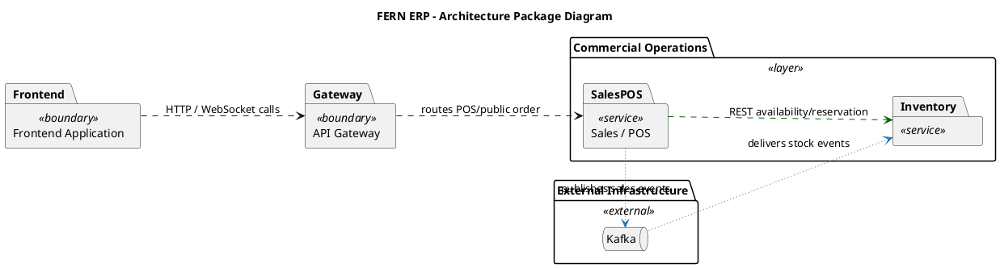

# FERN Code-Derived Package Analysis

## Part 1. Architecture Summary

FERN is a front-end/back-end system with a React web client, a Spring API Gateway, and multiple Spring Boot microservices. The backend is primarily microservice-oriented; each service follows a layered style with API controllers, application services, repositories/infrastructure, and configuration. Business boundaries are split by bounded context: Auth/IAM, Organization, Catalog/Menu, Sales/POS, Inventory, Procurement, HR, Payroll, Finance, Reporting, Audit, and Control Plane. Cross-service calls are explicit through `RestClient` clients, while asynchronous integration uses Kafka listeners/topics. Persistence is service-owned through repositories against PostgreSQL, with reporting also using ClickHouse. Shared Spring configuration, authorization, error handling, Kafka, REST client, and security utilities form a technical shared kernel, not a business package.

## Part 2. Package Table

| Package | Stereotype | Responsibility | Representative components | Public API / Interface |
|---|---|---|---|---|
| Web Frontend | `<<boundary>>` | Browser UI, routing, auth state, POS/public/back-office screens, API calls through gateway. | `frontend/src/App.tsx`, `auth-provider.tsx`, `api/client.ts`, POS/public/back-office components | React routes, `API client` |
| API Gateway | `<<boundary>>` | Single HTTP/WebSocket entry point, route catalog, auth filter, sync publishing. | `GatewayRouteCatalog`, `GatewayAuthenticationFilter`, `SyncPublishController`, `WebSocketSyncHandler` | Gateway routes, WebSocket sync endpoint |
| Auth / IAM | `<<service>>` | Login/session/device pairing, permission catalog, role and token management. | `AuthController`, `DeviceController`, `AuthService`, `OrgEventConsumer`, `AuthUserRepository` | Auth REST API, device API, JWKS/token API |
| Organization | `<<service>>` | Regions, outlets, hierarchy, exchange-rate/reference organization data. | `OrgController`, `OrgService`, `OrgHierarchyCacheService`, `OrgRepository` | Organization REST API |
| Catalog & Menu | `<<service>>` | Product catalog, menu, pricing, publishing, variants/modifiers/allergens, images. | `ProductController`, `MenuController`, `PublishController`, `ProductService`, `MenuService` | Product/menu/publish REST APIs |
| Sales / POS | `<<service>>` | POS sessions, orders, public ordering, payments, kitchen sync, CRM/loyalty, sales reporting endpoints. | `SalesController`, `PublicPosController`, `KitchenController`, `SalesService`, `InventoryAvailabilityClient`, `InventoryReservationClient` | Sales/POS/public order APIs, inventory client interfaces |
| Inventory | `<<service>>` | Stock balance, reservations, lots, transactions, waste, stock counts, inventory event application. | `InventoryController`, `InventoryService`, `StockReservationService`, `InventoryEventConsumer` | Inventory REST API, Kafka consumers |
| Procurement | `<<service>>` | Suppliers, purchase orders, goods receipts, supplier invoices/payments. | `SupplierController`, `PurchaseOrderController`, `GoodsReceiptController`, `SupplierInvoiceController`, `ProcurementRepository` | Procurement REST APIs, procurement events |
| Workforce / HR | `<<service>>` | Employees, shifts, contracts, attendance, time-off, work shifts. | `HrController`, `WorkShiftService`, `EmployeeContractService`, HR repositories | HR REST API |
| Payroll | `<<service>>` | Payroll periods, timesheets, salary calculation, approval/payment workflow. | `PayrollController`, `PayrollService`, `PayrollRepository`, `HrServiceClient` | Payroll REST API, HR client interface |
| Finance | `<<service>>` | Expenses, invoices, finance summaries, financial event ingestion. | `FinanceController`, `InvoiceController`, `FinanceService`, `InvoiceService`, `FinanceEventConsumer` | Finance/invoice REST APIs, Kafka consumers |
| Reporting | `<<service>>` | Read-only operational and analytical reports across sales, expenses, inventory, P&L, staff KPI. | `ReportController`, `ReportService`, `ReportRepository`, `ClickHouseReportRepository` | Reporting REST API |
| Audit | `<<service>>` | Audit log ingestion, security-event reads, traceability. | `AuditController`, `AuditReadController`, `AuditService`, `AuditEventConsumer` | Audit REST/read APIs, Kafka consumers |
| Control Plane | `<<service>>` | Node registry, heartbeats, assignments, config, releases/rollouts. | `ControlPlaneController`, `ControlPlaneRegistryService`, `ControlPlanePersistenceRepository` | Control-plane REST API |
| Shared Service Kernel | `<<subsystem>>` | Technical foundation shared by services: auth policy, filters, error handling, REST/Kafka beans, outbox/idempotency. | `FernSharedConfiguration`, `AuthorizationPolicyService`, `ServiceExceptionHandler`, `ShedLockConfiguration` | Shared Spring beans and interfaces |
| External Infrastructure | `<<external>>` | Databases, cache, broker, analytics store, object storage. | PostgreSQL, Kafka, Redis, ClickHouse, object storage | Infrastructure endpoints |

## Part 3. Package Dependencies With Code Evidence

| From | To | Dependency | Evidence |
|---|---|---|---|
| Web Frontend | API Gateway | calls HTTP/WebSocket APIs | `frontend/src/App.tsx` uses `BrowserRouter`/`Routes`; `frontend/src/api/client.ts` uses `fetch` |
| API Gateway | Business Services | routes requests | `gateway/routing/GatewayRouteCatalog.java`, `GatewayRoutesConfiguration.java` |
| API Gateway | Shared Service Kernel | imports/scans shared auth/config | `GatewayApplication.java` has `scanBasePackages = {"com.fern.gateway", "com.fern.common.spring"}` |
| Every backend service | Shared Service Kernel | imports/scans shared Spring infrastructure | service applications scan `com.fern.common.spring`, e.g. `OrgServiceApplication.java`, `SalesServiceApplication.java` |
| Sales / POS | Inventory | REST calls for availability/reservation | `InventoryAvailabilityClient.java`, `InventoryReservationClient.java` import/use `RestClient` |
| Payroll | Workforce / HR | REST calls for shifts/contracts | `HrServiceClient.java` imports/uses `RestClient` |
| Finance | Sales / POS | REST call to read sale details for invoices | `InvoiceService.java` imports/uses `RestClient` and calls sales endpoint |
| Catalog & Menu | Object Storage | stores product images | `ObjectStorageConfig.java`, `ProductImageStorage.java` |
| Inventory | Kafka | consumes sales/procurement/inventory events | `InventoryEventConsumer.java` has `@KafkaListener` for `fern.sales.*`, `fern.procurement.*`, `fern.inventory.*` |
| Finance | Kafka | consumes procurement/payroll/sales financial events | `FinanceEventConsumer.java` has listeners for `invoice-approved`, `payroll-approved`, `payment-captured` |
| Audit | Kafka | consumes audit/security/domain events | `AuditEventConsumer.java` uses `@KafkaListener` |
| Auth / IAM | Kafka | consumes organization changes | `OrgEventConsumer.java` listens to `fern.org.outlet-*` and `fern.org.region-updated` |
| Reporting | ClickHouse | reads analytics data | `ClickHouseReportRepository.java`, `ClickHouseConfig.java` |
| Services | PostgreSQL | persist through repositories | repositories annotated `@Repository`, e.g. `SalesRepository`, `InventoryRepository`, `FinanceRepository`, `OrgRepository` |
| Control Plane | Redis/PostgreSQL | registry/cache/persistence | `ControlPlaneRegistryService.java`, `ControlPlanePersistenceRepository.java` |

## Part 4. PlantUML

Full PlantUML source is in [`usage-package-diagram.puml`](./usage-package-diagram.puml). The diagram keeps the visual at package/bounded-context level; internal controller/application/repository structure is described in the package table instead of overloading the figure.

## Part 5. Design Notes

No mandatory circular package dependency was found from the inspected code-level edges. The strongest synchronous coupling is `Finance -> Sales` for invoice sale details, `Sales -> Inventory` for stock checks/reservations, and `Payroll -> HR` for workforce data; these should remain explicit client interfaces. No direct frontend-to-database or presentation-to-repository skip-layer dependency was found. `Sales / POS` is large because it combines POS orders, public ordering, kitchen sync, CRM, loyalty, cash movement, telemetry, and admin sales reports; it may become a package/service split candidate if those lifecycles diverge. Several repositories are very large (`SalesRepository` around 3483 lines, `InventoryRepository` around 1674 lines, `FinanceRepository` around 1007 lines), suggesting infrastructure packages may benefit from smaller query/write repositories. Reporting intentionally crosses domain data as a read-model service; it should stay read-only to avoid becoming a domain backdoor.
