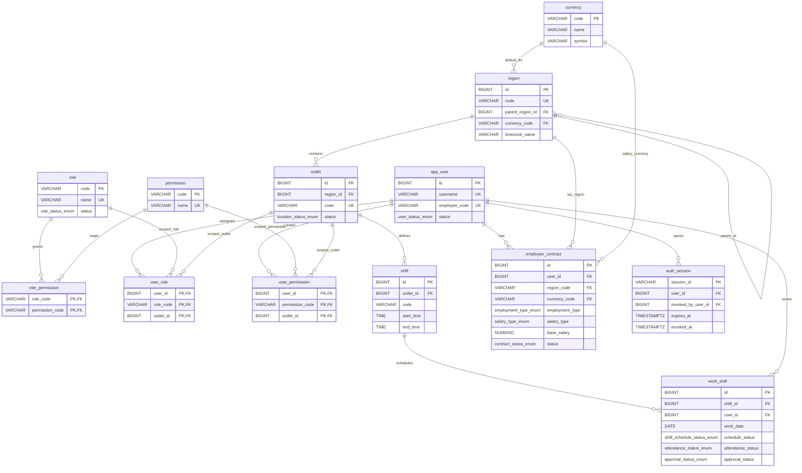
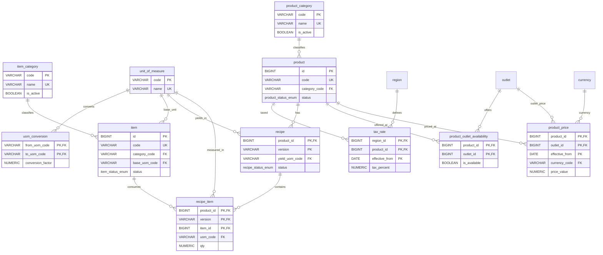
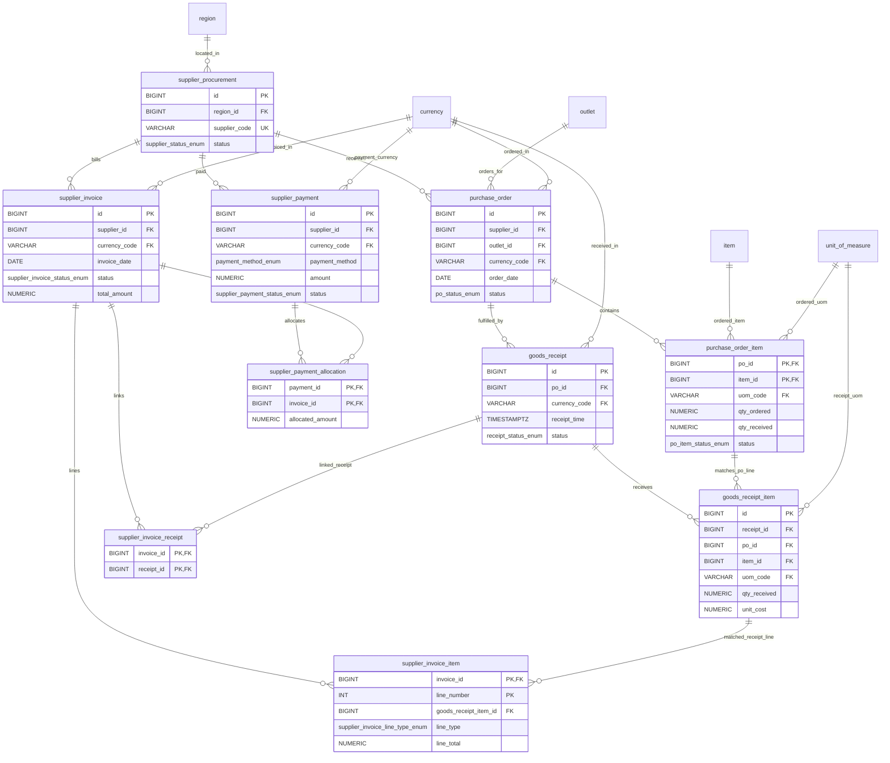
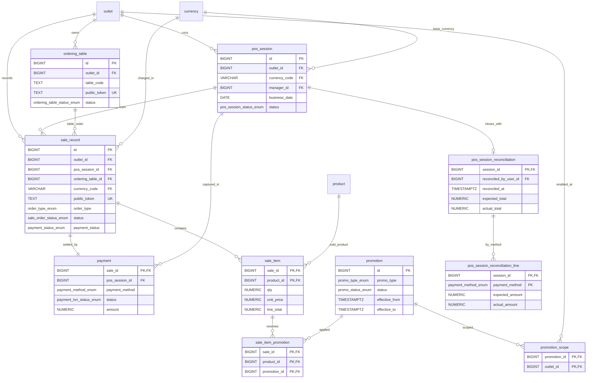
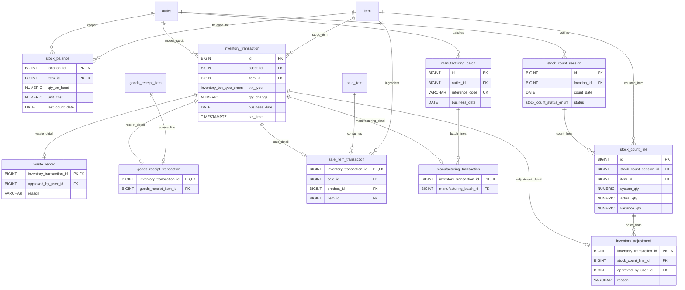
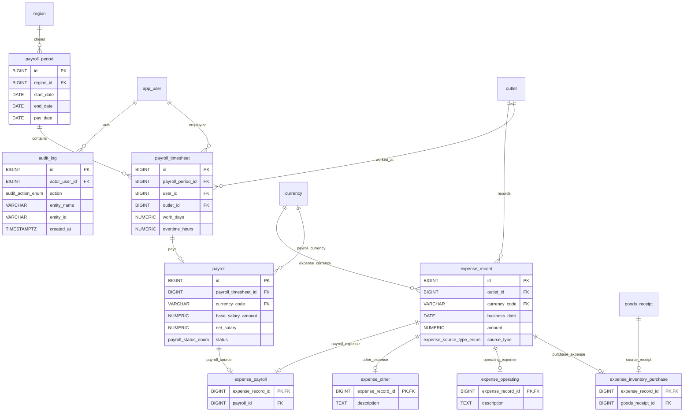
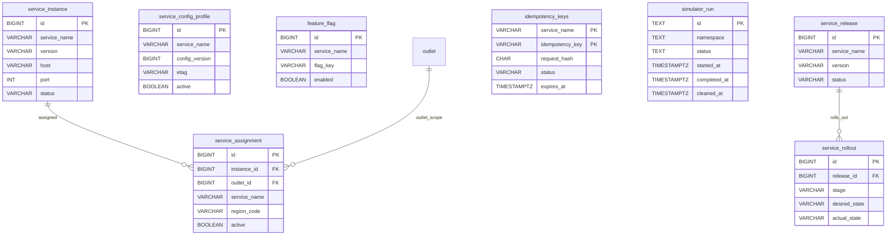

# FERN Database Diagram

All tables below live in schema `core`.

This ERD is derived from the SQL migrations in:

- `db/migrations/V1__core_schema.sql`
- `db/migrations/V3__service_control_plane_and_idempotency.sql`
- `db/migrations/V4__auth_sessions.sql`
- `db/migrations/V5__public_pos_ordering_tables.sql`
- `db/migrations/V6__public_pos_order_tracking.sql`
- `db/migrations/V7__sales_order_lifecycle_and_stock_guards.sql`
- `db/migrations/V9__simulator_run_tracking.sql`
- `db/migrations/V10__simulator_cleanup_stock_sync_guard.sql`
- `db/migrations/V11__pos_session_reconciliation.sql`

`V2`, `V8`, and `V12` do not add new entities. They add indexes, trigger fixes, and data backfill.

## 1. Core / Org / IAM / HR / Auth

Notes:

- `employee_contract.region_code` points to `region.code`, not `region.id`.
- `work_shift.assigned_by_user_id` and `work_shift.approved_by_user_id` also point to `app_user.id`.
- `employee_contract.created_by_user_id` also points to `app_user.id`.
- `auth_session.revoked_by_user_id` also points to `app_user.id`.

## 2. Catalog / Pricing

Notes:

- `uom_conversion` has two foreign keys back to `unit_of_measure`: `from_uom_code` and `to_uom_code`.
- `product.created_by_user_id`, `product.updated_by_user_id`, `recipe.created_by_user_id`, `product_price.created_by_user_id`, and `product_price.updated_by_user_id` all point to `app_user.id`.

## 3. Procurement

Notes:

- `goods_receipt_item` is anchored by two composite relationships: `(receipt_id, po_id) -> goods_receipt(id, po_id)` and `(po_id, item_id) -> purchase_order_item(po_id, item_id)`.
- `supplier_invoice` must be linked to at least one `goods_receipt` via trigger-enforced rules.
- `purchase_order.created_by_user_id`, `purchase_order.approved_by_user_id`, `goods_receipt.created_by_user_id`, `goods_receipt.approved_by_user_id`, `supplier_invoice.created_by_user_id`, `supplier_invoice.approved_by_user_id`, and `supplier_payment.created_by_user_id` all point to `app_user.id`.

## 4. Sales / POS

Notes:

- `payment` is intentionally 1:1 with `sale_record`; `sale_id` is both PK and FK.
- `sale_record.ordering_table_id` and `sale_record.public_token` were added in `V6__public_pos_order_tracking.sql`.
- `pos_session.manager_id` and `pos_session_reconciliation.reconciled_by_user_id` point to `app_user.id`.

## 5. Inventory

Notes:

- `stock_balance` is a cache table maintained by trigger from `inventory_transaction`.
- `sale_item_transaction.item_id` was added in `V7__sales_order_lifecycle_and_stock_guards.sql` and points to `item.id`.
- `waste_record.approved_by_user_id`, `stock_count_session.counted_by_user_id`, `stock_count_session.approved_by_user_id`, `manufacturing_batch.created_by_user_id`, `inventory_transaction.created_by_user_id`, and `inventory_adjustment.approved_by_user_id` point to `app_user.id`.

## 6. Finance / Expense / Audit

Notes:

- `payroll.payroll_timesheet_id` is `UNIQUE`, so the DB enforces one payroll row per timesheet.
- `expense_inventory_purchase.goods_receipt_id` and `expense_payroll.payroll_id` are both `UNIQUE`, so each source object can back at most one expense extension row.
- `payroll.approved_by_user_id`, `payroll_timesheet.approved_by_user_id`, and `expense_record.created_by_user_id` point to `app_user.id`.
- `audit_log` is polymorphic by `entity_name` and `entity_id`, so it does not use direct foreign keys to business tables.

## 7. Platform / Control Plane / Simulator

Notes:

- `service_assignment.region_code` is a logical region scope only; it is not a foreign key to `region`.
- `service_config_profile`, `feature_flag`, and `idempotency_keys` are keyed by `service_name` but are not linked by foreign keys to `service_instance` or `service_release`.
- `simulator_run` is standalone and was extended in `V10__simulator_cleanup_stock_sync_guard.sql`.
