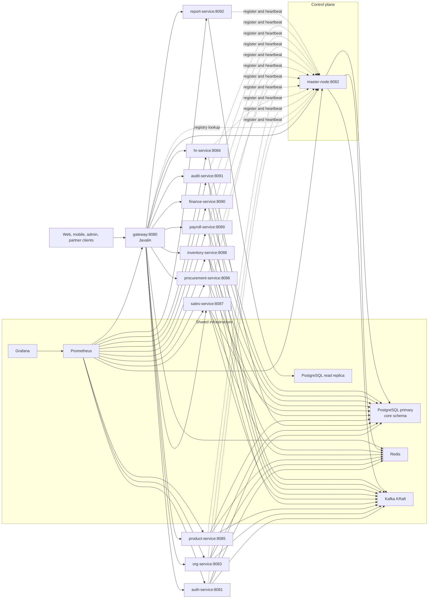
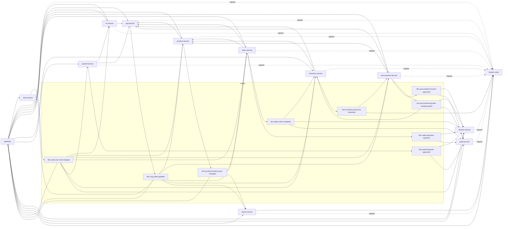

# FERN ERP Microservices Architecture

This document defines the target microservices architecture for FERN. It is grounded in the repository as it exists today:

- shared libraries already live under `common/`
- `services/master-node` is the only checked-in executable service today
- `services/auth-service` is still planned and should keep the `core` + `spring` + `aws-lambda` split
- PostgreSQL already exists as a shared `core` schema under `db/`
- local infrastructure already includes PostgreSQL, Redis, Flyway, and DB helper tooling under `infra/`

This is a future-state architecture package, not a claim that all listed services already exist on disk.

## Non-Negotiable Constraints

- Single PostgreSQL database, single `core` schema
- Strict ownership: one authoritative writer service per table group
- Cross-domain writes never go directly to another service's tables
- Snowflake `bigint` IDs are application-generated
- `stock_balance` is trigger-maintained and never written directly by services
- Monetary tables keep snapshot `currency_code`
- Outlet-scoped IAM must be enforced on every business operation
- Kafka is the event backbone and uses KRaft mode
- `report-service` reads from a PostgreSQL replica only
- `master-node` is a control plane, not an API proxy

## 1. Architecture Overview



### Operating Model

- Gateway handles external HTTP, JWT verification, rate limits, header propagation, and route dispatch.
- Domain services own write access to their tables and publish Kafka events when committed state changes.
- Other services consume events into caches, projections, or follow-on transactions.
- `master-node` keeps service topology, rollout intent, feature flags, and effective config state.
- `report-service` never reads from the primary and never writes data.

## 2. Service Catalog

| Service | Module path | Runtime | Port | Authoritative writer for | Database access pattern | Common modules | Direct synchronous dependencies |
| --- | --- | --- | --- | --- | --- | --- | --- |
| Gateway | `gateway/` | Javalin | `8080` | None | No business DB writes; Redis-backed rate limit and routing cache only | `common-utils`, `common-model`, `service-common`, `idempotency-core`, `event-schemas` | `auth-service`, `master-node`, all business services |
| Master Node | `services/master-node/` | Spring Boot | `8082` | Planned control-plane tables: `service_instance`, `service_assignment`, `service_config_profile`, `feature_flag`, `service_release`, `service_rollout` | PostgreSQL primary via HikariCP, Redis hot cache, Kafka for topology/config events | `common-utils`, `common-model`, `event-schemas` | None for business reads; all services call into it |
| Auth Service | `services/auth-service/{core,spring,aws-lambda}` | Spring Boot + AWS Lambda | `8081` | `app_user`, `role`, `permission`, `role_permission`, `user_role`, `user_permission` | PostgreSQL primary via HikariCP, Redis L1/L2 for sessions and claims | `common-utils`, `common-model`, `event-schemas`, `idempotency-core` | `org-service` for outlet and region validation on admin assignment flows |
| Organization Service | `services/org-service/` | Spring Boot | `8083` | `currency`, `region`, `exchange_rate`, `outlet` | PostgreSQL primary via HikariCP, Redis tiered cache | `common-utils`, `common-model`, `event-schemas`, `idempotency-core` | None |
| HR Service | `services/hr-service/` | Spring Boot | `8084` | `shift`, `work_shift`, `employee_contract` | PostgreSQL primary via HikariCP | `common-utils`, `common-model`, `event-schemas`, `idempotency-core` | `auth-service` for employee/user identity lookup, `org-service` for outlet and region metadata |
| Product Service | `services/product-service/` | Spring Boot | `8085` | `product_category`, `item_category`, `unit_of_measure`, `uom_conversion`, `item`, `product`, `tax_rate`, `recipe`, `recipe_item`, `product_outlet_availability`, `product_price` | PostgreSQL primary via HikariCP, Redis tiered cache | `common-utils`, `common-model`, `event-schemas`, `idempotency-core` | `org-service` for outlet and region context |
| Procurement Service | `services/procurement-service/` | Spring Boot | `8086` | `supplier_procurement`, `purchase_order`, `purchase_order_item`, `goods_receipt`, `goods_receipt_item`, `supplier_invoice`, `supplier_invoice_receipt`, `supplier_invoice_item`, `supplier_payment`, `supplier_payment_allocation` | PostgreSQL primary via HikariCP, Kafka outbox publisher, Redis for hot lookup cache | `common-utils`, `common-model`, `event-schemas`, `idempotency-core` | `org-service`, `product-service` |
| Sales Service | `services/sales-service/` | Spring Boot | `8087` | `pos_session`, `sale_record`, `payment`, `sale_item`, `promotion`, `promotion_scope`, `sale_item_promotion` | PostgreSQL primary via HikariCP, Redis POS/session cache, Kafka event publisher | `common-utils`, `common-model`, `event-schemas`, `idempotency-core` | `org-service`, `product-service` |
| Inventory Service | `services/inventory-service/` | Spring Boot | `8088` | `inventory_transaction`, `waste_record`, `goods_receipt_transaction`, `sale_item_transaction`, `manufacturing_batch`, `manufacturing_transaction`, `inventory_adjustment`, `stock_count_session`, `stock_count_line` | PostgreSQL primary via HikariCP, Redis stock cache, Kafka consumer and publisher | `common-utils`, `common-model`, `event-schemas`, `idempotency-core` | `product-service`, `org-service` |
| Payroll Service | `services/payroll-service/` | Spring Boot | `8089` | `payroll_period`, `payroll_timesheet`, `payroll` | PostgreSQL primary via HikariCP, Kafka publisher | `common-utils`, `common-model`, `event-schemas`, `idempotency-core` | `hr-service`, `org-service` |
| Finance Service | `services/finance-service/` | Spring Boot | `8090` | `expense_record`, `expense_inventory_purchase`, `expense_operating`, `expense_other`, `expense_payroll` | PostgreSQL primary via HikariCP, Kafka consumer, limited Redis cache for reference data | `common-utils`, `common-model`, `event-schemas`, `idempotency-core` | None on hot path; event-driven from procurement, sales, payroll |
| Audit Service | `services/audit-service/` | Spring Boot | `8091` | `audit_log` | PostgreSQL primary via HikariCP, Kafka consumer | `common-utils`, `common-model`, `event-schemas`, `idempotency-core` | None on hot path; event-driven |
| Report Service | `services/report-service/` | Spring Boot | `8092` | None | Read-only HikariCP datasource against PostgreSQL replica | `common-utils`, `common-model`, `event-schemas` | `master-node` for effective config and feature gating only |

### Ownership Rules

- Direct writes across service boundaries are forbidden.
- Reads across service boundaries follow this order:
  1. local cache or projection
  2. authoritative service HTTP call
  3. read replica, but only for `report-service`
- `stock_balance` belongs to the Inventory domain logically, but the only valid write path is `inventory_transaction`.

## 3. Master-Node API Specification And Data Model

### Responsibilities

- Service registry with heartbeat-based liveness
- Configuration distribution by service, region, and outlet assignment
- Service discovery for gateway and service-to-service clients
- Health aggregation across all registered services
- Release metadata and staged rollout coordination
- Feature flag evaluation inputs, but not business authorization

### Discovery And Load Balancing Model

- Every service registers itself at startup and heartbeats every `10s`.
- Redis TTL on each heartbeat key is `30s`.
- Gateway and service clients refresh endpoint lists from `master-node` every `15s` or when a cached endpoint fails.
- Request balancing is client-side weighted round-robin using active instances returned by `master-node`.
- `master-node` never proxies business traffic.

### REST Endpoints

| Method | Path | Caller | Purpose | Request body highlights | Response body highlights |
| --- | --- | --- | --- | --- | --- |
| `POST` | `/api/v1/control/services/register` | Internal service | Register a service instance | `instanceId`, `serviceName`, `version`, `runtime`, `host`, `port`, `regionCodes`, `outletIds`, `capabilities` | `leaseTtlSeconds`, `effectiveConfigVersion`, `heartbeatPath` |
| `POST` | `/api/v1/control/services/{instanceId}/heartbeat` | Internal service | Refresh liveness and current load | `status`, `startedAt`, `inFlightRequests`, `cpuLoad`, `memoryUsage`, `observedConfigVersion` | `accepted`, `nextHeartbeatSeconds` |
| `POST` | `/api/v1/control/services/{instanceId}/deregister` | Internal service | Graceful shutdown | `reason`, `drainTimeoutSeconds` | `accepted`, `removedFromActiveSet` |
| `GET` | `/api/v1/control/services` | Gateway, ops, internal services | List all service types and active counts | None | Array of service summaries grouped by service name |
| `GET` | `/api/v1/control/services/{serviceName}/instances` | Gateway, internal services | Resolve active endpoints | Query: `regionCode`, `outletId`, `capability` | Array of instance endpoints with weights and health |
| `GET` | `/api/v1/control/config/{serviceName}` | Internal service | Pull effective configuration | Query: `regionCode`, `outletId`, `currentVersion` | `configVersion`, `etag`, `properties`, `featureFlags` |
| `GET` | `/api/v1/control/assignments/{serviceName}` | Internal service, ops | Pull region and outlet assignment rules | Query: `regionCode` | Desired region, outlet, and feature ownership set |
| `GET` | `/api/v1/control/health/system` | Gateway, ops | Aggregate whole-system health | None | Service rollup, dependency health, degraded counts |
| `GET` | `/api/v1/control/health/services/{serviceName}` | Gateway, ops | Per-service health details | Query: `regionCode` optional | Instance health, last heartbeat, release version |
| `POST` | `/api/v1/control/releases` | Gateway-admin only | Create a release record | `serviceName`, `version`, `imageRef`, `changeSummary`, `createdBy` | `releaseId`, `status=draft` |
| `POST` | `/api/v1/control/releases/{releaseId}/rollouts` | Gateway-admin only | Start or advance rollout stage | `targetAssignments`, `strategy`, `batchSize`, `maxUnavailable`, `approvalRef` | `rolloutId`, `stage`, `accepted` |
| `GET` | `/api/v1/control/releases/{releaseId}` | Gateway-admin only | Inspect rollout status | None | Release metadata, assignment progress, failure details |

### Registration Payload

```json
{
  "instanceId": 615001223344556677,
  "serviceName": "sales-service",
  "version": "0.1.0-SNAPSHOT",
  "runtime": "spring-boot",
  "host": "sales-service",
  "port": 8087,
  "regionCodes": ["VN", "VN-HCM"],
  "outletIds": [615001200000000101, 615001200000000102],
  "capabilities": ["sales.write", "sales.read", "promotion.read"],
  "metadata": {
    "buildSha": "abc1234",
    "startupProfile": "docker",
    "readinessPath": "/actuator/health"
  }
}
```

### PostgreSQL Control-Plane Tables

All control-plane metadata lives in the same PostgreSQL database and `core` schema. These are planned additions beyond the current 43-table business schema.

| Table | Purpose | Key columns |
| --- | --- | --- |
| `core.service_instance` | Durable audit trail of registered instances | `id bigint`, `instance_id bigint`, `service_name`, `version`, `runtime`, `host`, `port`, `status`, `registered_at`, `last_heartbeat_at`, `metadata_jsonb` |
| `core.service_assignment` | Region and outlet assignment for each service | `id bigint`, `service_name`, `region_code`, `outlet_id`, `config_profile_id`, `desired_instances`, `routing_weight`, `active` |
| `core.service_config_profile` | Effective config bundles per service and environment | `id bigint`, `service_name`, `profile_name`, `config_version`, `etag`, `config_jsonb`, `created_at`, `updated_at` |
| `core.feature_flag` | Flag state scoped by service, region, or outlet | `id bigint`, `flag_key`, `service_name`, `region_code`, `outlet_id`, `enabled`, `rule_jsonb`, `updated_at` |
| `core.service_release` | Release metadata and deployable version record | `id bigint`, `service_name`, `version`, `image_ref`, `status`, `created_by`, `created_at` |
| `core.service_rollout` | Rollout stages and observed progress | `id bigint`, `release_id`, `assignment_id`, `stage`, `desired_state`, `actual_state`, `started_at`, `completed_at`, `error_summary` |

### Redis Keys

| Key pattern | Value | TTL | Owner |
| --- | --- | --- | --- |
| `fern:control:heartbeat:<service>:<instanceId>` | Lightweight heartbeat JSON | `30s` | `master-node` |
| `fern:control:instances:<service>` | Sorted set of active instance IDs with weights | `30s` refreshed on heartbeat | `master-node` |
| `fern:control:endpoint:<instanceId>` | Host, port, health, region, outlet assignment | `30s` refreshed on heartbeat | `master-node` |
| `fern:control:config:<service>:<scope>` | Effective config blob and etag | `10m` or version invalidation | `master-node` |
| `fern:control:assignment:<service>:<scope>` | Active assignment summary | `10m` or version invalidation | `master-node` |
| `fern:control:rollout:<releaseId>` | Current rollout progress counters | `1h` while active | `master-node` |

### Config Distribution

- Services call `GET /api/v1/control/config/{serviceName}` on startup.
- Services repeat the call every `30s` with `If-None-Match`.
- `master-node` returns `304 Not Modified` when nothing changed.
- Region and outlet assignment changes are cached in Redis and refreshed immediately after rollout or admin updates.

### Health Aggregation

- Gateway and ops dashboards read `/api/v1/control/health/system`.
- `master-node` marks an instance `degraded` after one missed heartbeat interval and `down` after `30s`.
- Durable rows remain in PostgreSQL even after Redis keys expire, so instance history stays auditable.

## 4. Gateway Routing Table And Auth Model

### Route Mapping

| External path | Target service | Notes |
| --- | --- | --- |
| `/api/v1/auth/**` | `auth-service` | Login, refresh, user and role administration |
| `/api/v1/org/**` | `org-service` | Currency, region, outlet management |
| `/api/v1/hr/**` | `hr-service` | Scheduling and contracts |
| `/api/v1/products/**` | `product-service` | Items, products, recipes, pricing |
| `/api/v1/procurement/**` | `procurement-service` | Suppliers, PO, receipts, invoices, supplier payments |
| `/api/v1/sales/**` | `sales-service` | POS sessions, sales, promotions, payment capture |
| `/api/v1/inventory/**` | `inventory-service` | Stock movements, counts, adjustments, manufacturing |
| `/api/v1/payroll/**` | `payroll-service` | Payroll periods, timesheets, approval |
| `/api/v1/finance/**` | `finance-service` | Expenses and finance views |
| `/api/v1/audit/**` | `audit-service` | Audit search, export, trace lookup |
| `/api/v1/reports/**` | `report-service` | Read-only analytics and aggregated views |
| `/api/v1/control/**` | `master-node` | Control-plane APIs, gateway-admin only |

### External Auth Flow

1. Gateway extracts `Authorization: Bearer <jwt>` or session cookie.
2. Gateway validates the JWT using a short-lived JWKS cache fetched from `auth-service`.
3. For revocation-sensitive endpoints, gateway falls back to token introspection.
4. Gateway resolves the target outlet from path, query, or request body.
5. Gateway asks `auth-service` to authorize the requested outlet and permission when local cached claims are insufficient.
6. Gateway forwards the request with trusted internal headers to the target service.
7. Downstream services trust only gateway-authenticated internal headers, never the raw external JWT.

### Auth-Service Internal APIs Used By The Gateway

| Method | Path | Purpose |
| --- | --- | --- |
| `GET` | `/api/v1/auth/internal/jwks` | Retrieve signing keys for local JWT validation |
| `POST` | `/api/v1/auth/internal/tokens/introspect` | Validate token state, session state, and claim freshness |
| `POST` | `/api/v1/auth/internal/authorize` | Confirm outlet-scoped permission or role for the current request |

### Forwarded Internal Header Contract

The first eight headers align with or extend the existing `service-common` middleware.

| Header | Source | Purpose |
| --- | --- | --- |
| `X-Internal-Service` | Existing `InternalServiceAuth` | Declares the calling service, always `gateway` for external traffic |
| `X-Internal-Token` | Existing `InternalServiceAuth` | Shared internal trust token |
| `X-Internal-User-Id` | Existing `InternalServiceAuth` | Authenticated user ID |
| `X-Internal-Session-Id` | Existing `InternalServiceAuth` | Session ID when present |
| `X-Internal-Roles` | Existing `InternalServiceAuth` | Comma-separated effective role codes |
| `X-Internal-Permissions` | Existing `InternalServiceAuth` | Comma-separated effective permission codes |
| `X-Trace-Id` | Existing `CorrelationMiddleware` | Cross-service trace correlation |
| `X-Request-Id` | Existing `CorrelationMiddleware` | Per-request unique ID |
| `X-Internal-Outlet-Id` | New gateway standard | Outlet scope enforced for the request |
| `X-Internal-Region-Code` | New gateway standard | Region context used for routing and validation |

The `service-common` package should be extended to validate and expose `X-Internal-Outlet-Id` and `X-Internal-Region-Code` in the same way it already handles service, user, session, role, and permission headers.

### Rate Limiting

| Traffic type | Limit key | Strategy | Default limit |
| --- | --- | --- | --- |
| Login and token endpoints | `ip + route` | Redis token bucket | `20 req/min` |
| Authenticated reads | `userId + route` | Redis token bucket | `300 req/min` |
| Mutating business writes | `userId + outletId + route` | Redis token bucket | `60 req/min` |
| Control-plane admin APIs | `userId + route` | Redis token bucket | `30 req/min` |

Redis key format:

- `fern:gateway:ratelimit:ip:<ip>:<route>`
- `fern:gateway:ratelimit:user:<userId>:<route>`
- `fern:gateway:ratelimit:user-outlet:<userId>:<outletId>:<route>`

### Request And Response Transformation

- Gateway always injects `X-Trace-Id` and `X-Request-Id`.
- Successful business responses are forwarded unchanged.
- Gateway error responses use a standard envelope:

```json
{
  "error": {
    "code": "forbidden",
    "message": "Missing permission sales.write",
    "trace_id": "2d2f7b0d-3477-43f3-9f35-40a8bdb1a4c0",
    "request_id": "5878a4a7-2fdf-47bb-a675-4fdb5eb8f72d"
  }
}
```

## 5. Redis Cache Matrix

| Service | Cached data | Topology | Key namespace | TTL | Invalidation |
| --- | --- | --- | --- | --- | --- |
| Auth | JWT claim set | L1 in-memory + Redis L2 | `fern:auth:claims:<tokenHash>` | L1 `5m`, L2 `15m` or token expiry | token refresh, logout, role change |
| Auth | Session record | L1 in-memory + Redis L2 | `fern:auth:session:<sessionId>` | Rolling `30m` | logout, password reset, user lock |
| Auth | Role and permission matrix | L1 in-memory + Redis L2 | `fern:auth:acl:user:<userId>:outlet:<outletId>` | L1 `5m`, L2 `30m` | `fern.auth.user-role-changed` |
| Org | Outlet metadata | Tiered cache | `fern:org:outlet:<outletId>` | L1 `30m`, L2 `6h` | `fern.org.outlet-updated` |
| Org | Region tree | Tiered cache | `fern:org:region:<regionCode>` | L1 `30m`, L2 `6h` | region admin update, daily refresh |
| Org | Exchange rate | L1 in-memory + Redis L2 | `fern:org:fx:<from>:<to>:<businessDate>` | L1 `15m`, L2 `24h` | scheduled refresh and org update |
| Product | Product catalog | Tiered cache | `fern:product:catalog:<productId>` | L1 `10m`, L2 `1h` | product update, status change |
| Product | Outlet price | Tiered cache | `fern:product:price:<outletId>:<productId>` | L1 `5m`, L2 `15m` | `fern.product.product-price-changed` |
| Sales | POS session state | L1 in-memory + Redis L2 | `fern:sales:session:<posSessionId>` | session lifetime until close | explicit close, reconcile, cancel |
| Inventory | Current stock level | L1 in-memory + Redis L2 | `fern:inventory:stock:<outletId>:<itemId>` | L1 `30s`, L2 `2m` | write-through after inventory transaction commit |
| Master Node | Active endpoint set | Redis hot cache | `fern:control:instances:<service>` | `30s` | heartbeat update or expire |
| Master Node | Effective config | Redis hot cache | `fern:control:config:<service>:<scope>` | `10m` | config profile change or rollout stage change |

### Cache Rules

- Only the owning service writes or invalidates the canonical cache entry for its domain.
- Consumers may keep derived local caches but must subscribe to invalidation topics.
- Inventory cache values are a read optimization over `stock_balance`, not a second source of truth.

## 6. Kafka Topic Catalog And Event Envelope

### Envelope Contract

`common/event-schemas` should define the envelope and payload DTOs used by every service:

```java
package com.fern.events.core;

import java.time.Instant;

public record EventEnvelope<T>(
    String eventId,
    String eventType,
    String sourceService,
    Instant producedAt,
    String traceId,
    String schemaVersion,
    T payload
) {}
```

This aligns with the fields already produced by `EventPublisher` in `service-common`.

### Topic Catalog

| Topic | Producer | Consumers | Payload DTO | Partition key | Retry and idempotency |
| --- | --- | --- | --- | --- | --- |
| `fern.sales.sale-completed` | `sales-service` | `inventory-service`, `finance-service`, `audit-service` | `com.fern.events.sales.SaleCompletedEvent` | `saleId` | Idempotent. Consumers store `eventId` in `idempotency-core` before side effects. |
| `fern.sales.payment-captured` | `sales-service` | `finance-service`, `audit-service` | `com.fern.events.sales.PaymentCapturedEvent` | `saleId` | Idempotent. Deduplicate by `eventId` and `saleId`. |
| `fern.procurement.goods-receipt-posted` | `procurement-service` | `inventory-service`, `finance-service`, `audit-service` | `com.fern.events.procurement.GoodsReceiptPostedEvent` | `goodsReceiptId` | Idempotent. Replays must not duplicate stock or expense rows. |
| `fern.procurement.invoice-approved` | `procurement-service` | `finance-service`, `audit-service` | `com.fern.events.procurement.InvoiceApprovedEvent` | `supplierInvoiceId` | Idempotent. Expense posting checks `eventId`. |
| `fern.inventory.stock-low-threshold` | `inventory-service` | `procurement-service`, `master-node` alert adapter | `com.fern.events.inventory.StockLowThresholdEvent` | `outletId:itemId` | At-least-once. Duplicate alerts tolerated and coalesced in Redis. |
| `fern.payroll.payroll-approved` | `payroll-service` | `finance-service`, `audit-service` | `com.fern.events.payroll.PayrollApprovedEvent` | `payrollId` | Idempotent. Finance ignores duplicate `eventId`. |
| `fern.auth.user-role-changed` | `auth-service` | `gateway`, all domain services | `com.fern.events.auth.UserRoleChangedEvent` | `userId` | At-least-once. Used for cache invalidation only. |
| `fern.org.outlet-updated` | `org-service` | `gateway`, `auth-service`, `hr-service`, `product-service`, `procurement-service`, `sales-service`, `inventory-service`, `payroll-service`, `report-service` | `com.fern.events.org.OutletUpdatedEvent` | `outletId` | At-least-once. Used for metadata cache invalidation and refresh. |
| `fern.product.product-price-changed` | `product-service` | `sales-service`, `gateway`, `report-service` | `com.fern.events.product.ProductPriceChangedEvent` | `outletId:productId` | At-least-once. Cache invalidation plus optional local warmup. |

### Suggested Payload Fields

| DTO | Required fields |
| --- | --- |
| `SaleCompletedEvent` | `saleId`, `outletId`, `businessDate`, `currencyCode`, `lineItems`, `subtotal`, `discount`, `taxAmount`, `totalAmount` |
| `PaymentCapturedEvent` | `saleId`, `paymentMethod`, `amount`, `currencyCode`, `paymentTime`, `transactionRef` |
| `GoodsReceiptPostedEvent` | `goodsReceiptId`, `poId`, `supplierId`, `outletId`, `businessDate`, `currencyCode`, `lineItems`, `totalPrice` |
| `InvoiceApprovedEvent` | `supplierInvoiceId`, `supplierId`, `invoiceDate`, `currencyCode`, `totalAmount`, `linkedReceiptIds` |
| `StockLowThresholdEvent` | `outletId`, `itemId`, `qtyOnHand`, `reorderThreshold`, `observedAt` |
| `PayrollApprovedEvent` | `payrollId`, `userId`, `payrollPeriodId`, `outletId`, `currencyCode`, `netSalary`, `approvedAt` |
| `UserRoleChangedEvent` | `userId`, `outletId`, `roles`, `permissions`, `changedAt`, `changedByUserId` |
| `OutletUpdatedEvent` | `outletId`, `regionCode`, `status`, `name`, `updatedAt` |
| `ProductPriceChangedEvent` | `productId`, `outletId`, `currencyCode`, `oldPrice`, `newPrice`, `effectiveFrom`, `updatedByUserId` |

### Consumer Groups

- One consumer group per service and version line, for example `fern.inventory.v1`, `fern.finance.v1`, `fern.audit.v1`.
- Partition by the business entity that requires ordered handling:
  - `saleId` for sales and payments
  - `goodsReceiptId` for receipts
  - `supplierInvoiceId` for invoices
  - `payrollId` for payroll
  - `outletId:itemId` for stock threshold alerts
- Business events keep `7d` retention by default.
- Cache invalidation topics keep `3d` retention by default.

## 7. Service Dependency Graph



### Call Policies

| Call type | Timeout | Retries | Failure behavior |
| --- | --- | --- | --- |
| Gateway -> service | `300ms` read, `800ms` write | `1` retry on connect timeout only | Return standardized `503` or downstream status |
| Service -> master-node | `200ms` | `2` retries with jitter | Use last cached config/endpoint list if available |
| Service -> authoritative domain service | `300ms` read, `700ms` write | `1` retry on idempotent GET only | Fallback to cache if safe, otherwise fail fast |
| Kafka consumer side effects | poll loop with `1s` backoff | retry until success or dead-letter threshold | `idempotency-core` protects duplicates |

Internal HTTP auth uses the existing `InternalServiceAuth` shared-token model, with gateway and peer services forwarding trusted user context only over internal network calls.

## 8. Docker Compose Additions

The current `infra/docker-compose.yml` already contains PostgreSQL, Redis, Flyway, and DB helper containers. The architecture expands it as follows.

### Compose Design Notes

- Replace the single local PostgreSQL container with a primary plus read replica pair so `report-service` can stay replica-only even in local development.
- Add Kafka in KRaft mode.
- Add Prometheus and Grafana for visibility from the first implementation phase.
- Add one container per service and a separate container for the custom gateway.

### Future-State Compose Snippet

```yaml
x-common-env: &common-env
  POSTGRES_HOST: postgres
  POSTGRES_PORT: 5432
  POSTGRES_DB: fern
  POSTGRES_USER: fern
  POSTGRES_PASSWORD: fern
  REDIS_HOST: redis
  REDIS_PORT: 6379
  KAFKA_BOOTSTRAP: kafka:9092
  MASTER_NODE_URL: http://master-node:8082
  INTERNAL_SERVICE_TOKEN: fern-local-internal-token

x-service-base: &service-base
  restart: unless-stopped
  depends_on:
    postgres:
      condition: service_healthy
    redis:
      condition: service_healthy
    kafka:
      condition: service_healthy
    master-node:
      condition: service_healthy
  environment:
    <<: *common-env

services:
  postgres:
    image: bitnami/postgresql:16
    environment:
      POSTGRESQL_USERNAME: fern
      POSTGRESQL_PASSWORD: fern
      POSTGRESQL_DATABASE: fern
      POSTGRESQL_REPLICATION_MODE: master
      POSTGRESQL_REPLICATION_USER: repl_user
      POSTGRESQL_REPLICATION_PASSWORD: repl_pass
    ports:
      - "5432:5432"
    healthcheck:
      test: ["CMD-SHELL", "pg_isready -U fern -d fern"]
      interval: 10s
      timeout: 5s
      retries: 5

  postgres-replica:
    image: bitnami/postgresql:16
    depends_on:
      postgres:
        condition: service_healthy
    environment:
      POSTGRESQL_REPLICATION_MODE: slave
      POSTGRESQL_MASTER_HOST: postgres
      POSTGRESQL_MASTER_PORT_NUMBER: 5432
      POSTGRESQL_REPLICATION_USER: repl_user
      POSTGRESQL_REPLICATION_PASSWORD: repl_pass
      POSTGRESQL_PASSWORD: fern
    ports:
      - "5433:5432"
    healthcheck:
      test: ["CMD-SHELL", "pg_isready -U postgres"]
      interval: 10s
      timeout: 5s
      retries: 5

  kafka:
    image: bitnami/kafka:3.9
    environment:
      KAFKA_CFG_NODE_ID: 1
      KAFKA_CFG_PROCESS_ROLES: controller,broker
      KAFKA_CFG_CONTROLLER_LISTENER_NAMES: CONTROLLER
      KAFKA_CFG_LISTENERS: PLAINTEXT://:9092,CONTROLLER://:9093
      KAFKA_CFG_ADVERTISED_LISTENERS: PLAINTEXT://kafka:9092
      KAFKA_CFG_CONTROLLER_QUORUM_VOTERS: 1@kafka:9093
      KAFKA_CFG_AUTO_CREATE_TOPICS_ENABLE: "false"
      KAFKA_CFG_NUM_PARTITIONS: 12
      ALLOW_PLAINTEXT_LISTENER: "yes"
    ports:
      - "9092:9092"
    healthcheck:
      test: ["CMD-SHELL", "/opt/bitnami/kafka/bin/kafka-topics.sh --bootstrap-server localhost:9092 --list >/dev/null 2>&1"]
      interval: 15s
      timeout: 10s
      retries: 8

  gateway:
    <<: *service-base
    build:
      context: ..
      dockerfile: gateway/Dockerfile
    environment:
      <<: *common-env
      PORT: 8080
    ports:
      - "8080:8080"
    depends_on:
      auth-service:
        condition: service_healthy
      master-node:
        condition: service_healthy
      redis:
        condition: service_healthy
    healthcheck:
      test: ["CMD-SHELL", "wget -qO- http://localhost:8080/health/ready >/dev/null || exit 1"]
      interval: 15s
      timeout: 5s
      retries: 5

  master-node:
    restart: unless-stopped
    build:
      context: ..
      dockerfile: services/master-node/Dockerfile
    environment:
      <<: *common-env
      SERVER_PORT: 8082
    ports:
      - "8082:8082"
    depends_on:
      postgres:
        condition: service_healthy
      redis:
        condition: service_healthy
      kafka:
        condition: service_healthy
    healthcheck:
      test: ["CMD-SHELL", "wget -qO- http://localhost:8082/actuator/health | grep UP >/dev/null || exit 1"]
      interval: 15s
      timeout: 5s
      retries: 5

  auth-service:
    <<: *service-base
    build:
      context: ..
      dockerfile: services/auth-service/spring/Dockerfile
    environment:
      <<: *common-env
      SERVER_PORT: 8081
    ports:
      - "8081:8081"
    healthcheck:
      test: ["CMD-SHELL", "wget -qO- http://localhost:8081/actuator/health | grep UP >/dev/null || exit 1"]
      interval: 15s
      timeout: 5s
      retries: 5

  org-service:
    <<: *service-base
    build:
      context: ..
      dockerfile: services/org-service/Dockerfile
    environment:
      <<: *common-env
      SERVER_PORT: 8083
    ports:
      - "8083:8083"
    healthcheck:
      test: ["CMD-SHELL", "wget -qO- http://localhost:8083/actuator/health | grep UP >/dev/null || exit 1"]
      interval: 15s
      timeout: 5s
      retries: 5

  hr-service:
    <<: *service-base
    build:
      context: ..
      dockerfile: services/hr-service/Dockerfile
    environment:
      <<: *common-env
      SERVER_PORT: 8084
    ports:
      - "8084:8084"
    healthcheck:
      test: ["CMD-SHELL", "wget -qO- http://localhost:8084/actuator/health | grep UP >/dev/null || exit 1"]
      interval: 15s
      timeout: 5s
      retries: 5

  product-service:
    <<: *service-base
    build:
      context: ..
      dockerfile: services/product-service/Dockerfile
    environment:
      <<: *common-env
      SERVER_PORT: 8085
    ports:
      - "8085:8085"
    healthcheck:
      test: ["CMD-SHELL", "wget -qO- http://localhost:8085/actuator/health | grep UP >/dev/null || exit 1"]
      interval: 15s
      timeout: 5s
      retries: 5

  procurement-service:
    <<: *service-base
    build:
      context: ..
      dockerfile: services/procurement-service/Dockerfile
    environment:
      <<: *common-env
      SERVER_PORT: 8086
    ports:
      - "8086:8086"
    healthcheck:
      test: ["CMD-SHELL", "wget -qO- http://localhost:8086/actuator/health | grep UP >/dev/null || exit 1"]
      interval: 15s
      timeout: 5s
      retries: 5

  sales-service:
    <<: *service-base
    build:
      context: ..
      dockerfile: services/sales-service/Dockerfile
    environment:
      <<: *common-env
      SERVER_PORT: 8087
    ports:
      - "8087:8087"
    healthcheck:
      test: ["CMD-SHELL", "wget -qO- http://localhost:8087/actuator/health | grep UP >/dev/null || exit 1"]
      interval: 15s
      timeout: 5s
      retries: 5

  inventory-service:
    <<: *service-base
    build:
      context: ..
      dockerfile: services/inventory-service/Dockerfile
    environment:
      <<: *common-env
      SERVER_PORT: 8088
    ports:
      - "8088:8088"
    healthcheck:
      test: ["CMD-SHELL", "wget -qO- http://localhost:8088/actuator/health | grep UP >/dev/null || exit 1"]
      interval: 15s
      timeout: 5s
      retries: 5

  payroll-service:
    <<: *service-base
    build:
      context: ..
      dockerfile: services/payroll-service/Dockerfile
    environment:
      <<: *common-env
      SERVER_PORT: 8089
    ports:
      - "8089:8089"
    healthcheck:
      test: ["CMD-SHELL", "wget -qO- http://localhost:8089/actuator/health | grep UP >/dev/null || exit 1"]
      interval: 15s
      timeout: 5s
      retries: 5

  finance-service:
    <<: *service-base
    build:
      context: ..
      dockerfile: services/finance-service/Dockerfile
    environment:
      <<: *common-env
      SERVER_PORT: 8090
    ports:
      - "8090:8090"
    healthcheck:
      test: ["CMD-SHELL", "wget -qO- http://localhost:8090/actuator/health | grep UP >/dev/null || exit 1"]
      interval: 15s
      timeout: 5s
      retries: 5

  audit-service:
    <<: *service-base
    build:
      context: ..
      dockerfile: services/audit-service/Dockerfile
    environment:
      <<: *common-env
      SERVER_PORT: 8091
    ports:
      - "8091:8091"
    healthcheck:
      test: ["CMD-SHELL", "wget -qO- http://localhost:8091/actuator/health | grep UP >/dev/null || exit 1"]
      interval: 15s
      timeout: 5s
      retries: 5

  report-service:
    <<: *service-base
    build:
      context: ..
      dockerfile: services/report-service/Dockerfile
    environment:
      <<: *common-env
      SERVER_PORT: 8092
      DB_REPLICA_URL: jdbc:postgresql://postgres-replica:5432/fern
    ports:
      - "8092:8092"
    depends_on:
      postgres-replica:
        condition: service_healthy
      redis:
        condition: service_healthy
      kafka:
        condition: service_healthy
      master-node:
        condition: service_healthy
    healthcheck:
      test: ["CMD-SHELL", "wget -qO- http://localhost:8092/actuator/health | grep UP >/dev/null || exit 1"]
      interval: 15s
      timeout: 5s
      retries: 5

  prometheus:
    image: prom/prometheus:v2.54.1
    ports:
      - "9090:9090"
    volumes:
      - ./monitoring/prometheus.yml:/etc/prometheus/prometheus.yml:ro
    depends_on:
      - gateway
      - master-node

  grafana:
    image: grafana/grafana:11.2.0
    ports:
      - "3000:3000"
    environment:
      GF_SECURITY_ADMIN_USER: admin
      GF_SECURITY_ADMIN_PASSWORD: admin
    volumes:
      - ./monitoring/grafana/provisioning:/etc/grafana/provisioning:ro
    depends_on:
      - prometheus
```

## 9. Maven Reactor Expansion

```text
fern-backend
|-- common
|   |-- common-utils
|   |-- common-model
|   |-- idempotency-core
|   |-- service-common
|   `-- event-schemas
|-- gateway
|-- services
|   |-- master-node
|   |-- auth-service
|   |   |-- core
|   |   |-- spring
|   |   `-- aws-lambda
|   |-- org-service
|   |-- hr-service
|   |-- product-service
|   |-- procurement-service
|   |-- sales-service
|   |-- inventory-service
|   |-- payroll-service
|   |-- finance-service
|   |-- audit-service
|   `-- report-service
|-- db
`-- infra
```

### Reactor Rules

- `common/pom.xml` adds `event-schemas`.
- `services/pom.xml` adds every new Spring Boot service and the `auth-service` nested parent.
- `gateway/pom.xml` is a new root-level module under the same parent `pom.xml`.
- `master-node` stays a single Spring Boot module and is extended rather than replaced.

## 10. Per-Module Dependency And Package Conventions

### Module Dependency Matrix

| Module | Required dependencies |
| --- | --- |
| `common/event-schemas` | `common-utils`, Jackson annotations, `jackson-datatype-jsr310`, JUnit for DTO tests |
| `gateway` | `common-utils`, `common-model`, `service-common`, `idempotency-core`, `event-schemas`, `javalin`, `postgresql` optional none, `jedis`, `kafka-clients`, Jackson |
| `services/master-node` | `common-utils`, `common-model`, `event-schemas`, `spring-boot-starter-web`, `spring-boot-starter-actuator`, `spring-boot-starter-validation`, `postgresql`, `HikariCP`, `jedis`, `kafka-clients` |
| `services/auth-service/core` | `common-utils`, `common-model`, `event-schemas` |
| `services/auth-service/spring` | `auth-service-core`, `common-utils`, `common-model`, `event-schemas`, `idempotency-core`, `spring-boot-starter-web`, `spring-boot-starter-actuator`, `spring-boot-starter-validation`, `postgresql`, `HikariCP`, `jedis`, `kafka-clients` |
| `services/auth-service/aws-lambda` | `auth-service-core`, `common-utils`, `event-schemas`, AWS Lambda runtime artifacts |
| Standard mutating Spring service | `common-utils`, `common-model`, `event-schemas`, `idempotency-core`, `spring-boot-starter-web`, `spring-boot-starter-actuator`, `spring-boot-starter-validation`, `postgresql`, `HikariCP`, `jedis`, `kafka-clients` |
| `services/report-service` | `common-utils`, `common-model`, `event-schemas`, `spring-boot-starter-web`, `spring-boot-starter-actuator`, `postgresql`, `HikariCP` |

### Package Conventions

#### Spring Boot services

```text
com.fern.services.<service>
|-- <Service>Application
|-- config
|-- api
|-- application
|-- domain
|-- infrastructure
|   |-- persistence
|   |-- redis
|   |-- events
|   `-- http
`-- support
```

#### Gateway

```text
com.fern.gateway
|-- GatewayApplication
|-- config
|-- routing
|-- auth
|-- ratelimit
|-- forwarding
|-- discovery
`-- health
```

#### Event schemas

```text
com.fern.events
|-- core
|-- auth
|-- org
|-- sales
|-- procurement
|-- inventory
|-- payroll
`-- product
```

### Spring Boot `application.yml` Convention

```yaml
server:
  port: ${SERVER_PORT:8087}

spring:
  application:
    name: sales-service
  threads:
    virtual:
      enabled: true

management:
  endpoints:
    web:
      exposure:
        include: health,info,prometheus
  endpoint:
    health:
      show-details: always

dependencies:
  postgres:
    url: ${DB_URL:jdbc:postgresql://postgres:5432/fern}
    username: ${POSTGRES_USER:fern}
    password: ${POSTGRES_PASSWORD:fern}
    poolSize: ${DB_POOL_SIZE:16}
  postgresReplica:
    url: ${DB_REPLICA_URL:jdbc:postgresql://postgres-replica:5432/fern}
  redis:
    host: ${REDIS_HOST:redis}
    port: ${REDIS_PORT:6379}
  kafka:
    bootstrap: ${KAFKA_BOOTSTRAP:kafka:9092}
  masterNode:
    baseUrl: ${MASTER_NODE_URL:http://master-node:8082}

fern:
  service:
    registration:
      enabled: true
      heartbeatIntervalSeconds: 10
    routing:
      cacheTtlSeconds: 15
```

### Gateway `ServiceConfig` Convention

Gateway should keep using `service-common`'s `ServiceConfig` with environment-driven bootstrap:

- `PORT=8080`
- `REDIS_HOST`, `REDIS_PORT`
- `KAFKA_BOOTSTRAP`
- `MASTER_NODE_URL`
- `INTERNAL_SERVICE_TOKEN`
- no direct primary DB write configuration

## 11. Implementation Roadmap

### Phase 1: Foundation

Deliverables:

- add `common/event-schemas`
- extend root and module POMs for new architecture modules
- implement `master-node` registry, heartbeat, config, and release metadata APIs
- implement gateway skeleton with routing, internal auth, trace propagation, and rate limiting
- extend local infra with Kafka KRaft, primary + replica PostgreSQL, Prometheus, and Grafana
- define base service templates, Dockerfiles, and shared config conventions

Integration checkpoints:

- `master-node` accepts register and heartbeat requests and persists durable metadata
- gateway resolves live endpoints through `master-node`
- Kafka publish and consume smoke test succeeds using `EventEnvelope<T>`
- Prometheus scrapes gateway and `master-node`

Must be true before Phase 2:

- service registration and discovery work
- internal service auth works end to end
- build can include `gateway` and `event-schemas`

### Phase 2: Core Services

Deliverables:

- implement `auth-service` runtime modules
- implement `org-service`
- implement `product-service`
- standardize gateway JWT validation against `auth-service` JWKS and introspection
- ship outlet and region metadata caching plus product catalog and price caching
- add `fern.auth.user-role-changed`, `fern.org.outlet-updated`, and `fern.product.product-price-changed`

Integration checkpoints:

- gateway validates JWT and injects outlet-scoped context
- `org-service` changes invalidate outlet metadata caches
- `product-service` price changes invalidate sales-facing caches
- auth role changes invalidate permission caches across services

Must be true before Phase 3:

- outlet-scoped IAM is enforced through gateway and downstream headers
- product pricing and outlet metadata are accessible without direct cross-domain SQL

### Phase 3: Transactional Services

Deliverables:

- implement `procurement-service`
- implement `sales-service`
- implement `inventory-service`
- wire event flows for sale completion, payment capture, goods receipt posting, and low stock alerts
- enforce idempotent consumers using `idempotency-core`
- integrate inventory writes through `inventory_transaction` only

Integration checkpoints:

- `sale-completed` deducts stock without double-processing
- `goods-receipt-posted` adds stock and preserves procurement transaction semantics
- `payment-captured` reaches finance and audit consumers once logically even under replay
- `stock_balance` stays correct through trigger-maintained updates

Must be true before Phase 4:

- sales, procurement, and inventory flows are event-complete
- gateway routes all business domains
- operational dashboards show core service health

### Phase 4: Finance, Audit, And Reporting

Deliverables:

- implement `payroll-service`
- implement `finance-service`
- implement `audit-service`
- implement `report-service` against the replica only
- add finance expense flows from procurement, sales, and payroll events
- add rollout metadata views and control-plane admin endpoints behind gateway admin auth

Integration checkpoints:

- `payroll-approved` produces finance expenses and audit records
- `report-service` connects only to the replica and exposes no write endpoints
- `audit-service` stores event-driven audit rows with trace IDs
- rollout metadata in `master-node` can represent staged deployment state without carrying user traffic

Exit criteria:

- every business domain has one writer service
- gateway, control plane, Kafka, Redis, replica reads, and observability are all integrated
- another engineer can scaffold modules and services directly from this document without unresolved architecture questions

## Acceptance Scenarios

The architecture is only considered implemented correctly when all of these are demonstrably true:

1. A service registers with `master-node`, heartbeats into Redis, disappears from the active set after TTL expiry, and still remains auditable in PostgreSQL.
2. Gateway validates a JWT, injects trace, request, user, outlet, and region headers, and forwards a trusted internal call to a downstream service.
3. `fern.sales.sale-completed` causes inventory deduction, finance expense creation, and audit logging without double-processing.
4. `fern.procurement.goods-receipt-posted` causes stock increase and finance-side expense linkage.
5. `fern.auth.user-role-changed` invalidates authorization caches across services.
6. `fern.org.outlet-updated` invalidates cached outlet metadata across dependent services.
7. `report-service` reads from a replica only and never writes to the primary.
8. `master-node` tracks staged rollout intent and instance health while gateway remains the only traffic entry point.
