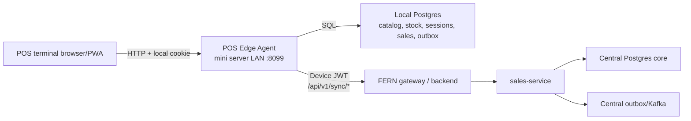
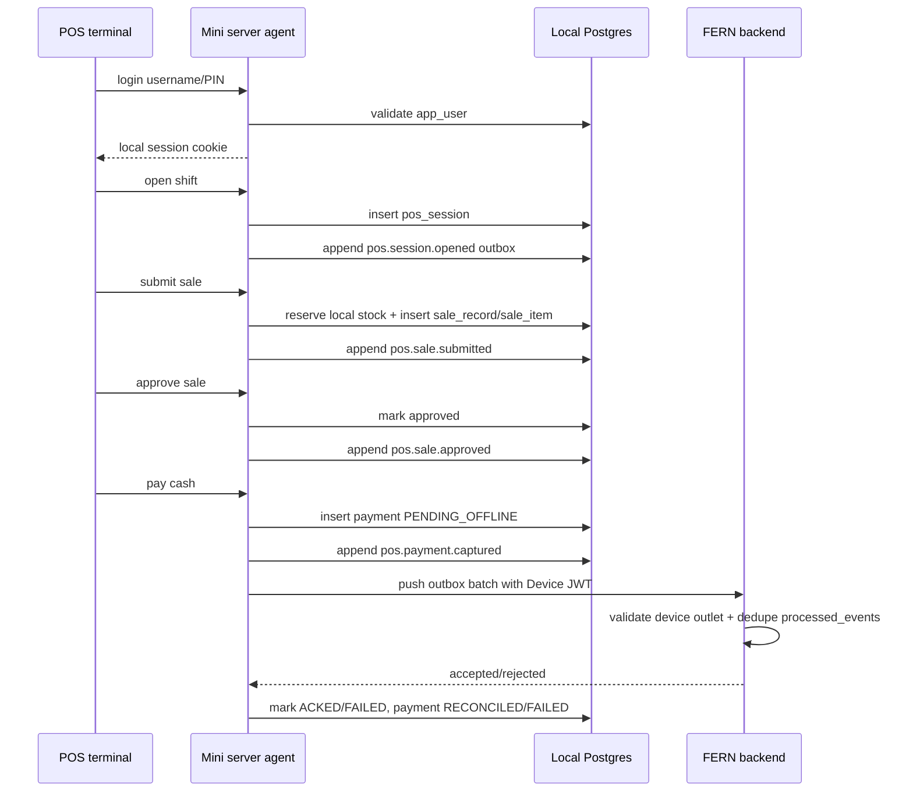

# 08 — Current Implementation Overview

Tài liệu này mô tả trạng thái hiện tại của luồng POS offline trong repo tại ngày
2026-04-27. Đây là snapshot theo source đang có trong worktree, không khẳng định
tất cả thay đổi đã được merge upstream.

## 1. Tóm Tắt Hiện Trạng

Hệ thống hiện đã có một luồng POS offline chạy theo mô hình mini server tại outlet:

- POS terminal trong LAN mở PWA `FERN-pos-edge` và gọi agent local ở port `8099`.
- Agent Node.js trên mini server giữ local Postgres, local session, catalog/stock/recipe cache, sale/payment local và outbox sync.
- Browser POS không giữ central JWT. Central sync do mini server thực hiện bằng Device JWT.
- Agent có puller đồng bộ catalog, menu, stock, recipe và clock anchor từ backend khi online.
- Sale offline đi theo chuỗi `submit -> approve -> pay`, ghi local trước, đẩy event lên backend qua outbox.
- Backend sales-service đã có `/api/v1/sync/push` và các pull endpoint để nhận event POS edge, dedupe bằng `processed_events`, và route event về sales service.
- Demo hiện tại trên `http://127.0.0.1:5173/order` load được menu, ca mở, user local và trạng thái sync.

## 2. Kiến Trúc Tổng Quan



Ranh giới trust hiện tại:

| Thành phần | Vai trò | Token/credential |
|---|---|---|
| POS terminal | UI bán hàng trong LAN | Local HttpOnly cookie `fern_edge_session`; không có central JWT |
| Mini server agent | Nơi ghi local và sync upstream | Device JWT lưu local trong `device-token.json` |
| Backend | Nguồn dữ liệu trung tâm và sync receiver | Validate device context/outlet binding |

Source chính:

- Frontend POS: `FERN-pos-edge/src`
- Agent local: `FERN-pos-edge/agent/src`
- Agent schema: `FERN-pos-edge/agent/src/db/migrations`
- Backend sync: `services/sales-service/src/main/java/com/fern/services/sales/api/SyncController.java`
- Backend sync service: `services/sales-service/src/main/java/com/fern/services/sales/application/SyncService.java`

## 3. Frontend POS Edge Đã Có

PWA hiện gọi agent local, không gọi thẳng central gateway:

- `src/api/http.ts` tự resolve agent theo host hiện tại: `http(s)://<window.location.hostname>:8099`.
- Có các route chính: `/login`, `/open-shift`, `/order`, `/close-shift`, `/waste`.
- Login dùng user/PIN local.
- `useSyncStatus` poll `/api/v1/sync/manifest` mỗi 15 giây.
- Header UI hiển thị outlet, ca, số event chờ sync, tuổi menu, cashier và các hành động đóng ca/đăng xuất.
- `useSubmitOrder` sinh `clientSaleId` bằng Snowflake, tạo idempotency key riêng cho `submit`, `approve`, `pay`.
- Pending submit được lưu trong Dexie để retry an toàn nếu lỗi network/5xx.
- Audit local được lưu Dexie và flush qua agent.

Luồng thanh toán hiện tại chỉ hỗ trợ cash offline. Non-cash chưa được coi là offline-safe.

## 4. Agent Local Đã Có

Agent Node.js/Fastify là backend local của mini server. Các nhóm API chính:

| Nhóm | Endpoint local | Trạng thái |
|---|---|---|
| Auth | `POST /api/v1/auth/login`, `GET /api/v1/auth/me`, `POST /api/v1/auth/logout` | Có |
| Offline lease | `POST /api/v1/auth/lease-offline` | Có, mặc định 12 giờ |
| Device | `POST /api/v1/devices/provision`, `POST /api/v1/devices/pair`, `GET /api/v1/devices/current` | Có |
| Catalog/menu | `GET /api/v1/product/menus`, `GET /api/v1/menus`, `GET /api/v1/product/prices` | Có |
| Stock | `GET /api/v1/inventory/stock-balances`, availability local | Có |
| Session | `POST /api/v1/sales/pos-sessions`, `POST /api/v1/sales/pos-sessions/:id/close` | Có |
| Sale | `POST /api/v1/sales/orders`, approve, mark-payment-done, cancel | Có |
| Refund | `POST /api/v1/sales/orders/:id/refund` | Có endpoint nhưng trả `offline_refund_disabled` |
| Sync | `GET /api/v1/sync/manifest`, `POST /api/v1/sync/force-pull` | Có; force pull yêu cầu manager role |
| Waste | `POST /api/v1/inventory/waste` | Có route local |

Local schema đã có các bảng quan trọng:

- `outlet`, `app_user`
- `product`, `product_price`, `product_variant`, `modifier_*`
- `item`, `stock_balance`
- `recipe`, `recipe_component`
- `pos_session`
- `sale_record`, `sale_item`, `sale_item_modifier`
- `payment`
- `sale_inventory_reservation`
- `outbox_event`
- `local_idempotency`
- `device_meta`

## 5. Local Auth Và Device JWT

Luồng xác thực hiện tại:

1. Terminal đăng nhập vào mini server bằng username + PIN/password local.
2. Agent validate `app_user.pin_hash` hoặc `password_hash`.
3. Agent set HttpOnly cookie local `fern_edge_session`.
4. Agent xóa legacy central cookie nếu có.
5. Browser chỉ dùng cookie local để gọi agent.
6. Agent dùng Device JWT khi sync lên central.

`fern-client.ts` hiện attach Device JWT cho upstream calls và chủ động xóa các header internal fallback như `X-Internal-Token`, `X-Internal-Service`, `X-Internal-Outlet-Ids`.

Điểm đã đúng với mô hình mini server LAN: terminal không cần central JWT, còn Device JWT là credential của mini server.

## 6. Luồng Bán Hàng Offline End-To-End



Sale local hiện có trạng thái chính:

| Bước | Local effect | Outbox event |
|---|---|---|
| Mở ca | `pos_session.status = open` | `pos.session.opened` |
| Submit | tạo `sale_record`, `sale_item`, reserve stock | `pos.sale.submitted` |
| Approve | chuyển sale sang approved | `pos.sale.approved` |
| Pay cash | tạo `payment.state = PENDING_OFFLINE` | `pos.payment.captured` |
| Void/cancel | cancel sale và release reservation | `pos.sale.voided` |
| Đóng ca | close session nếu outbox không còn `PENDING`/`SYNCING` | `pos.session.closed` |

## 7. Sync Và Outbox

Agent local có outbox table `outbox_event` với trạng thái:

- `PENDING`
- `SYNCING`
- `ACKED`
- `FAILED`

Relay hiện tại:

- Tick mỗi 1 giây.
- Claim batch tối đa 50 rows bằng `FOR UPDATE SKIP LOCKED`.
- Publish lên central ngoài local transaction.
- Mark `ACKED`/`FAILED`/retry sau response.
- Backoff exponential, tối đa 10 attempts.
- Reclaim `SYNCING` quá 30 giây.
- Với `pos.payment.captured`, payment chuyển `RECONCILED` khi event được ACK.

Payload push gửi lên backend gồm:

- `deviceId`
- `eventId`
- `type`
- `idempotencyKey`
- `clientOccurredAt`
- `monotonicSeq`
- `payload`

Event types backend đang nhận:

| Event | Backend route |
|---|---|
| `pos.session.opened` | `openPosSessionFromSync` |
| `pos.session.closed` | `closePosSessionFromSync` |
| `pos.sale.submitted` | `submitSaleFromSync` |
| `pos.sale.approved` | `approveSaleFromSync` |
| `pos.payment.captured` | `capturePaymentFromSync` |
| `pos.sale.voided` | `voidSaleFromSync` |
| `pos.audit.recorded` | append central audit outbox |
| `pos.sale.refunded` | reject vì offline refund disabled |
| `pos.inventory.adjusted` | reject; phải đi qua inventory-service |

Backend dedupe bằng `core.processed_events` theo `idempotency_key`, `device_id`, `payload_hash`, và chỉ accept duplicate khi event trước đó đã `SUCCESS`.

## 8. Pull Dữ Liệu Từ Central

Backend sync hiện có các endpoint pull:

| Endpoint | Dữ liệu | Ghi chú |
|---|---|---|
| `/api/v1/sync/manifest` | version catalog/price/stock/recipe/menu + server time | Dùng làm clock/version anchor |
| `/api/v1/sync/pull/menu` | snapshot menu đầy đủ | Bao gồm product, variants, modifiers |
| `/api/v1/sync/pull/catalog` | NDJSON catalog delta | Có cursor/checkpoint |
| `/api/v1/sync/pull/stock` | stock balance theo outlet | Snapshot hiện tại |
| `/api/v1/sync/pull/recipes` | NDJSON recipe/BOM delta | Có cursor/checkpoint |
| `/api/v1/sync/pull/tax-rules` | tax rules theo outlet | Có |

Agent pullers hiện có:

- `catalog-puller.ts`
- `stock-puller.ts`
- `recipe-puller.ts`
- `clock-anchor.ts`

Manifest local hiện trả các field phục vụ UI/risk:

- `outbox.pending`, `outbox.failed`, `outbox.stale_syncing`
- `offline_risk.pending_sale_count`, `pending_sale_total_cents`, `offline_minutes`
- `catalog_cursor`, `stock_cursor`, `recipe_cursor`
- `menu_version`
- `device_token.paired`, `expiresAt`, `expiringSoon`
- `clock_anchor`
- `server_time`

## 9. Inventory Local Đã Có

Agent hiện đã có kiểm tra tồn local dựa trên recipe/BOM:

- Pull `stock_balance` từ central.
- Pull `recipe` và `recipe_component`.
- Khi submit sale, agent resolve nguyên liệu cần dùng.
- Agent lock stock rows `FOR UPDATE`.
- Nếu có stock snapshot: reject khi `available < required`.
- Nếu thiếu snapshot cho item/product: cho bán tiếp và để central reconciliation/audit xử lý.
- Agent tăng `qty_reserved_local` và ghi `sale_inventory_reservation`.
- Khi void/cancel, agent release reservation.

Điểm đã fix so với lỗi oversell trước: kiểm tra hiện so sánh `available + epsilon < requirement.qty`, không chỉ check `available < 0`.

## 10. Backend Central Đã Có Cho POS Offline

Sales-service hiện có:

- `SyncController` cho push/pull.
- `SyncService` xử lý manifest, pull catalog/stock/menu/recipe/tax-rule.
- Device outlet binding check cho pull và push.
- `processed_events` để chống replay side effect.
- `DeviceService` provision `device_registry` và cấp worker id cho Snowflake.
- Migrations liên quan:
  - `V29__processed_events.sql`
  - `V37__device_auth.sql`
  - `V39__hub_register_sales_detail.sql`

Central sale sync path hiện có thể nhận sale id từ edge để sale id local và central khớp nhau.

## 11. Trạng Thái Demo Quan Sát Được

Kiểm tra nhanh local ngày 2026-04-27:

- Browser đang ở `http://127.0.0.1:5173/order`.
- UI load được outlet `Outlet VN-HCM-7`, cashier `Cashier Demo`, ca ngày `2026-04-27`.
- Menu hiển thị nhiều category và product như `Cha Gio`, `Canh Chua`, `Com Chay`.
- Header hiển thị `0 chờ sync` và `Menu vừa cập nhật`.
- Console browser không có error/warning tại thời điểm kiểm tra.
- Agent health trả `status=ok`, outlet id `3483033648569532416`, worker id `128`.
- Device hiện đã paired, device id `3483718399618453504`.
- Manifest live trả:
  - `outbox.pending = 0`
  - `outbox.failed = 2`
  - `outbox.stale_syncing = 0`
  - `device_token.paired = true`
  - `stock_cursor = null`

`failed=2` là điểm cần kiểm tra riêng nếu mục tiêu demo là “sạch hoàn toàn”. UI hiện chỉ nổi bật pending sync, nên failed outbox có thể không đủ rõ với cashier.

## 12. Các Giới Hạn/Rủi Ro Còn Lại

| Nhóm | Hiện trạng | Rủi ro |
|---|---|---|
| Manual force pull | Chỉ manager/outlet manager/admin/superadmin được gọi | Cashier không tự refresh được khi demo nếu quyền thấp |
| Stock cursor | Manifest live đang trả `stock_cursor = null` | UI/ops khó biết stock snapshot mới nhất |
| Outbox failed | Manifest live đang có `failed=2` | Cần màn hình/alert xử lý failed event rõ hơn |
| Payment | Offline cash only | QR/card/e-wallet cần online flow riêng |
| Refund | Endpoint có nhưng disabled offline | Cần luồng manager-online hoặc queue riêng nếu muốn refund offline |
| Missing stock snapshot | Cho bán tiếp nếu item chưa có local stock row | Central phải audit/reconcile oversell hoặc dữ liệu thiếu |
| LAN security | Dev đang dùng HTTP loopback | Production cần LAN TLS/reverse proxy hoặc network isolation |
| Deployment | README agent có hướng dẫn Windows service cơ bản | Cần hardening backup, log rotation, service recovery, monitoring |
| Docs cũ | `00-current-state.md` là audit lịch sử trước implementation | Cần đọc `08-current-implementation-overview.md` để biết trạng thái hiện tại |

## 13. Runbook Demo Nhanh

Điều kiện:

- Backend central đang chạy.
- Agent local đang chạy ở `http://127.0.0.1:8099`.
- PWA đang chạy ở `http://127.0.0.1:5173`.
- Mini server đã paired Device JWT.
- Local DB đã có user/PIN, catalog, stock/recipe demo.

Kiểm tra:

```bash
curl http://127.0.0.1:8099/health
curl http://127.0.0.1:8099/api/v1/sync/manifest
curl http://127.0.0.1:8099/api/v1/devices/current
```

Flow UI:

1. Login bằng user/PIN local, ví dụ demo đang dùng `cashier / 1234`.
2. Mở ca tại `/open-shift`.
3. Vào `/order`, chọn món, thanh toán cash.
4. Đợi header về `0 chờ sync`.
5. Kiểm tra manifest để chắc `outbox.pending = 0` và xử lý nếu `outbox.failed > 0`.

## 14. Kết Luận

Luồng POS offline hiện không còn ở mức research-only. Repo đã có một implementation khá đầy đủ cho mô hình mini server LAN:

- Local auth/session.
- Device JWT upstream.
- Local catalog/menu/stock/recipe.
- Offline sale + cash payment.
- Outbox sync/retry.
- Backend sync receiver + dedupe.
- Basic demo UI và manifest status.

Các phần cần ưu tiên trước khi pilot thực tế là xử lý outbox failed rõ hơn, hoàn thiện stock cursor/monitoring, hardening deployment mini server, và bổ sung vận hành cho refund/non-cash/manager override nếu nghiệp vụ yêu cầu.
