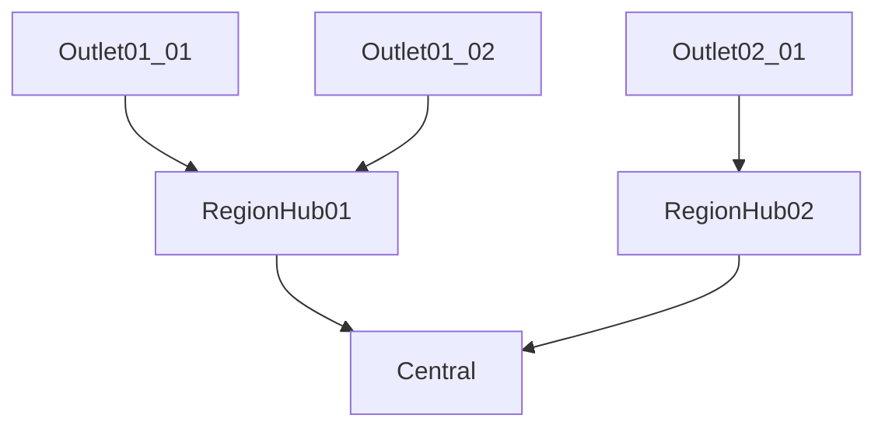
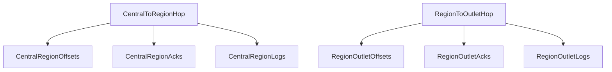
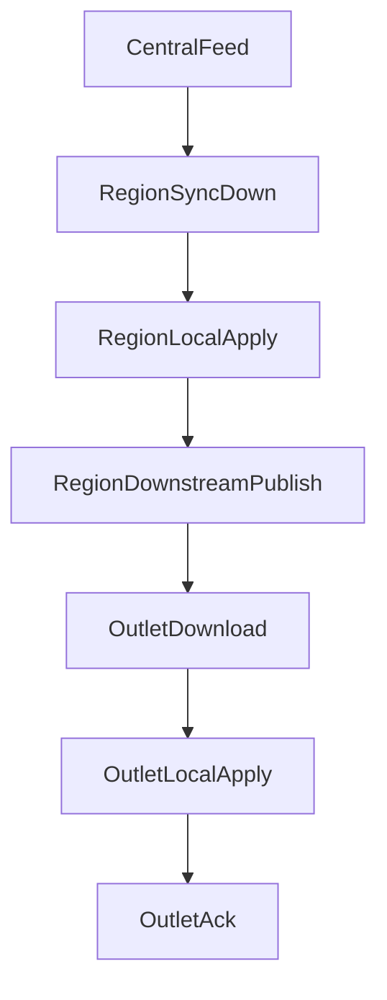
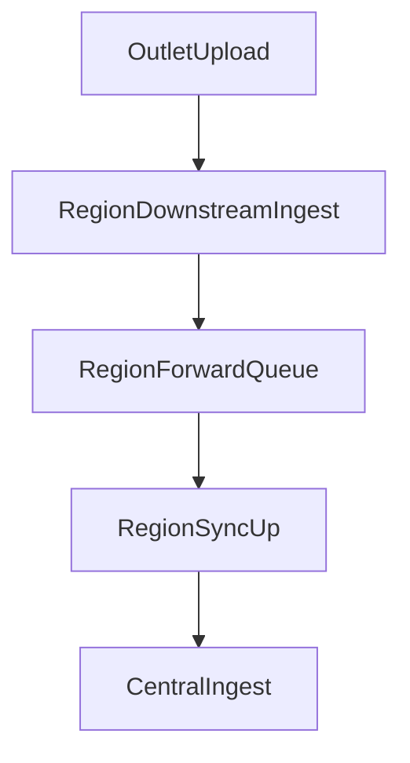

# Sync Regional Hub Target Architecture

## Purpose

This document defines the target architecture for a true multi-hop sync topology:

- `central -> region`
- `region -> outlet`

In this design, a `region` is not just an edge node with a broader tier policy. It is a real upstream sync server for its child outlets while still acting as an edge client of central.

## Deployment Topology

Each tier has its own database:

- `central` has one central database
- each `region` has its own database
- each `outlet` has its own database

Runtime topology:



This means:

- `central` syncs only with region hubs
- each `region` syncs upstream with central and downstream with its outlets
- each `outlet` syncs only with its assigned region

## Current Gap From Existing Design

The current `sync-service` already supports:

- a central API under `/api/sync/*`
- an edge sync loop through `TieredSyncOrchestrator`
- a `REGIONAL` tier policy

But the current implementation still assumes:

- one upstream URL
- one parent feed (`central-outbox`)
- one node-to-store identity
- central/store sync directions only

That makes the current implementation a strong single-hop engine, but not yet a true regional hub platform.

## Target Runtime Model

## 1. Region is a dual-role runtime

A region must expose two sync surfaces at the same time:

- `upstream surface`: behaves like an edge node talking to central
- `downstream surface`: behaves like a central sync server talking to outlets

Target runtime roles:

- `MASTER_CENTRAL`
- `REGIONAL_HUB`
- `OUTLET_EDGE`

`REGIONAL_HUB` is not equivalent to current `REGIONAL` tier behavior. It is a new runtime shape with dual responsibilities.

## 2. Two hops must remain independent

Do not reuse one set of offsets, acks, and logs across both hops.

Each hop needs its own delivery state:



The two hops may share code paths, but they must not share operational state.

## Event Ownership Model

## 1. Relay unchanged for central-owned master data

These event families can be relayed from central to region and then from region to outlet without redefining their business meaning:

- `PRODUCT_CREATED`, `PRODUCT_UPDATED`
- `CATEGORY_UPDATED`
- `MENU_UPDATED`
- `PRICE_POLICY_UPDATED`
- `PROMOTION_UPDATED`
- `STORE_CONFIG_UPDATED`
- `ITEM_AVAILABILITY_UPDATED`

Reason:

- their payload contracts already live in `SyncPayloadSchemas`
- `sync-service` apply handlers already route by `(eventType, aggregateType)`
- downstream consumers at outlet can keep using the same protocol

## 2. Ingest then republish for store-owned operational events

These event families should be treated as uploads into an authority, not blindly relayed downstream:

- `SALE_ORDER_CREATED`
- `SALE_ORDER_CANCELLED`
- `PAYMENT_CREATED`
- `KITCHEN_TICKET_CREATED`
- `KITCHEN_TICKET_UPDATED`
- `CASH_MOVEMENT_CREATED`

Recommended semantics:

1. outlet uploads to region
2. region validates and stores the event
3. region pushes upstream to central
4. if any downstream fan-out is ever needed later, region or central republishes under explicit semantics

This keeps store-owned operational events from being mistaken as central-owned replicated state.

## Target State Model

## 1. New downstream feed tables

The region hub needs downstream state that is distinct from current central-only tables.

Recommended new tables:

### `core.downstream_outbox`

Purpose:

- feed from a hub node to child nodes

Suggested columns:

- `id`
- `source_node_id`
- `event_type`
- `aggregate_type`
- `aggregate_id`
- `target_scope`
- `target_store_id`
- `target_node_id`
- `payload_json`
- `version`
- `created_at`

### `core.downstream_inbox`

Purpose:

- accepted uploads from child nodes into a hub

Suggested semantics:

- analogous to `central_inbox`
- but owned by the hub runtime for `outlet -> region`

### `core.downstream_event_acks`

Purpose:

- ack state for downstream recipients

This must be per-recipient, not just observational at the event family level.

## 2. Node hierarchy support

Current `sync_nodes` is not enough for parent-child topology.

Recommended choices:

- extend `core.sync_nodes`
- and/or add `core.node_hierarchy`

Required concepts:

- `parent_node_id`
- `managed_scope_type`
- `managed_scope_id`
- hub tier / child tier relationship

At minimum, the system must express:

- central provisions region nodes
- region provisions outlet nodes
- outlet belongs to exactly one parent region

## 3. Multi-stream offsets

Current `sync_offsets` assumes a single parent feed such as `central-outbox`.

A region hub needs multiple logical streams:

- upstream central intake stream
- downstream delivery stream(s) to child outlets

Recommended approach:

- keep `core.sync_offsets`
- add clearer `stream_name` usage and upstream/feed identity

Examples:

- `central-outbox`
- `downstream-outbox:outlet-01-01`
- `downstream-outbox:outlet-01-02`

## 4. Expanded sync directions

Current directions are effectively central/store only.

Target directions should include:

- `CENTRAL_TO_REGION`
- `REGION_TO_CENTRAL`
- `REGION_TO_OUTLET`
- `OUTLET_TO_REGION`

This is required for logs, dashboards, and troubleshooting.

## Runtime Configuration Model

## 1. Runtime role

Add a dedicated runtime role field rather than overloading `SYNC_MODE` and `SYNC_TIER`.

Recommended:

```text
SYNC_RUNTIME_ROLE=MASTER_CENTRAL | REGIONAL_HUB | OUTLET_EDGE
```

Keep `SYNC_TIER` as the business/policy dimension:

- `MASTER`
- `REGIONAL`
- `OUTLET`

This prevents confusion between:

- transport/runtime behavior
- business aggregate eligibility

## 2. Region config must include two faces

A region hub needs both:

- upstream config to central
- downstream server behavior for outlets

At minimum, region config should support:

- upstream central URL
- local node identity for region
- child-node provisioning capability
- downstream feed enablement

## 3. Outlet config

Outlets keep the current client-like model, but their upstream becomes region:

- `CENTRAL_SYNC_URL` now points to the region hub URL
- handshake target is region
- upload/download/ack target is region

## Target Package and Class Design

## 1. Keep current packages intact where possible

Current packages should remain valid:

- `api`
- `central`
- `edge`
- `orchestration`
- `transport`
- `state`
- `apply`
- `tier`

But region hub behavior needs a distinct package area so it does not leak into `central` or `edge`.

## 2. New package groups

Recommended additions under `services/sync-service/src/main/java/com/fern/services/sync/`:

- `hub/`
- `hub.feed/`
- `hub.ingest/`
- `hub.node/`
- `hub.state/`

### Responsibilities

- `hub/`: region-hub runtime boundary
- `hub.feed/`: outlet download feed logic
- `hub.ingest/`: outlet upload ingestion logic
- `hub.node/`: outlet child-node lifecycle
- `hub.state/`: downstream feed and hierarchy abstractions if they outgrow `state`

## 3. New classes

### Boundary / facade

- `hub/RegionalHubFacade`

Purpose:

- region-facing central boundary for child outlets
- outlet-facing entry point behind `/api/sync/*`

### Downstream use-cases

- `hub.ingest/OutletUploadService`
- `hub.feed/OutletDownloadService`
- `hub.feed/OutletAckService`
- `hub.node/OutletNodeProvisioningService`

### Orchestration

- `orchestration/RegionalHubForwardingOrchestrator`

Purpose:

- bridge `central -> region -> outlet`
- decide which upstream events are:
  - local apply only
  - local apply + downstream relay

Do not overload `TieredSyncOrchestrator` further unless forced by simplicity. The current orchestrator already owns enough single-hop flow.

### State abstractions

- `state/DownstreamFeedStore`
- `state/DownstreamInboxStore`
- `state/NodeTopologyStore`

These can be implemented in `state` first. Move to `hub.state` only if the state layer becomes too broad.

## API Surface Strategy

Reuse `/api/sync/*` for outlet-to-region communication.

Reason:

- outlet protocol remains stable
- no new client transport contract is required
- existing edge code can keep talking to the same path family

But request handling must branch by runtime role:

- on `MASTER_CENTRAL`: current central behavior
- on `REGIONAL_HUB`: outlet-facing downstream behavior

That means `SyncController` remains the HTTP boundary, but dispatches to different facades depending on runtime role.

## Target Flows

## 1. Central -> region -> outlet



Step semantics:

1. region downloads from central
2. region applies locally where needed
3. region republishes relay-eligible events to `downstream_outbox`
4. outlet downloads from region
5. outlet applies locally
6. outlet acks region

## 2. Outlet -> region -> central



Step semantics:

1. outlet uploads to region
2. region validates and stores inbound event
3. region appends to its upstream queue
4. region uploads to central
5. central ingests as today

## Security and Provisioning Model

## 1. Provisioning chain

Provisioning becomes hierarchical:

- central provisions region
- region provisions outlet

That means outlet credentials come from region, not directly from central.

## 2. Handshake model

- region handshakes with central
- outlet handshakes with region

This cleanly matches the network topology and token trust chain.

## Test Strategy

## 1. Structural tests

- runtime role resolution for `REGIONAL_HUB`
- controller/facade dispatch by runtime role
- downstream stream naming and state separation
- parent-child node authorization

## 2. Contract tests

- central-owned payload relay unchanged through region
- `StoreConfigPayload` and `ProductPayload` compatibility end-to-end through hub path
- no cross-region leakage between outlet children of different regions

## 3. State tests

- downstream outbox claim/ack/retry behavior
- multi-stream offset advancement
- downstream ack state per outlet recipient

## Rollout Plan

### Phase 1. Schema and topology

- add downstream tables
- extend node topology
- expand sync log directions

### Phase 2. Runtime role model

- add `REGIONAL_HUB`
- branch HTTP dispatch and scheduler logic by runtime role

### Phase 3. Region downstream services

- add `hub.*` boundary and use-cases
- add downstream inbox/feed stores
- add forwarding orchestrator

### Phase 4. Contract and operational tests

- relay unchanged tests
- outlet-to-region-to-central ingest tests
- downstream isolation tests

### Phase 5. Deployment

Deploy only after the new dual-role region runtime is complete:

- `1` central
- `10` regional hubs
- `100` outlet edges

## Key Changes In Existing Code

The main current files that will be touched in implementation phase are:

- `services/sync-service/src/main/java/com/fern/services/sync/application/SyncProperties.java`
- `services/sync-service/src/main/java/com/fern/services/sync/shared/SyncRuntimeRoleResolver.java`
- `services/sync-service/src/main/java/com/fern/services/sync/api/SyncController.java`
- `services/sync-service/src/main/java/com/fern/services/sync/central/CentralSyncFacade.java`
- `services/sync-service/src/main/java/com/fern/services/sync/orchestration/TieredSyncOrchestrator.java`
- `services/sync-service/src/main/java/com/fern/services/sync/state/SyncRepository.java`
- `services/sync-service/src/main/java/com/fern/services/sync/application/SyncNodeProvisioningService.java`
- `db/migrations/V82__offline_first_sync_service.sql`
- `db/migrations/V83__sync_outbox_claims_and_retry_windows.sql`

## Final Outcome

After this architecture is implemented, `sync-service` will support:

- central managing regional hubs
- regional hubs acting as true upstream sync servers for outlets
- two-hop sync with separate state and delivery semantics per hop
- many databases and many servers without overloading central/store single-hop assumptions
