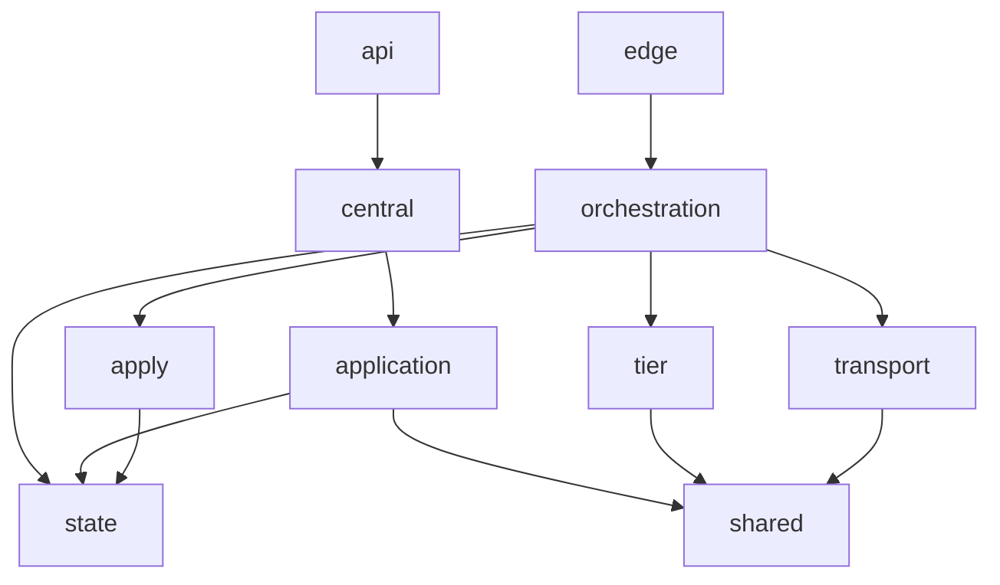
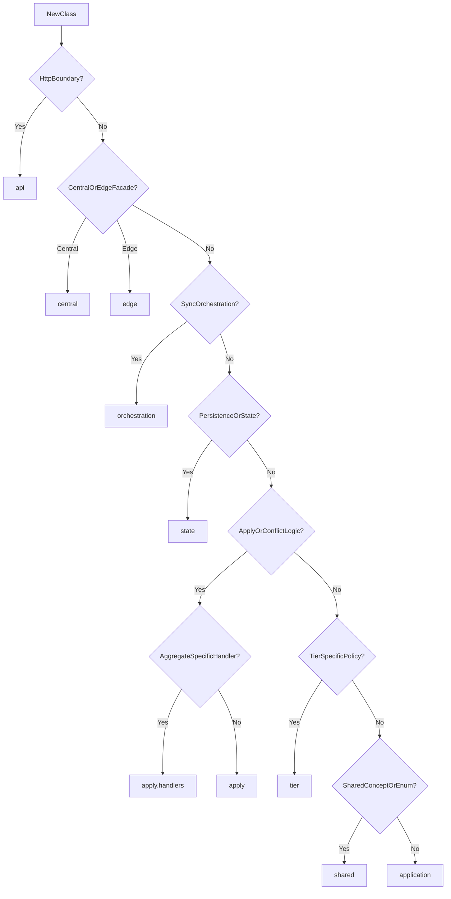

# Sync Service Package Map

## Purpose

This document defines the target package map for `sync-service` after the refactor toward tier-neutral orchestration and canonical package ownership.

Its goal is to keep new code aligned with the current architecture so the codebase does not drift back into mixed-responsibility packages.

## Current Design Direction

The intended dependency direction for new sync code is:

## Package Ownership

### `api`

Responsibility:

- HTTP controllers
- sync API DTOs
- request validation at the HTTP boundary

Contains today:

- `SyncController`
- `SyncDtos`

Rules:

- Keep business orchestration out of this package.
- Controllers should delegate into a facade or use-case service immediately.

### `central`

Responsibility:

- central runtime boundary
- central-facing facade layer called by controllers
- grouped central use-cases by responsibility

Contains today:

- `CentralSyncFacade`
- `central.ingest/*`
- `central.feed/*`
- `central.outbox/*`
- `central.node/*`

Rules:

- `CentralSyncFacade` stays as the stable boundary used by `api`.
- Group central growth by use-case shape before adding more classes into `application`.
- Central grouped use-cases may compose `application` services.
- Do not put persistence, transport implementation, or SQL code here.

### `edge`

Responsibility:

- edge runtime boundary
- edge-facing entry points used by schedulers or edge runtime adapters

Contains today:

- `TieredSyncFacade`
- `EdgeSyncFacade`

Rules:

- Edge facade methods should stay thin and delegate to orchestration.
- Do not embed tier policy or payload apply logic here.

### `orchestration`

Responsibility:

- tier-neutral sync engine orchestration
- `syncUp` / `syncDown` flow composition
- coordination across transport, state, tier, and apply layers

Contains today:

- `TieredSyncOrchestrator`

Rules:

- This package owns flow coordination, not low-level data access.
- No SQL, payload parsing details, or controller concerns here.

### `transport`

Responsibility:

- transport-facing contracts
- upstream/downstream sync client abstractions
- transport-specific adapter subpackages

Contains today:

- `CentralSyncClient`
- `transport.http/HttpCentralSyncClient`

Rules:

- Put new transport contracts here.
- Concrete transport adapters should prefer a dedicated subpackage such as `transport.http`.
- Do not place new transport adapters into `infrastructure`.

### `state`

Responsibility:

- persistence and mutable sync state
- repository implementation
- state store abstractions for orchestration

Contains today:

- `SyncRepository`
- `SyncStateStore`
- `DatabaseSyncStateStore`

Rules:

- Any new DB access for sync state belongs here.
- Offset, inbox, outbox, ack, sync log, and conflict persistence should stay here.
- Do not put transport or payload apply policy here.

### `apply`

Responsibility:

- local apply pipeline
- event routing
- conflict/apply policy
- apply-scoped helpers

Contains today:

- `SyncPayloadRouter`
- `SyncConflictPolicy`
- `SyncEventApplier`
- `RouterSyncEventApplier`
- `PayloadJson`

Rules:

- Generic apply logic lives here.
- Aggregate-specific handlers do not live directly here; they go under `apply.handlers`.

### `apply.handlers`

Responsibility:

- aggregate-specific local apply implementations

Contains today:

- `ProductSyncPayloadHandler`
- `CategorySyncPayloadHandler`
- `PricePolicySyncPayloadHandler`
- `MenuSyncPayloadHandler`
- `PromotionSyncPayloadHandler`
- `ItemAvailabilitySyncPayloadHandler`
- `StoreConfigSyncPayloadHandler`

Rules:

- One handler should own one aggregate/event family.
- Handler code may use `apply.PayloadJson` and write through SQL directly if the logic is truly handler-local.
- Do not place generic routing or policy code here.

### `tier`

Responsibility:

- tier model
- profile resolution
- tier-specific policy by `MASTER`, `REGIONAL`, `OUTLET`

Contains today:

- `SyncTierProfile`
- `SyncTierProfileRegistry`
- `tier/master/*`
- `tier/regional/*`
- `tier/outlet/*`

Rules:

- Any policy that changes by tier belongs here.
- Do not place mutable state logic or runtime adapter code here.

### `shared`

Responsibility:

- cross-cutting sync concepts
- shared enums and small abstractions used across multiple layers

Contains today:

- `SyncTier`
- `SyncRuntimeMode`
- `SyncRuntimeRoleResolver`
- `SyncTransportClient`

Rules:

- Keep this package small and concept-focused.
- Do not use `shared` as a catch-all for unclear ownership.

### `application`

Responsibility:

- runtime bootstrap
- configuration
- scheduler and health support
- central use-case services that are not yet worth splitting further

Contains today:

- `SyncProperties`
- `SyncConfiguration`
- `StoreSyncAgentScheduler`
- `SyncRuntimeHealthIndicator`
- `RuntimeRoleSupport`
- `SyncUploadService`
- `SyncDownloadService`
- `SyncInboxService`
- `SyncStatusService`
- `SyncOutboxService`
- `SyncNodeAuthService`
- `SyncNodeProvisioningService`

Rules:

- This package is still allowed, but it is no longer the default landing zone.
- If a central concern already fits `central.ingest`, `central.feed`, `central.outbox`, or `central.node`, prefer that grouped central package as the entry shape.
- New code should go here only when it is truly bootstrap/runtime/use-case glue and does not fit a more specific package.

## Packages To Keep

These packages are part of the target structure and should continue to be used:

- `api`
- `central`
- `edge`
- `orchestration`
- `transport`
- `state`
- `apply`
- `apply.handlers`
- `tier`
- `shared`
- `application`

## Packages To Avoid For New Code

### Avoid `application` when a narrower home already exists

Do not put a new class in `application` if it is clearly:

- a transport contract
- a repository/state concern
- an apply policy or apply handler
- a tier policy
- an edge or central boundary facade

### Avoid `model` for behavior

`model` should remain focused on sync enums and value-like domain concepts such as:

- `AggregateType`
- `EventType`
- `SyncDirection`
- `SyncStatus`
- `ConflictResolution`
- `TargetScope`

Do not place services, orchestration, adapters, or package-level policies here.

### Avoid reviving `infrastructure` as a generic bucket

`infrastructure` should not receive new repository, handler, or business adapter code.

At this point it should not be the default home even for transport adapters, because `transport.http` is now the canonical placement for HTTP sync adapters.

## Placement Rules For New Classes

### Rule 1: Start from the boundary

- HTTP boundary -> `api`
- central runtime boundary -> `central`
- edge runtime boundary -> `edge`

If it is part of central runtime flow shape:

- ingest/upload/ack entry logic -> `central.ingest`
- download/status/feed entry logic -> `central.feed`
- central outbox publish entry logic -> `central.outbox`
- node provision/rotate/revoke/handshake entry logic -> `central.node`

### Rule 2: If it coordinates flow, place it in orchestration

- sync loop coordination
- multi-step `syncUp` / `syncDown`
- interaction across transport, tier, apply, and state

-> `orchestration`

### Rule 3: If it reads or writes sync state, place it in state

- repository methods
- cursor persistence
- inbox/outbox state
- sync logs
- conflict rows

-> `state`

### Rule 4: If it decides how to apply or routes apply, place it in apply

- apply routing
- conflict policy
- apply-scoped helper parsing

-> `apply`

If it is aggregate-specific apply logic:

-> `apply.handlers`

### Rule 5: If it varies by tier, place it in tier

- `MASTER` / `REGIONAL` / `OUTLET` behavior
- push/pull eligibility
- forwarding or filtering policy by tier

-> `tier`

### Rule 6: Use shared only for truly shared concepts

- enums
- neutral abstractions
- tiny cross-cutting concepts

-> `shared`

Do not move something to `shared` just because its correct home is not obvious yet.

### Rule 7: Use application as the fallback, not the default

Only place code in `application` when:

- it is runtime/config glue, or
- it is an underlying central use-case service still reused by grouped `central/*` entry classes, or
- it does not yet fit any more specific package without forcing an artificial split

## Placement Decision Tree

## Team Guidance

- New sync engine work should normally flow through `edge/central -> orchestration -> transport/state/apply/tier`.
- `application` is no longer the default place to put a new service.
- If a class feels like it could go in many places, stop and classify its single primary responsibility first.
- Prefer placing code correctly on day one over adding “temporary” classes in broad packages and cleaning them later.
