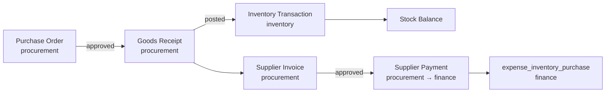
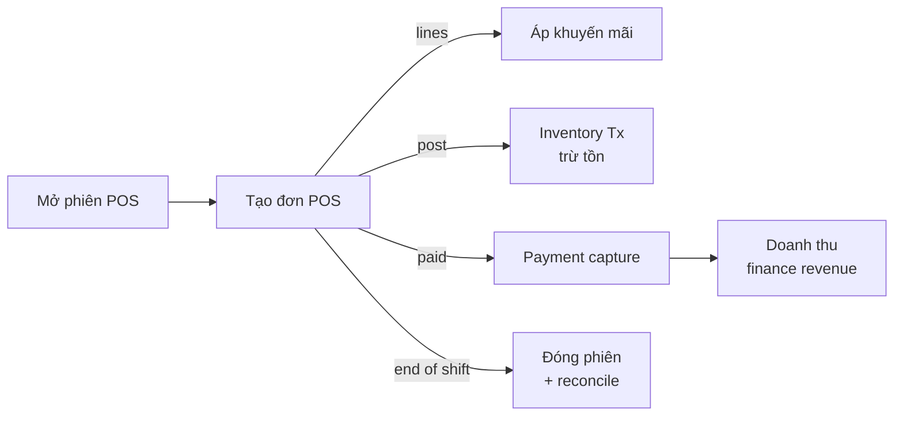
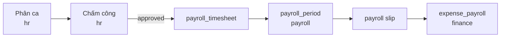
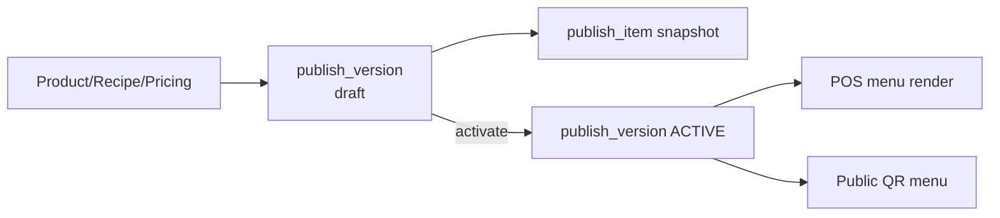
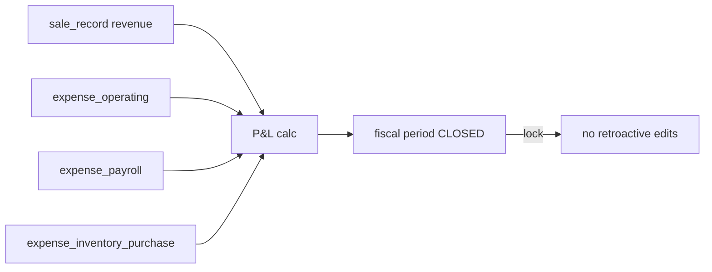
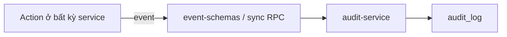

# INTER-MODULE FLOWS — Luồng nghiệp vụ xuyên module

Mô tả các flow vắt qua ≥2 service. Chi tiết từng bước nằm trong UC từng module; tài liệu này giữ bức tranh tổng.

## 1. Procure-to-Pay (P2P)

- UC liên quan: `UC-PROC-001` (PO), `UC-PROC-002` (GR), `UC-PROC-003` (Invoice), `UC-FIN-001` (Payment).
- Three-way match: PO ↔ GR ↔ Invoice trước khi duyệt thanh toán.

## 2. Order-to-Cash (O2C) — POS

- UC: `UC-POS-001..006`.
- `sale_item_transaction` ghi nối đơn → kho (mỗi sale_item sinh inventory_transaction).

## 3. Workforce-to-Payroll

- UC: `UC-HR-002` (phân ca), `UC-HR-003` (phê duyệt), `UC-FIN-002` (chạy bảng lương).

## 4. Catalog Publish

- UC: `UC-CAT-004` (xuất bản menu).
- Chỉ 1 `publish_version` ACTIVE mỗi (outlet × channel × daypart).

## 5. Period Close — Finance

- UC: `UC-FIN-003` (đóng kỳ), `UC-FIN-004` (P&L report).

## 6. Audit sidecar (mọi module)

Tất cả module ghi domain event → `audit-service` sink → `audit_log` / `catalog_audit_log`.

- UC: `UC-AUD-001..004`.
