# STATE MACHINES — Sơ đồ trạng thái các thực thể chính

Mỗi sơ đồ phản ánh enum/trạng thái hiện có trong code & migration.

## 1. Purchase Order

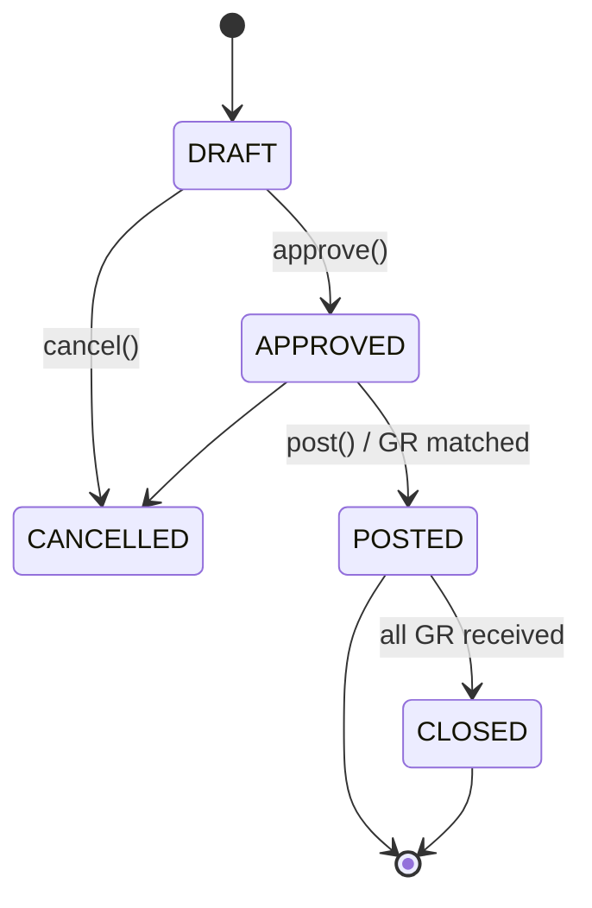

## 2. Goods Receipt

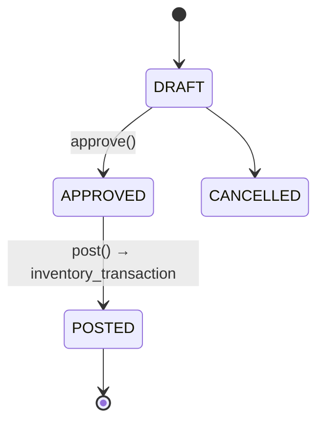

## 3. Supplier Invoice

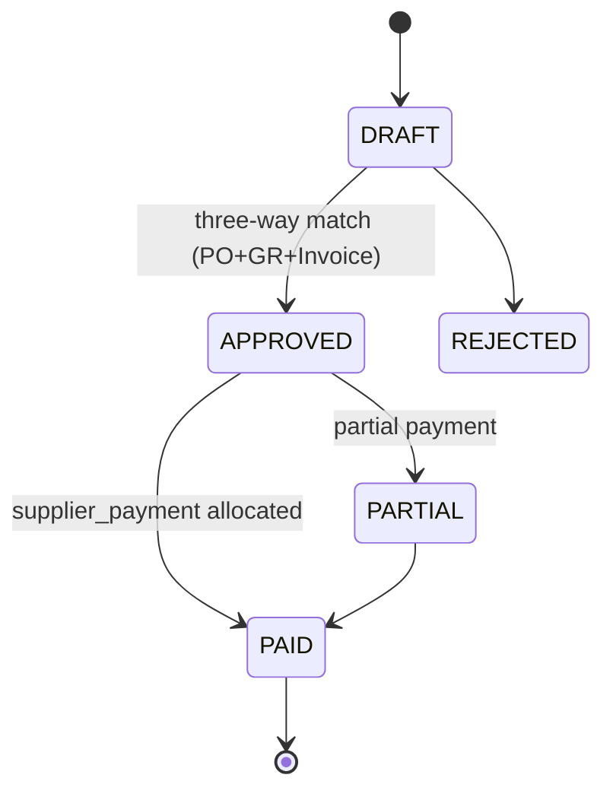

## 4. Supplier Payment

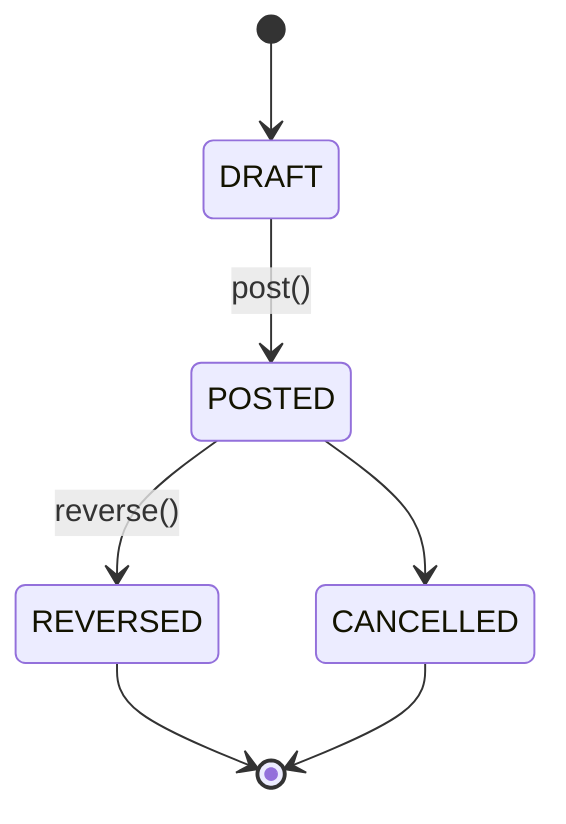

## 5. POS Session

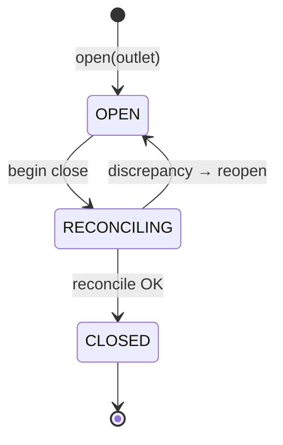

## 6. Sale Record

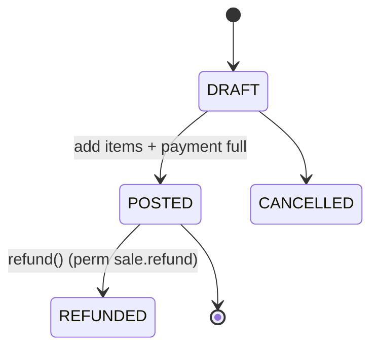

## 7. Stock Count Session

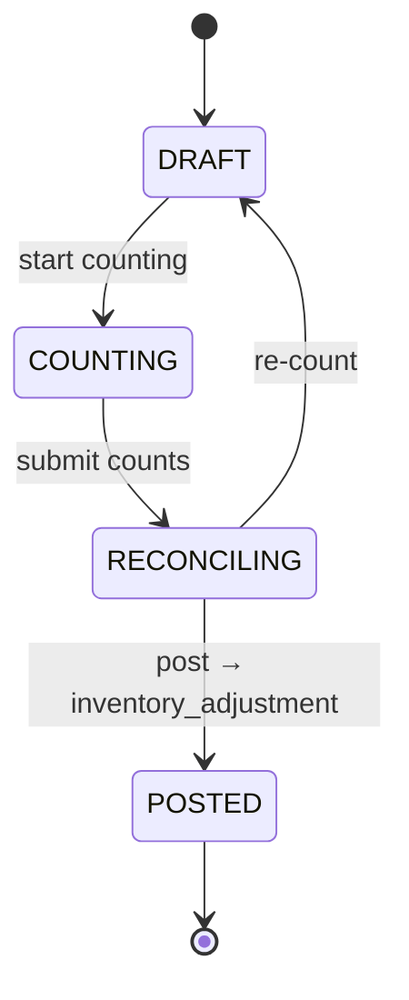

## 8. Employment Contract

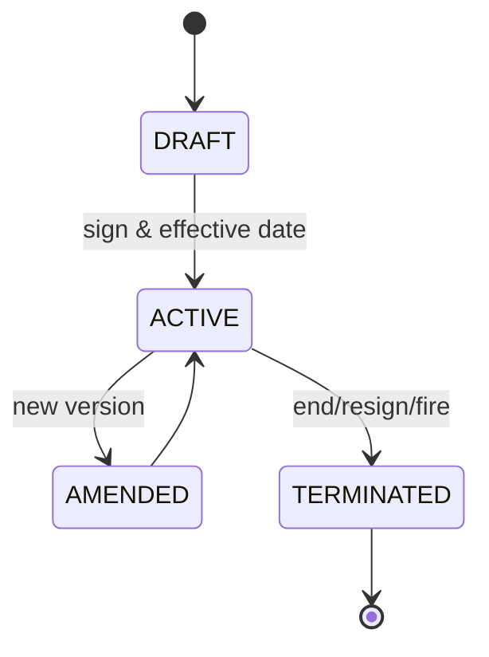

## 9. Payroll Period

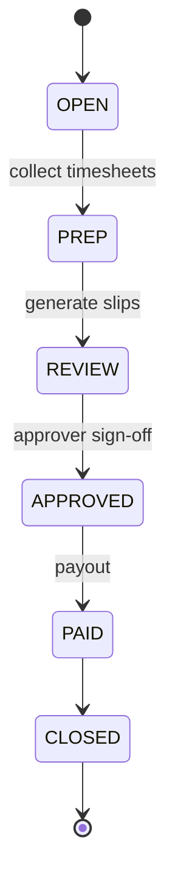

## 10. Outlet Lifecycle

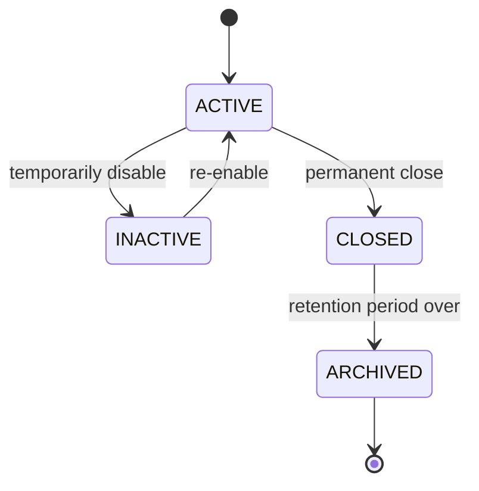

## 11. Publish Version (Menu)

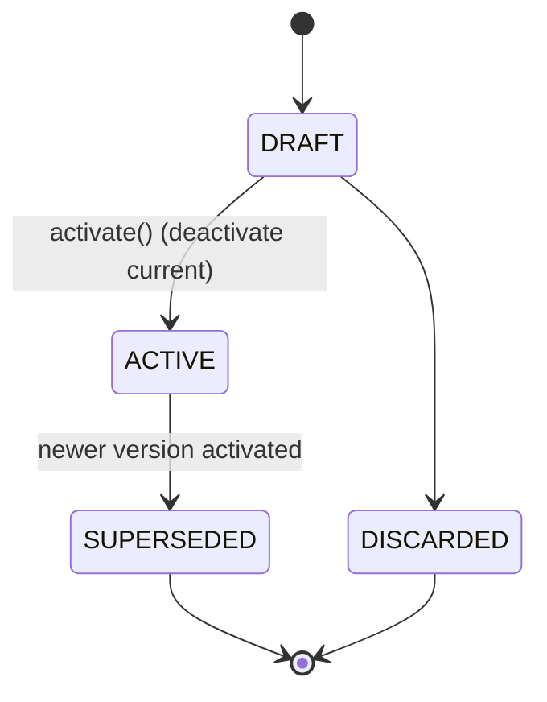
