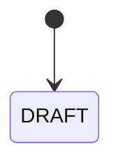
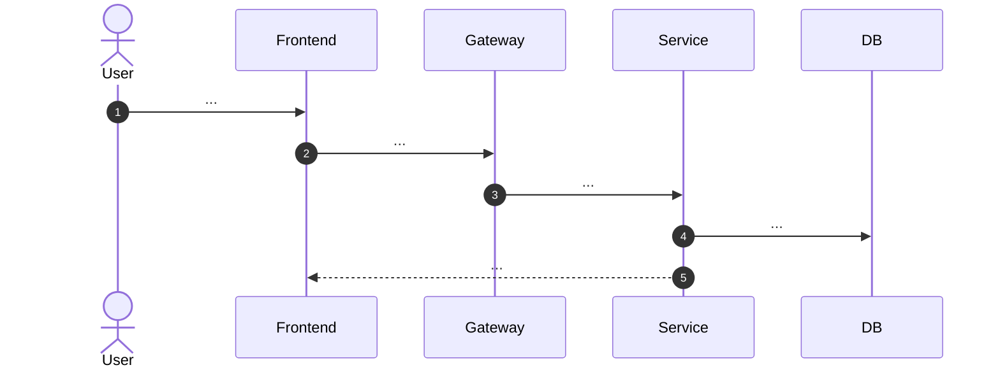

# UC-<MODULE>-<NNN>: <Tên Use Case>

**Module:** `<module>`
**Mô tả ngắn:** <1–2 câu>
**Phiên bản SRS:** 1.0
**Source code tham chiếu:**

- Backend: `services/<svc>/...`
- Frontend: `frontend/src/components/<domain>/...`
- DB: `db/migrations/V<n>__<name>.sql`

## 1. Actors & quyền

| Actor | Role code | Permission cần thiết |
|-------|-----------|----------------------|
|       |           |                      |

## 2. Điều kiện

- **Tiền điều kiện:**
- **Hậu điều kiện (thành công):**
- **Hậu điều kiện (thất bại):**

## 3. Thực thể dữ liệu

| Entity | Bảng DB | Service |
|--------|---------|---------|
|        |         |         |

## 4. API endpoints liên quan

| Method | Path | Controller#handler |
|--------|------|--------------------|
|        |      |                    |

## 5. Luồng chính (MAIN)

1. ...

## 6. Luồng thay thế / lỗi (ALT / EXC)

- **ALT-1** — ...
- **EXC-1** — ... → HTTP status, error code

## 7. Quy tắc nghiệp vụ

- **BR-1** — ...

## 8. State machine

## 9. Sequence diagram

## 10. Ghi chú & dependency liên module

- ...
