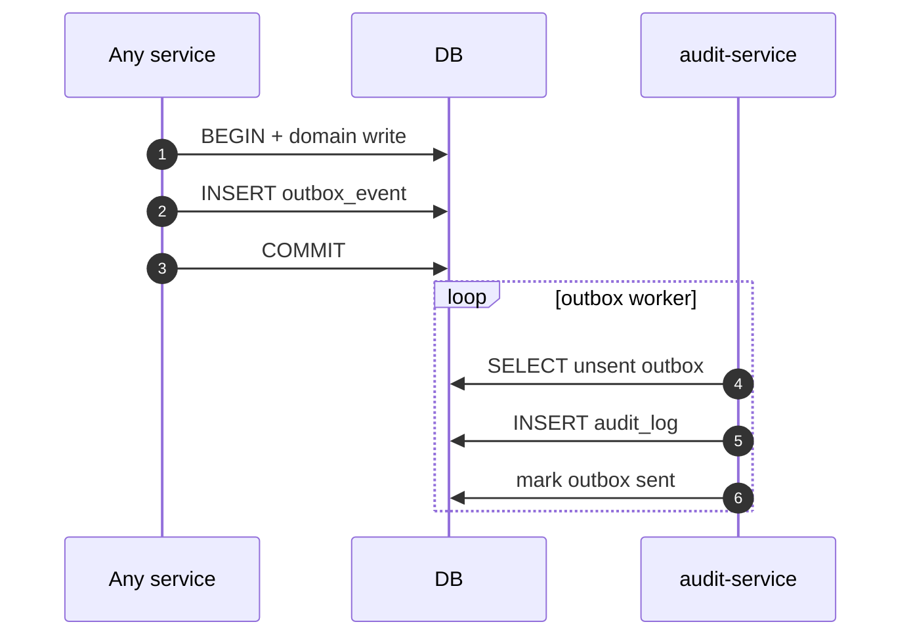

# UC-AUD-004: Ghi audit log hệ thống (write flow)

**Module:** Audit & Traceability
**Mô tả ngắn:** Mọi service ghi audit log khi thực hiện domain action; `audit_log` (chung) và `catalog_audit_log` (riêng cho catalog publish).
**Phiên bản SRS:** 1.0
**Source code tham chiếu:**

- Backend: [AuditController.java](../../services/audit-service/src/main/java/com/fern/services/audit/api/AuditController.java)
- Common: `common/event-schemas`
- Catalog audit: [PublishController.java](../../services/product-service/src/main/java/com/fern/services/product/api/PublishController.java) (`GET /audit-log`)
- DB: `V15__catalog_publish_and_audit.sql`

## 1. Actors

| Actor | Vai trò |
|-------|---------|
| Service backend (mọi module) | ghi event |
| audit-service | sink + expose read API |

## 2. Thực thể dữ liệu

| Entity | Bảng |
|--------|------|
| Audit Log | `audit_log` |
| Catalog Audit Log | `catalog_audit_log` |

## 3. Bố cục bản ghi

```json
{
  "id": 123,
  "occurredAt": "2026-04-21T10:00:00Z",
  "actorId": 4004,
  "actorRole": "outlet_manager",
  "outletId": 2000,
  "module": "sales",
  "entityType": "sale_record",
  "entityId": "sale-123",
  "action": "paid",
  "eventName": "sale.paid",
  "requestId": "req-abc",
  "payload": { ... delta ... }
}
```

## 4. Luồng chính (MAIN)

1. Service thực hiện action (ví dụ `SalesController#markPaymentDone`).
2. Trong cùng transaction hoặc outbox:
   - Option A (sync): INSERT trực tiếp vào `audit_log` cùng DB.
   - Option B (async outbox): ghi `outbox_event` → worker đẩy sang `audit-service`.
3. audit-service validate schema (dựa trên `event-schemas`) → persist.
4. Emit notification (nếu severity CRITICAL).

## 5. Quy tắc nghiệp vụ

- **BR-1** — Audit write KHÔNG được làm fail domain transaction; nếu outbox fail, retry.
- **BR-2** — Payload không chứa bí mật (password, token).
- **BR-3** — Event schema versioned (`eventName@v1`).
- **BR-4** — `catalog_audit_log` riêng để chịu tải publish và có schema chuyên biệt.

## 6. Sequence diagram



## 7. Ghi chú

- Public endpoint (QR) cũng ghi audit với actor `system:public`.
- Retention & redaction policy: doc riêng.
