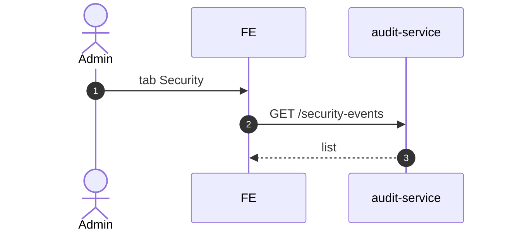

# UC-AUD-002: Xem sự kiện bảo mật

**Module:** Audit & Traceability
**Mô tả ngắn:** Xem các sự kiện bảo mật (login fail, permission denied, session revoke, unusual IP).
**Phiên bản SRS:** 1.0
**Source code tham chiếu:**

- Backend: [AuditReadController.java](../../services/audit-service/src/main/java/com/fern/services/audit/api/AuditReadController.java) (`GET /security-events`)
- Frontend: [AuditModule.tsx](../../frontend/src/components/audit/AuditModule.tsx) (tab Security)

## 1. Actors & quyền

| Actor | Role | Permission |
|-------|------|------------|
| Admin | `admin` | `audit.read` |
| Superadmin | `superadmin` | inherit |

## 2. API endpoints

| Method | Path | Handler |
|--------|------|---------|
| GET | `/api/v1/audit/security-events` | `AuditReadController#listSecurityEvents` |

## 3. Luồng chính (MAIN)

1. Actor mở tab Security.
2. Filter `{ severity, eventType, from, to }`.
3. FE gọi endpoint.
4. Service trả list với severity `INFO|WARN|CRITICAL`.

## 4. Quy tắc nghiệp vụ

- **BR-1** — Sự kiện CRITICAL (brute-force, escalation) alert push (nếu config).
- **BR-2** — Giữ tối thiểu 180 ngày (policy retention).

## 5. Event type đề xuất

| Type | Severity |
|------|---------:|
| `auth.login.failure` | WARN |
| `auth.brute_force_suspected` | CRITICAL |
| `auth.permission.denied` | INFO |
| `auth.session.revoked_force` | WARN |
| `auth.override.escalation` | CRITICAL |

## 6. Sequence diagram

