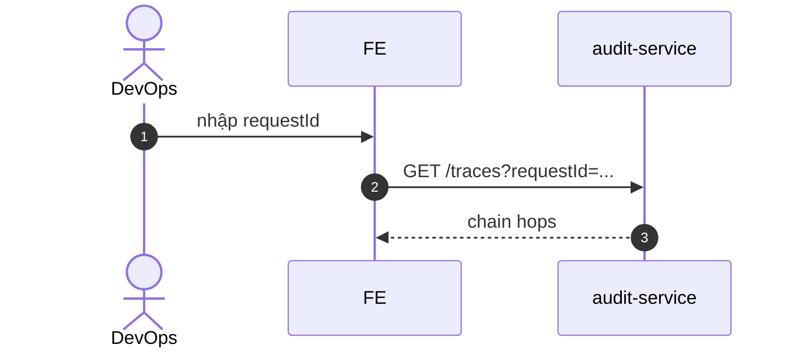

# UC-AUD-003: Truy vết request

**Module:** Audit & Traceability
**Mô tả ngắn:** Xem request trace (requestId, gateway → service hop) cho debug.
**Phiên bản SRS:** 1.0
**Source code tham chiếu:**

- Backend: [AuditReadController.java](../../services/audit-service/src/main/java/com/fern/services/audit/api/AuditReadController.java) (`GET /traces`)
- Frontend: [AuditModule.tsx](../../frontend/src/components/audit/AuditModule.tsx) (tab Traces)

## 1. Actors & quyền

| Actor | Role | Permission |
|-------|------|------------|
| Admin / Superadmin | `admin`/`superadmin` | `audit.read` |
| Dev ops | (role riêng nếu có) | `audit.read` |

## 2. API endpoints

| Method | Path | Handler |
|--------|------|---------|
| GET | `/api/v1/audit/traces` | `AuditReadController#listTraces` |

## 3. Luồng chính (MAIN)

1. Actor nhập `requestId` hoặc filter.
2. `GET /traces?requestId=...`.
3. Service trả chain: gateway → service(s) → DB hop với latency.

## 4. Quy tắc nghiệp vụ

- **BR-1** — `requestId` propagate từ gateway (header `X-Request-Id`).
- **BR-2** — Trace lưu N ngày (policy).

## 5. Sequence diagram

## 6. Ghi chú

- Gắn kết OpenTelemetry nếu bật.
