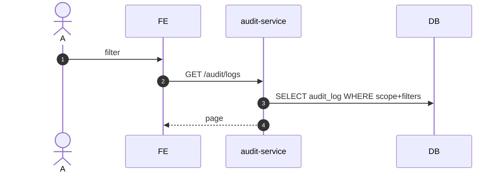

# UC-AUD-001: Xem nhật ký audit

**Module:** Audit & Traceability
**Mô tả ngắn:** Tra cứu `audit_log` theo actor/entity/action/time range; có filter scope outlet/region.
**Phiên bản SRS:** 1.0
**Source code tham chiếu:**

- Backend: [AuditController.java](../../services/audit-service/src/main/java/com/fern/services/audit/api/AuditController.java)
- Frontend: [AuditModule.tsx](../../frontend/src/components/audit/AuditModule.tsx) (tab Explorer)

## 1. Actors & quyền

| Actor | Role | Permission |
|-------|------|------------|
| Admin | `admin` | `audit.read` |
| Region Manager | `region_manager` | (scope region) |
| Outlet Manager | `outlet_manager` | (scope outlet) |
| Superadmin | `superadmin` | inherit |

## 2. API endpoints

| Method | Path | Handler |
|--------|------|---------|
| GET | `/api/v1/audit/logs` | `AuditController#listLogs` |
| GET | `/api/v1/audit/logs/{id}` | `AuditController#getLog` |

## 3. Luồng chính (MAIN)

1. Actor mở tab Explorer.
2. Filter `{ actorId?, entityType?, entityId?, action?, from, to, outletId? }`.
3. FE `GET /audit/logs` + query params (paginate limit+offset).
4. Service scope-filter trước khi trả.
5. FE render bảng + drill-down `{id}`.

## 4. Lỗi

- **EXC-1** Không permission → `403`.
- **EXC-2** Range quá rộng → `400 RANGE_TOO_LARGE`.

## 5. Quy tắc nghiệp vụ

- **BR-1** — `audit_log` immutable; không expose DELETE.
- **BR-2** — Filter scope bắt buộc cho non-admin.

## 6. Sequence diagram

## 7. Ghi chú

- Event name convention: `<module>.<entity>.<action>`.
