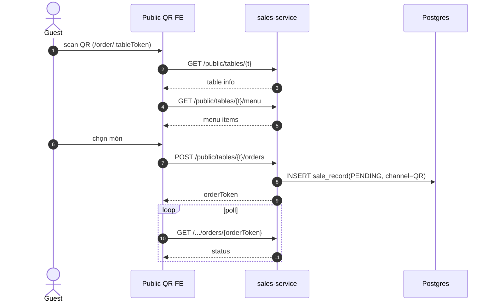

# UC-POS-006: Đặt hàng qua QR (public)

**Module:** Bán hàng & POS (public surface)
**Mô tả ngắn:** Khách scan QR bàn, xem menu theo `ordering_table`, đặt order không cần đăng nhập; order vào queue bếp/thu ngân tại outlet.
**Phiên bản SRS:** 1.0
**Source code tham chiếu:**

- Backend: [PublicPosController.java](../../services/sales-service/src/main/java/com/fern/services/sales/api/PublicPosController.java)
- Frontend: [frontend/src/pages](../../frontend/src/pages) — route `/order/:tableToken`, `/posorder`
- DB: `V5__public_pos_ordering_tables.sql`, `V6__public_pos_order_tracking.sql`

## 1. Actors & quyền

| Actor | Quyền |
|-------|-------|
| Guest (khách) | Không cần auth — truy cập bằng `tableToken` |
| Staff (queue nhận) | `cashier` (phía nội bộ tiếp nhận) |

## 2. Điều kiện

- **Tiền điều kiện:** `ordering_table` active, `tableToken` hợp lệ, outlet còn mở bán, có `publish_version` ACTIVE cho kênh QR.
- **Hậu điều kiện (thành công):** `sale_record` tạo mới trạng thái `PENDING` kèm `ordering_table_id`, `order_token` trả về cho khách để track.
- **Hậu điều kiện (thất bại):** Không tạo order; khách thấy thông báo lỗi thân thiện.

## 3. Thực thể dữ liệu

| Entity | Bảng | Service |
|--------|------|---------|
| Ordering Table | `ordering_table` | sales-service |
| Sale Record (public) | `sale_record` (+ order_token) | sales-service |

## 4. API endpoints (public — không auth)

| Method | Path | Handler |
|--------|------|---------|
| GET | `/api/v1/sales/public/tables/{tableToken}` | `PublicPosController#getTable` |
| GET | `/api/v1/sales/public/tables/{tableToken}/menu` | `PublicPosController#getMenu` |
| POST | `/api/v1/sales/public/tables/{tableToken}/orders` | `PublicPosController#placeOrder` |
| GET | `/api/v1/sales/public/tables/{tableToken}/orders/{orderToken}` | `PublicPosController#getOrder` |

## 5. Luồng chính (MAIN)

1. Khách scan QR → FE public load với `tableToken`.
2. FE gọi `GET /public/tables/{tableToken}` — kiểm bàn hợp lệ, lấy `outletId`.
3. FE gọi `GET /public/tables/{tableToken}/menu` — lấy menu ACTIVE cho outlet/channel QR.
4. Khách chọn món + modifier → FE gọi `POST /public/tables/{tableToken}/orders` với `{ items, customerNote? }`.
5. Service tạo `sale_record` (`channel = QR`, `ordering_table_id`, `status = PENDING`), phát event `public.order.placed`.
6. Service trả `orderToken` để khách poll `GET /.../orders/{orderToken}` theo dõi trạng thái.
7. Staff bên trong (queue) duyệt → flow chuyển sang UC-POS-002/003 bình thường.

## 6. Luồng thay thế / lỗi

- **EXC-1 Token sai/khóa** → `404 TABLE_NOT_FOUND` hoặc `410 TABLE_DISABLED`.
- **EXC-2 Ngoài giờ mở** → `409 OUTLET_CLOSED`.
- **EXC-3 Món ngoài menu** → `422 ITEM_NOT_AVAILABLE`.
- **EXC-4 Vượt rate limit** → `429` (public endpoint có throttle).

## 7. Quy tắc nghiệp vụ

- **BR-1** — Endpoint public không nhận thông tin cá nhân nhạy cảm.
- **BR-2** — Mỗi `tableToken` ánh xạ 1 outlet; một bàn 1 thời điểm có thể có nhiều order "in-progress".
- **BR-3** — Thanh toán: khách trả tại quầy hoặc qua flow thanh toán mở rộng (ngoài phạm vi UC này).
- **BR-4** — Order do guest tạo phải được staff `confirm` trước khi in bếp (chặn spam).

## 8. State machine

Order public dùng cùng state machine `sale_record` + bước `PENDING → CONFIRMED → POSTED`.

## 9. Sequence diagram

## 10. Ghi chú liên module

- Staff confirm: gọi `UC-POS-002` `#confirm` rồi `#markPaymentDone` khi khách trả.
- Audit: `public.order.placed`.
- Rate-limit / abuse: xử lý tại gateway.
