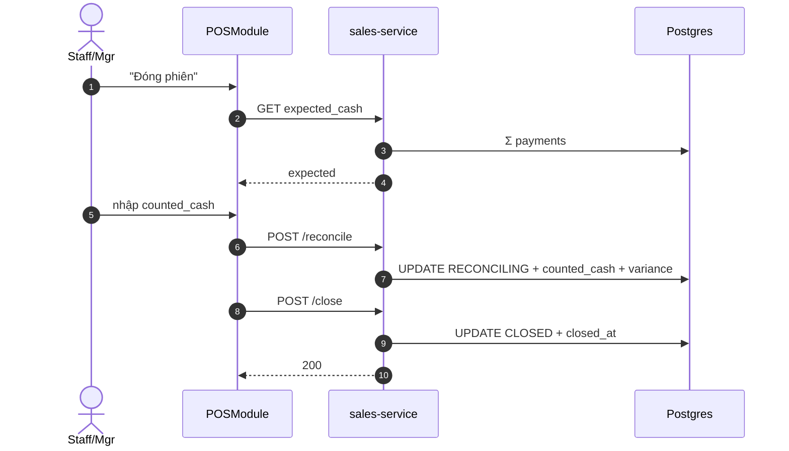

# UC-POS-005: Đóng & đối soát phiên POS

**Module:** Bán hàng & POS
**Mô tả ngắn:** Outlet Manager/Staff đối soát tiền mặt thực tế với `pos_session.expected_cash`, ghi chênh lệch và đóng phiên.
**Phiên bản SRS:** 1.0
**Source code tham chiếu:**

- Backend: [SalesController.java](../../services/sales-service/src/main/java/com/fern/services/sales/api/SalesController.java)
  - `POST /api/v1/sales/pos-sessions/{sessionId}/reconcile`
  - `POST /api/v1/sales/pos-sessions/{sessionId}/close`
- Frontend: [frontend/src/components/pos/POSModule.tsx](../../frontend/src/components/pos/POSModule.tsx)
- DB: `V11__pos_session_reconciliation.sql`

## 1. Actors & quyền

| Actor | Role | Permission |
|-------|------|------------|
| Outlet Manager | `outlet_manager` | `sales.order.write` |
| Staff (nếu policy cho phép tự đóng) | `cashier` | `sales.order.write` |

## 2. Điều kiện

- **Tiền điều kiện:** `pos_session.status = OPEN` của user; không còn order `DRAFT` hoặc `PENDING_PAYMENT`.
- **Hậu điều kiện (thành công):** `pos_session.status = CLOSED`, `closed_at`, `expected_cash`, `counted_cash`, `cash_variance`, `reconciler_id` ghi đầy đủ.
- **Hậu điều kiện (thất bại):** Phiên giữ nguyên OPEN hoặc RECONCILING.

## 3. Thực thể dữ liệu

| Entity | Bảng | Service |
|--------|------|---------|
| POS Session | `pos_session` | sales-service |

## 4. API endpoints

| Method | Path | Handler |
|--------|------|---------|
| POST | `/api/v1/sales/pos-sessions/{id}/reconcile` | `SalesController#reconcile` |
| POST | `/api/v1/sales/pos-sessions/{id}/close` | `SalesController#closeSession` |

## 5. Luồng chính (MAIN)

1. Actor chọn "Đóng phiên".
2. Service tính `expected_cash = opening_cash + Σ CASH payments - refunds`.
3. Actor nhập `counted_cash` + notes; FE gọi `/reconcile`.
4. Service cập nhật `status = RECONCILING`, ghi `counted_cash`, `cash_variance`.
5. Actor xác nhận → FE gọi `/close`.
6. Service UPDATE `status = CLOSED`, `closed_at`.
7. Event `pos.session.closed` phát audit + xuất sang finance revenue pipeline.

## 6. Luồng thay thế / lỗi

- **ALT-1 Chênh lệch vượt ngưỡng** — `|cash_variance|` > policy threshold → cảnh báo FE, buộc notes; có thể yêu cầu approval.
- **EXC-1 Còn order chưa xử lý** → `409 OPEN_ORDERS_EXIST`.
- **EXC-2 Đã CLOSED** → `409 SESSION_ALREADY_CLOSED`.
- **EXC-3 Không phải owner phiên** → `403 SESSION_OWNER_MISMATCH` (trừ khi Outlet Manager ghi đè).

## 7. Quy tắc nghiệp vụ

- **BR-1** — `counted_cash >= 0`.
- **BR-2** — `cash_variance = counted_cash - expected_cash`, có thể âm/dương.
- **BR-3** — Chỉ `outlet_manager`/`superadmin` được đóng phiên của user khác.
- **BR-4** — Sau CLOSED không cho phép sửa order trong phiên.

## 8. State machine

Xem [STATE-MACHINES.md §5](../STATE-MACHINES.md#5-pos-session).

## 9. Sequence diagram

## 10. Ghi chú liên module

- Doanh thu CLOSED đẩy sang UC-FIN-004 (P&L).
- Audit: `pos.session.reconciled`, `pos.session.closed`.
