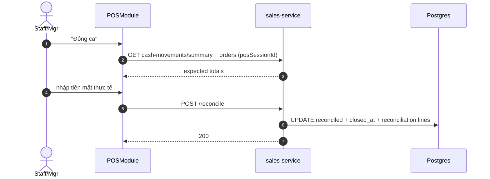

# UC-POS-005: Đóng & đối soát phiên POS

**Module:** Bán hàng & POS
**Mô tả ngắn:** Outlet Manager/Staff đối soát tiền mặt thực tế với `pos_session.expected_cash`, ghi chênh lệch và đóng phiên.
**Phiên bản SRS:** 1.0
**Source code tham chiếu:**

- Backend: [SalesController.java](../../services/sales-service/src/main/java/com/fern/services/sales/api/SalesController.java)
  - `POST /api/v1/sales/pos-sessions/{sessionId}/reconcile`
  - `POST /api/v1/sales/pos-sessions/{sessionId}/close`
- Frontend cashier: [frontend/src/routes/pos-order/components/CloseShiftDialog.tsx](../../frontend/src/routes/pos-order/components/CloseShiftDialog.tsx)
- Frontend admin: [frontend/src/components/pos/POSModule.tsx](../../frontend/src/components/pos/POSModule.tsx)
- DB: `V11__pos_session_reconciliation.sql`

## 1. Actors & quyền

| Actor | Role | Permission |
|-------|------|------------|
| Outlet Manager | `outlet_manager` | `sales.order.write` |
| Staff (nếu policy cho phép tự đóng) | `cashier` | `sales.order.write` |

## 2. Điều kiện

- **Tiền điều kiện:** `pos_session.status = OPEN` của chính cashier (`managerId` khớp user); không còn đơn `unpaid` trong phiên.
- **Hậu điều kiện (thành công):** `pos_session.status = reconciled`, `closed_at`, dòng đối soát theo phương thức thanh toán (`cash`, `card`, `ewallet`, …) được ghi đầy đủ.
- **Hậu điều kiện (thất bại):** Phiên giữ nguyên `OPEN`.

## 3. Thực thể dữ liệu

| Entity | Bảng | Service |
|--------|------|---------|
| POS Session | `pos_session` | sales-service |

## 4. API endpoints

| Method | Path | Handler |
|--------|------|---------|
| POST | `/api/v1/sales/pos-sessions/{id}/reconcile` | `SalesController#reconcile` — đóng phiên trong một bước |
| GET | `/api/v1/sales/pos-sessions/{id}/payment-summary` | Tổng theo phương thức (`cash`, `card`, `ewallet`, …) |
| GET | `/api/v1/sales/pos-sessions/{id}/cash-movements/summary` | `expectedTotal`, `openFloat`, … trước khi đối soát |

## 5. Luồng chính (MAIN)

1. Actor chọn "Đóng ca".
2. FE lấy tổng dự kiến từ `GET .../cash-movements/summary` và đơn đã thanh toán trong phiên.
3. Actor nhập tiền mặt thực tế + ghi chú; FE gọi `POST .../reconcile` với `lines[]` theo phương thức thanh toán backend (`cash`, `card`, `ewallet`, `bank_transfer`, `voucher`). QR/Ví map sang `ewallet`.
4. Service kiểm tra không còn đơn `unpaid`, tính chênh lệch từng phương thức.
5. Service cập nhật `status = reconciled`, `closed_at`, ghi dòng đối soát và `CLOSE_COUNT` cash-movement nếu có.
6. Event `pos.session.closed` phát audit + xuất sang finance revenue pipeline.

## 6. Luồng thay thế / lỗi

- **ALT-1 Chênh lệch vượt ngưỡng** — `|cash_variance|` > policy threshold → cảnh báo FE, buộc notes; có thể yêu cầu approval.
- **EXC-1 Còn order chưa thanh toán** → `409 SESSION_HAS_UNPAID_ORDERS` (FE giữ dialog, mở drawer "Đang chờ").
- **EXC-2 Đã reconciled/closed** → `409 SESSION_ALREADY_CLOSED`.
- **EXC-3 Không phải owner phiên** → `403 SESSION_OWNER_MISMATCH` (trừ khi Outlet Manager ghi đè).

## 7. Quy tắc nghiệp vụ

- **BR-1** — `counted_cash >= 0`.
- **BR-2** — `cash_variance = counted_cash - expected_cash`, có thể âm/dương.
- **BR-3** — Chỉ `outlet_manager`/`superadmin` được đóng phiên của user khác.
- **BR-4** — Sau CLOSED không cho phép sửa order trong phiên.

## 8. State machine

Xem [STATE-MACHINES.md §5](../STATE-MACHINES.md#5-pos-session).

## 9. Sequence diagram

```mermaid
sequenceDiagram
  autonumber
  actor U as Staff/Mgr
  participant FE as POSModule
  participant S as sales-service
  participant DB as Postgres
  U->>FE: "Đóng ca"
  FE->>S: GET cash-movements/summary + orders (posSessionId)
  S-->>FE: expected totals
  U->>FE: nhập tiền mặt thực tế
  FE->>S: POST /reconcile
  S->>DB: UPDATE reconciled + closed_at + reconciliation lines
  S-->>FE: 200
```

## 10. Ghi chú liên module

- Doanh thu CLOSED đẩy sang UC-FIN-004 (P&L).
- Audit: `pos.session.reconciled`, `pos.session.closed`.
