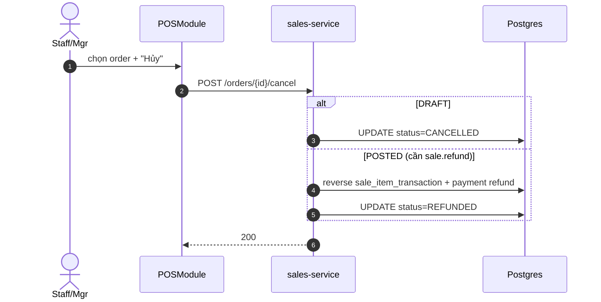

# UC-POS-004: Hủy đơn POS

**Module:** Bán hàng & POS
**Mô tả ngắn:** Hủy `sale_record` khi đang `DRAFT` (chưa post) hoặc reverse khi đã `POSTED` (cần quyền hoàn tiền).
**Phiên bản SRS:** 1.0
**Source code tham chiếu:**

- Backend: [SalesController.java](../../services/sales-service/src/main/java/com/fern/services/sales/api/SalesController.java) (`POST /api/v1/sales/orders/{saleId}/cancel`)
- Frontend: [frontend/src/components/pos/POSModule.tsx](../../frontend/src/components/pos/POSModule.tsx)

## 1. Actors & quyền

| Actor | Role | Permission |
|-------|------|------------|
| Staff | `cashier` | `sales.order.write` (chỉ DRAFT) |
| Outlet Manager | `outlet_manager` | `sales.order.write` + `sale.refund` |
| Superadmin | `superadmin` | inherit |

## 2. Điều kiện

- **Tiền điều kiện:** order thuộc phiên OPEN của user; nếu đã POSTED → actor phải có `sale.refund`.
- **Hậu điều kiện (thành công):**
  - DRAFT → `CANCELLED`; tồn đã reserve được release.
  - POSTED → `REFUNDED`; `sale_item_transaction` reverse, `stock_balance` hoàn, `payment.refund` ghi.
- **Hậu điều kiện (thất bại):** Giữ nguyên.

## 3. Thực thể dữ liệu

| Entity | Bảng | Service |
|--------|------|---------|
| Sale Record | `sale_record` | sales-service |
| Sale Item Transaction (reverse) | `sale_item_transaction` | sales-service |
| Payment refund | `payment` | sales-service |

## 4. API endpoints

| Method | Path | Controller#handler |
|--------|------|--------------------|
| POST | `/api/v1/sales/orders/{saleId}/cancel` | `SalesController#cancel` |

## 5. Luồng chính (MAIN — DRAFT)

1. Actor chọn order DRAFT → "Hủy".
2. FE gọi `POST /orders/{id}/cancel` body `{ reason }`.
3. Service validate `status = DRAFT`, scope user.
4. Service UPDATE `sale_record.status = CANCELLED`, release reservation tồn (nếu có).
5. Service phát event `sale.cancelled`.

## 5b. Luồng hoàn (MAIN — POSTED refund)

1. Actor OutletManager chọn order POSTED → "Hoàn".
2. Kiểm tra permission `sale.refund`.
3. Service BEGIN txn: insert reverse `sale_item_transaction` (hoàn tồn), insert `payment` âm (`amount < 0`), UPDATE `sale_record.status = REFUNDED`.
4. COMMIT + event `sale.refunded`.

## 6. Luồng thay thế / lỗi

- **EXC-1 Không quyền refund** → `403 MISSING_PERMISSION_SALE_REFUND`.
- **EXC-2 Đã CANCELLED/REFUNDED** → `409 SALE_NOT_CANCELLABLE`.
- **EXC-3 Phiên đã đóng** → `409 POS_SESSION_CLOSED` (hoàn phải cùng phiên hoặc dùng flow hoàn hậu kỳ tùy policy).
- **EXC-4 Reason trống** (nếu bắt buộc) → `400 REASON_REQUIRED`.

## 7. Quy tắc nghiệp vụ

- **BR-1** — Lý do hủy ≥ 1 ký tự (khuyến nghị enum reason codes).
- **BR-2** — Refund phải reverse đúng số lượng line, không partial trừ khi policy cho phép.
- **BR-3** — Mọi hủy/refund ghi audit kèm `actor_id`, `reason`.

## 8. State machine

Xem [STATE-MACHINES.md §6](../STATE-MACHINES.md#6-sale-record).

## 9. Sequence diagram

## 10. Ghi chú liên module

- Audit: `sale.cancelled`, `sale.refunded`.
- Tồn: release/hoàn trực tiếp qua trigger `stock_balance`.
