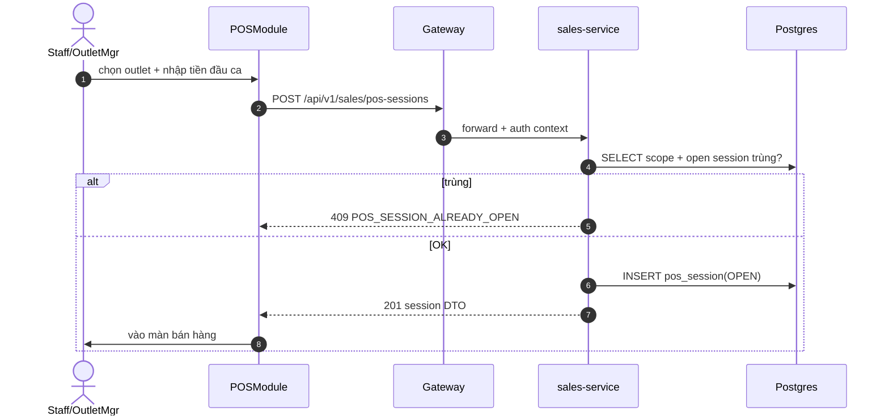

# UC-POS-001: Mở phiên POS

**Module:** Bán hàng & POS
**Mô tả ngắn:** Outlet Manager/Staff mở phiên làm việc POS tại outlet; hệ thống khởi tạo `pos_session` trạng thái `OPEN` với tiền đầu ca.
**Phiên bản SRS:** 1.0
**Source code tham chiếu:**

- Backend: [services/sales-service/.../api/SalesController.java](../../services/sales-service/src/main/java/com/fern/services/sales/api/SalesController.java) (`POST /api/v1/sales/pos-sessions`)
- Frontend: [frontend/src/components/pos/POSModule.tsx](../../frontend/src/components/pos/POSModule.tsx)
- DB: `db/migrations/V1__core_schema.sql`, `V11__pos_session_reconciliation.sql`

## 1. Actors & quyền

| Actor | Role code | Permission |
|-------|-----------|------------|
| Outlet Manager | `outlet_manager` | `sales.order.write` |
| Staff (thu ngân) | `cashier` | `sales.order.write` |
| Superadmin | `superadmin` | inherit |

## 2. Điều kiện

- **Tiền điều kiện:**
  - User đã đăng nhập (`auth_session` hợp lệ), có scope outlet đích.
  - Outlet có `status = active`.
  - Không có `pos_session` nào ở trạng thái `OPEN` cho cùng `(outlet_id, user_id)`.
- **Hậu điều kiện (thành công):** `pos_session` mới `status = OPEN`, `opened_at = now()`, `opening_cash` đã ghi; event `pos.session.opened` được phát.
- **Hậu điều kiện (thất bại):** Không tạo session; state outlet/user nguyên vẹn.

## 3. Thực thể dữ liệu

| Entity | Bảng DB | Service |
|--------|---------|---------|
| POS Session | `pos_session` | sales-service |
| Outlet | `outlet` | org-service |
| App User | `app_user` | auth-service |

## 4. API endpoints

| Method | Path | Controller#handler |
|--------|------|--------------------|
| POST | `/api/v1/sales/pos-sessions` | `SalesController#openSession` |
| GET  | `/api/v1/sales/pos-sessions` | `SalesController#listSessions` |
| GET  | `/api/v1/sales/pos-sessions/{id}` | `SalesController#getSession` |

## 5. Luồng chính (MAIN)

1. Actor đăng nhập, chọn outlet trong scope.
2. FE gọi `POST /api/v1/sales/pos-sessions` với body `{ outletId, openingCash, notes? }`.
3. Service validate scope outlet, kiểm tra không có phiên `OPEN` trùng.
4. Service insert `pos_session` (`status = OPEN`).
5. Service phát audit event `pos.session.opened`.
6. Service trả 201 kèm DTO phiên vừa tạo.
7. FE điều hướng vào màn bán hàng gắn `sessionId`.

## 6. Luồng thay thế / lỗi

- **ALT-1** — Actor chọn outlet khác scope → EXC-2.
- **EXC-1 Phiên đã mở** — Đã có `OPEN` phiên trùng user/outlet → `409 CONFLICT`, code `POS_SESSION_ALREADY_OPEN`.
- **EXC-2 Ngoài scope** — User không có outlet đích trong `user_role.outlet_id` → `403 FORBIDDEN`, code `SCOPE_DENIED`.
- **EXC-3 Outlet inactive** — `outlet.status != active` → `409 CONFLICT`, code `OUTLET_NOT_ACTIVE`.
- **EXC-4 Validation** — `openingCash < 0` hoặc thiếu field → `400 BAD_REQUEST`.

## 7. Quy tắc nghiệp vụ

- **BR-1** — `openingCash >= 0`, đơn vị tiền lấy theo `outlet.currency_code`.
- **BR-2** — Một user không có 2 phiên `OPEN` trùng outlet.
- **BR-3** — Chỉ `outlet_manager` / `cashier` / `superadmin` được mở phiên.
- **BR-4** — `opened_at` UTC; FE hiển thị theo `region.timezone_name`.

## 8. State machine

Xem [STATE-MACHINES.md §5](../STATE-MACHINES.md#5-pos-session).

## 9. Sequence diagram

## 10. Ghi chú & dependency liên module

- Phiên mở là tiền điều kiện cho `UC-POS-002..004`.
- Đóng phiên: `UC-POS-005`.
- Audit: `UC-AUD-001` lưu event `pos.session.opened`.
