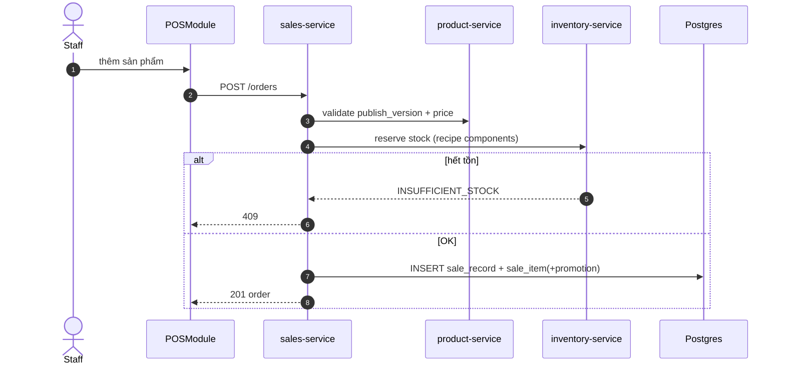

# UC-POS-002: Tạo đơn hàng POS

**Module:** Bán hàng & POS
**Mô tả ngắn:** Staff/OutletManager tạo sale_record gắn vào phiên POS đang mở, thêm line items, áp promotion, chuẩn bị cho bước thanh toán.
**Phiên bản SRS:** 1.0
**Source code tham chiếu:**

- Backend: [SalesController.java](../../services/sales-service/src/main/java/com/fern/services/sales/api/SalesController.java) (`POST /api/v1/sales/orders`)
- Frontend: [frontend/src/components/pos/POSModule.tsx](../../frontend/src/components/pos/POSModule.tsx)
- DB: `V1__core_schema.sql`, `V7__sales_order_lifecycle_and_stock_guards.sql`

## 1. Actors & quyền

| Actor | Role code | Permission |
|-------|-----------|------------|
| Staff | `cashier` | `sales.order.write` |
| Outlet Manager | `outlet_manager` | `sales.order.write` |

## 2. Điều kiện

- **Tiền điều kiện:** `pos_session.status = OPEN` của user hiện tại; có `menu.publish_version` ACTIVE cho outlet/channel; tồn kho recipe component đủ (hoặc outlet cho phép oversell theo policy).
- **Hậu điều kiện (thành công):** `sale_record` trạng thái `DRAFT`/`PENDING_PAYMENT`; `sale_item` + `sale_item_promotion` đã ghi; tổng tiền đã tính.
- **Hậu điều kiện (thất bại):** Không ghi nhận order; tồn kho nguyên vẹn.

## 3. Thực thể dữ liệu

| Entity | Bảng | Service |
|--------|------|---------|
| Sale Record | `sale_record` | sales-service |
| Sale Item | `sale_item` | sales-service |
| Promotion áp dụng | `sale_item_promotion` | sales-service |
| Product / Variant / Modifier | `product`, `product_variant`, `modifier_option` | product-service |
| POS Session | `pos_session` | sales-service |

## 4. API endpoints

| Method | Path | Controller#handler |
|--------|------|--------------------|
| POST | `/api/v1/sales/orders` | `SalesController#createOrder` |
| GET  | `/api/v1/sales/orders` | `SalesController#listOrders` |
| GET  | `/api/v1/sales/orders/{saleId}` | `SalesController#getOrder` |
| POST | `/api/v1/sales/orders/{saleId}/confirm` | `SalesController#confirm` |
| POST | `/api/v1/sales/orders/{saleId}/approve` | `SalesController#approve` |

## 5. Luồng chính (MAIN)

1. Staff chọn sản phẩm từ menu (FE dựa vào `publish_version` hiện hoạt).
2. FE build payload: `{ posSessionId, outletId, items: [{productId, variantId?, modifiers[], qty, appliedPromotionId?}], customerId? }`.
3. FE gọi `POST /api/v1/sales/orders`.
4. Service kiểm: phiên OPEN, sản phẩm thuộc menu ACTIVE, promotion hợp lệ/còn hiệu lực, qty > 0.
5. Service tính giá line = `product_price` × qty × (1 - promo%) − promo_fixed; ghi `sale_record`, `sale_item`, `sale_item_promotion`.
6. (Optional) Service gọi `inventory-service` để reserve tồn cho component theo `recipe`.
7. Service trả 201 order DTO, FE render.
8. Nếu cấu hình cần `confirm` (bếp) hoặc `approve` (quản lý), FE gọi endpoint tương ứng.

## 6. Luồng thay thế / lỗi

- **ALT-1 Áp promotion** — client truyền `appliedPromotionId` → service validate điều kiện (outlet, khoảng thời gian, qty tối thiểu).
- **ALT-2 Customer gắn CRM** — truyền `customerId` → lookup `CrmController` trước khi ghi sale.
- **EXC-1 Phiên không mở** → `409 POS_SESSION_NOT_OPEN`.
- **EXC-2 Sản phẩm ngoài menu** → `422 PRODUCT_NOT_IN_PUBLISHED_MENU`.
- **EXC-3 Hết tồn (guard `V7/V8`)** → `409 INSUFFICIENT_STOCK`.
- **EXC-4 Promotion hết hạn** → `422 PROMOTION_INACTIVE`.
- **EXC-5 Ngoài scope outlet** → `403 SCOPE_DENIED`.

## 7. Quy tắc nghiệp vụ

- **BR-1** — Mỗi order gắn đúng 1 `pos_session`.
- **BR-2** — Giá snapshot vào `sale_item.unit_price` tại thời điểm tạo; đổi giá sau không ảnh hưởng order.
- **BR-3** — Tổng chiết khấu ≤ tổng subtotal.
- **BR-4** — Hỗ trợ modifier group → mỗi `sale_item` có thể có nhiều `modifier_option`.
- **BR-5** — Thuế tính theo `region.tax_code` của outlet chứa phiên.

## 8. State machine

Xem [STATE-MACHINES.md §6](../STATE-MACHINES.md#6-sale-record).

## 9. Sequence diagram

## 10. Ghi chú liên module

- Tồn: trừ thật ở UC-POS-003 khi `mark-payment-done` (hoặc ở confirm tùy flow).
- Audit: `sale.created`.
- CRM: update `customer.last_order_at` (UC-CRM).
