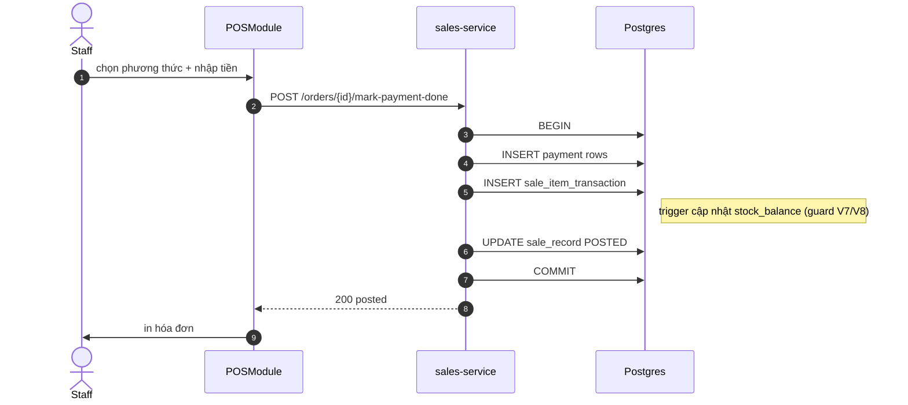

# UC-POS-003: Thanh toán đơn POS

**Module:** Bán hàng & POS
**Mô tả ngắn:** Ghi nhận thanh toán (1 hoặc nhiều phương thức) cho `sale_record`, chuyển order sang `POSTED`, post `sale_item_transaction` vào kho và ghi `payment`.
**Phiên bản SRS:** 1.0
**Source code tham chiếu:**

- Backend: [SalesController.java](../../services/sales-service/src/main/java/com/fern/services/sales/api/SalesController.java) (`POST /api/v1/sales/orders/{saleId}/mark-payment-done`)
- Frontend: [frontend/src/components/pos/POSModule.tsx](../../frontend/src/components/pos/POSModule.tsx)
- DB: `V1__core_schema.sql`, `V7__sales_order_lifecycle_and_stock_guards.sql`

## 1. Actors & quyền

| Actor | Role | Permission |
|-------|------|------------|
| Staff | `cashier` | `sales.order.write` |
| Outlet Manager | `outlet_manager` | `sales.order.write` |

## 2. Điều kiện

- **Tiền điều kiện:** `sale_record` tồn tại, thuộc `pos_session` OPEN của user; chưa ở trạng thái `POSTED`/`CANCELLED`; tổng `payment.amount` của body = `sale_record.total`.
- **Hậu điều kiện (thành công):** Order `POSTED`; `payment` rows ghi đầy đủ; `sale_item_transaction` đã trừ `stock_balance`; event `sale.paid`.
- **Hậu điều kiện (thất bại):** Order giữ nguyên state trước khi gọi.

## 3. Thực thể dữ liệu

| Entity | Bảng | Service |
|--------|------|---------|
| Payment | `payment` | sales-service |
| Sale transaction | `sale_item_transaction` | sales-service |
| Stock balance | `stock_balance` | inventory-service |

## 4. API endpoints

| Method | Path | Controller#handler |
|--------|------|--------------------|
| POST | `/api/v1/sales/orders/{saleId}/mark-payment-done` | `SalesController#markPaymentDone` |

## 5. Luồng chính (MAIN)

1. FE hiển thị tổng tiền + danh sách phương thức.
2. User chọn phương thức (`CASH`, `CARD`, `EWALLET`, ...) và nhập mức tiền cho mỗi phương thức.
3. FE gọi `POST /orders/{saleId}/mark-payment-done` với `{ payments: [{method, amount, reference?}], tendered, changeDue }`.
4. Service validate tổng `amount` == `sale_record.total`.
5. Service mở transaction DB:
   - INSERT `payment` rows.
   - INSERT `sale_item_transaction` cho mỗi sale_item → trigger cập nhật `stock_balance` (guard `V7/V8`).
   - UPDATE `sale_record.status = POSTED`, `paid_at = now()`.
6. Service phát event `sale.paid`.
7. Trả 200 kèm DTO đã post.
8. FE in hóa đơn.

## 6. Luồng thay thế / lỗi

- **ALT-1 Thanh toán lẻ** — nhiều dòng payment; tổng phải khớp.
- **EXC-1 Sai tổng** → `422 PAYMENT_AMOUNT_MISMATCH`.
- **EXC-2 Đã POSTED** → `409 SALE_ALREADY_POSTED`.
- **EXC-3 Hết tồn lúc post** (race) → `409 INSUFFICIENT_STOCK_AT_POST`, rollback.
- **EXC-4 Phiên đã đóng** → `409 POS_SESSION_CLOSED`.

## 7. Quy tắc nghiệp vụ

- **BR-1** — `tendered ≥ total` khi có `CASH`; `changeDue = tendered - total`.
- **BR-2** — Giảm tồn là **atomic** với update order.status.
- **BR-3** — Ghi audit `sale.paid` trong cùng transaction (outbox pattern nếu cấu hình).
- **BR-4** — `payment.reference` bắt buộc cho phương thức non-cash (mã giao dịch thẻ/ví).

## 8. State machine

Xem [STATE-MACHINES.md §6](../STATE-MACHINES.md#6-sale-record).

## 9. Sequence diagram

## 10. Ghi chú liên module

- Trừ tồn: gắn trực tiếp `stock_balance` qua trigger (xem `V7`, `V8`).
- Doanh thu: report `UC-FIN-004` lấy từ `sale_record`.
- Audit: `UC-AUD-001`.
