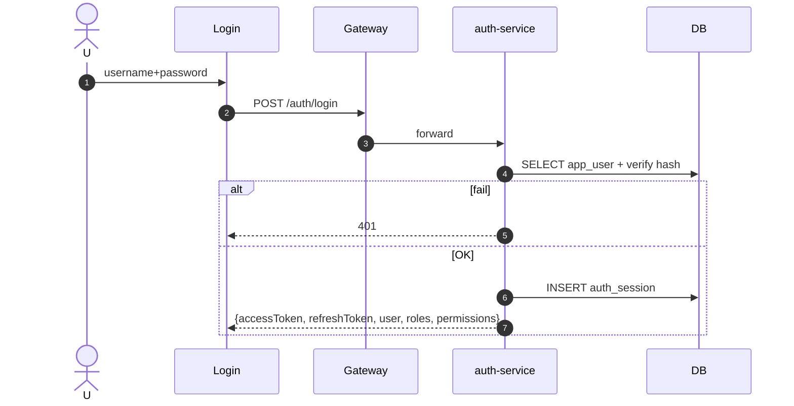

# UC-IAM-001: Đăng nhập

**Module:** IAM
**Mô tả ngắn:** User đăng nhập bằng username + password, nhận JWT + session id; session persist vào `auth_session`.
**Phiên bản SRS:** 1.0
**Source code tham chiếu:**

- Backend: [AuthController.java](../../services/auth-service/spring/src/main/java/com/fern/services/auth/spring/api/AuthController.java) (`POST /api/v1/auth/login`, `GET /me`, `POST /refresh`, `POST /logout`)
- Frontend: [frontend/src/pages/Login.tsx](../../frontend/src/pages/Login.tsx)
- DB: `V4__auth_sessions.sql`

## 1. Actors & quyền

| Actor | Role |
|-------|------|
| Mọi user đã tạo | tất cả |

## 2. Điều kiện

- **Tiền điều kiện:** `app_user.status = active`; mật khẩu chưa lock.
- **Hậu điều kiện (thành công):** JWT + `auth_session` record ghi; client nhận access+refresh token.
- **Hậu điều kiện (thất bại):** Không ghi session; tăng counter failed attempts (policy).

## 3. Thực thể dữ liệu

| Entity | Bảng |
|--------|------|
| App User | `app_user` |
| Auth Session | `auth_session` |

## 4. API endpoints

| Method | Path | Handler |
|--------|------|---------|
| POST | `/api/v1/auth/login` | `AuthController#login` |
| GET | `/api/v1/auth/me` | `#me` |
| POST | `/api/v1/auth/refresh` | `#refresh` |
| POST | `/api/v1/auth/logout` | `#logout` |

## 5. Luồng chính (MAIN)

1. User nhập `{ username, password }` → FE `POST /login`.
2. Service `select * from app_user where username = ? and status = 'active'`.
3. Verify password (HMAC salt) — format hash `base64(salt):base64(HS256(salt+pwd))`.
4. OK → INSERT `auth_session`, phát hành JWT (`sub = user_id`, `sid = session_id`), refresh token.
5. Trả `{ accessToken, refreshToken, user: {...}, roles, permissions, scopes }`.
6. FE lưu token, điều hướng dashboard.

## 6. Luồng thay thế / lỗi

- **EXC-1 Sai credentials** → `401 INVALID_CREDENTIALS`.
- **EXC-2 User inactive/lock** → `403 USER_INACTIVE`.
- **EXC-3 Rate-limit** → `429`.
- **EXC-4 Token expired** khi call `/me` → `401 TOKEN_EXPIRED` → client gọi `/refresh`.

## 7. Quy tắc nghiệp vụ

- **BR-1** — Password không log.
- **BR-2** — JWT ký bởi `JWT_SECRET` (infra/.env).
- **BR-3** — Session TTL cấu hình; refresh kéo dài session không tạo mới.
- **BR-4** — Đăng xuất đánh dấu `auth_session.revoked_at`.

## 8. Sequence diagram

## 9. Ghi chú

- Audit: `auth.login.success|failure`.
