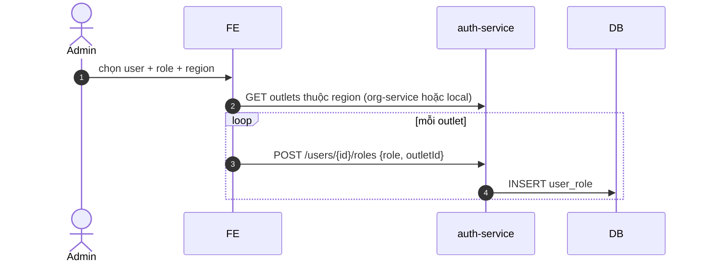

# UC-IAM-004: Gán scope outlet/vùng

**Module:** IAM
**Mô tả ngắn:** Gán user vào outlet cụ thể hoặc cả region (fan-out outlets); hỗ trợ role region-scope và outlet-scope.
**Phiên bản SRS:** 1.0
**Source code tham chiếu:**

- Backend: [AuthController.java](../../services/auth-service/spring/src/main/java/com/fern/services/auth/spring/api/AuthController.java) (`GET /scopes`, `POST /users/{id}/roles`)
- Frontend: [IAMModule.tsx](../../frontend/src/components/iam/IAMModule.tsx) (tab Scopes)

## 1. Actors & quyền

| Actor | Role | Permission |
|-------|------|------------|
| Admin | `admin` | `auth.user.write` |
| Superadmin | `superadmin` | inherit |

## 2. Điều kiện

- **Tiền điều kiện:** Outlet/region tồn tại active; role được phép scope outlet (không phải governance-only).
- **Hậu điều kiện (thành công):** Các bản ghi `user_role` được tạo cho từng outlet trong scope.

## 3. API endpoints

| Method | Path | Handler |
|--------|------|---------|
| GET | `/api/v1/auth/scopes` | `AuthController#listScopes` |
| POST | `/api/v1/auth/users/{userId}/roles` | `#grantRole` (dùng để gắn scope outlet) |

## 4. Luồng chính (MAIN)

### Scope outlet-level

1. Admin chọn user + role (ví dụ `outlet_manager`).
2. Chọn outletId duy nhất.
3. `POST /users/{id}/roles` `{ roleCode, outletId }`.

### Scope region-level (fan-out)

1. Admin chọn user + role `region_manager|finance|hr`.
2. Admin chọn regionId.
3. Client/service resolve danh sách `outlet.id` thuộc region (bao gồm sub-region).
4. Fan-out: `POST /users/{id}/roles` cho mỗi outletId (batch).

## 5. Luồng thay thế / lỗi

- **ALT-1 Bỏ scope** — `POST /users/{id}/roles/revoke` với từng outletId.
- **EXC-1 Role governance-only** (admin) không cho outletId → `422 ROLE_NOT_SCOPED`.
- **EXC-2 Outlet inactive** → `409 OUTLET_INACTIVE`.

## 6. Quy tắc nghiệp vụ

- **BR-1** — 1 user × role × outlet là unique.
- **BR-2** — Region scope luôn là fan-out, không có field `region_id` trên `user_role`.
- **BR-3** — Khi region thêm outlet mới, không tự fan-out; admin phải cập nhật manual (hoặc job đồng bộ).

## 7. Sequence diagram

## 8. Ghi chú

- Audit: `auth.scope.assigned|revoked`.
- POS/HR/Finance check scope lấy từ `user_role.outlet_id`.
