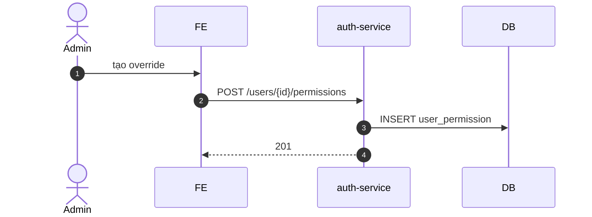

# UC-IAM-005: Ghi đè quyền người dùng (permission override)

**Module:** IAM
**Mô tả ngắn:** Grant/Deny permission lẻ cho user bất chấp role (`user_permission`, effect `GRANT|DENY`, gắn optional outlet scope).
**Phiên bản SRS:** 1.0
**Source code tham chiếu:**

- Backend: [AuthController.java](../../services/auth-service/spring/src/main/java/com/fern/services/auth/spring/api/AuthController.java) (`GET /overrides`, `POST /users/{id}/permissions`, `/permissions/revoke`)
- Frontend: [IAMModule.tsx](../../frontend/src/components/iam/IAMModule.tsx) (tab Overrides)

## 1. Actors & quyền

| Actor | Role | Permission |
|-------|------|------------|
| Admin | `admin` | `auth.role.write` |
| Superadmin | `superadmin` | inherit |

## 2. Thực thể dữ liệu

| Entity | Bảng |
|--------|------|
| User Permission Override | `user_permission` |

## 3. API endpoints

| Method | Path | Handler |
|--------|------|---------|
| GET | `/api/v1/auth/overrides` | `AuthController#listOverrides` |
| POST | `/api/v1/auth/users/{userId}/permissions` | `#grantOverride` |
| POST | `/api/v1/auth/users/{userId}/permissions/revoke` | `#revokeOverride` |

## 4. Luồng chính (MAIN)

1. Admin chọn user → tab Overrides.
2. Nhập `{ permissionCode, effect: GRANT|DENY, outletId?, reason }`.
3. `POST /users/{id}/permissions` → INSERT `user_permission`.
4. Effective permissions = (role grants ∪ user GRANT overrides) − user DENY overrides, lọc theo scope outlet.

## 5. Lỗi

- **EXC-1 Permission code sai** → `422`.
- **EXC-2 Trùng override** → `409` (nếu unique key).
- **EXC-3 Missing reason** cho DENY → `400 REASON_REQUIRED`.

## 6. Quy tắc nghiệp vụ

- **BR-1** — DENY thắng GRANT khi resolve.
- **BR-2** — Override có thể có `outlet_id` null = áp mọi scope.
- **BR-3** — Permission nhạy cảm (flag sensitive) cần multi-step approval (policy).
- **BR-4** — Mọi override ghi audit với `actor_id`, `reason`.

## 7. Sequence diagram

## 8. Ghi chú

- Audit: `auth.override.*`.
