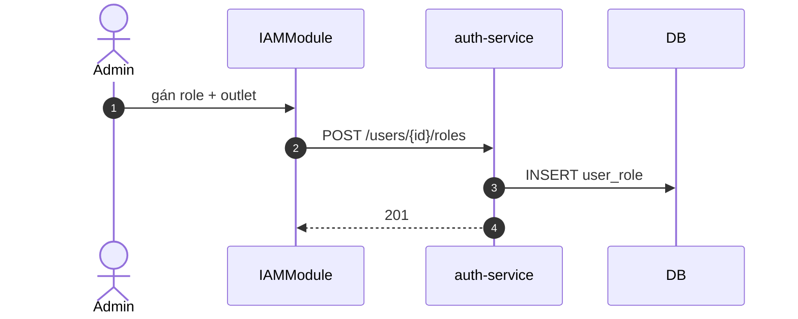

# UC-IAM-003: Phân quyền vai trò

**Module:** IAM
**Mô tả ngắn:** Gán/tháo role cho user (`user_role`), chỉnh permission của role (`role_permission`).
**Phiên bản SRS:** 1.0
**Source code tham chiếu:**

- Backend: [AuthController.java](../../services/auth-service/spring/src/main/java/com/fern/services/auth/spring/api/AuthController.java) (`POST /users/{id}/roles`, `/roles/revoke`, `PUT /roles/{roleCode}/permissions`)
- Frontend: [IAMModule.tsx](../../frontend/src/components/iam/IAMModule.tsx)

## 1. Actors & quyền

| Actor | Role | Permission |
|-------|------|------------|
| Admin | `admin` | `auth.role.write` |
| Superadmin | `superadmin` | inherit |

## 2. Điều kiện

- **Tiền điều kiện:** User tồn tại; role tồn tại trong `role`.
- **Hậu điều kiện (thành công):** Bản ghi `user_role` insert/delete hoặc `role_permission` update.

## 3. Thực thể dữ liệu

| Entity | Bảng |
|--------|------|
| Role | `role` |
| Permission | `permission` |
| Role-Permission | `role_permission` |
| User-Role | `user_role` |

## 4. API endpoints

| Method | Path | Handler |
|--------|------|---------|
| GET | `/api/v1/auth/roles` | `AuthController#listRoles` |
| GET | `/api/v1/auth/business-roles` | `#listBusinessRoles` |
| GET | `/api/v1/auth/permissions` | `#listPermissions` |
| POST | `/api/v1/auth/users/{userId}/roles` | `#grantRole` |
| POST | `/api/v1/auth/users/{userId}/roles/revoke` | `#revokeRole` |
| PUT | `/api/v1/auth/roles/{roleCode}/permissions` | `#setRolePermissions` |

## 5. Luồng chính (MAIN)

### Gán role cho user

1. Admin chọn user → tab Roles.
2. `POST /users/{id}/roles` body `{ roleCode, outletId? }` (outletId cho region/outlet scope role).
3. INSERT `user_role(user_id, role_code, outlet_id)`.

### Thu hồi role

1. `POST /users/{id}/roles/revoke` body `{ roleCode, outletId? }` → DELETE.

### Sửa permission của role

1. Admin chọn role → tab Permissions.
2. `PUT /roles/{roleCode}/permissions` body `{ permissionCodes: [...] }`.
3. Service diff với `role_permission` hiện có → INSERT/DELETE phù hợp.

## 6. Luồng thay thế / lỗi

- **EXC-1 Role không tồn tại** → `404`.
- **EXC-2 Permission code sai** → `422`.
- **EXC-3 Thu hồi role cuối cùng** của user → cảnh báo (user còn đăng nhập được nhưng không làm gì); không chặn.
- **EXC-4 Không permission** → `403`.

## 7. Quy tắc nghiệp vụ

- **BR-1** — `user_role` composite key `(user_id, role_code, outlet_id)`.
- **BR-2** — Role scope region = fan-out outlets thuộc region (không dùng region_id field).
- **BR-3** — `admin` không nhận permission vận hành (governance only — §8.1).
- **BR-4** — Sửa `role_permission` áp dụng ngay cho user mới login; user đang login giữ claims cũ đến hết session (hoặc force logout).

## 8. Sequence diagram

## 9. Ghi chú

- Audit: `auth.role.grant|revoke`, `auth.role.permissions.updated`.
