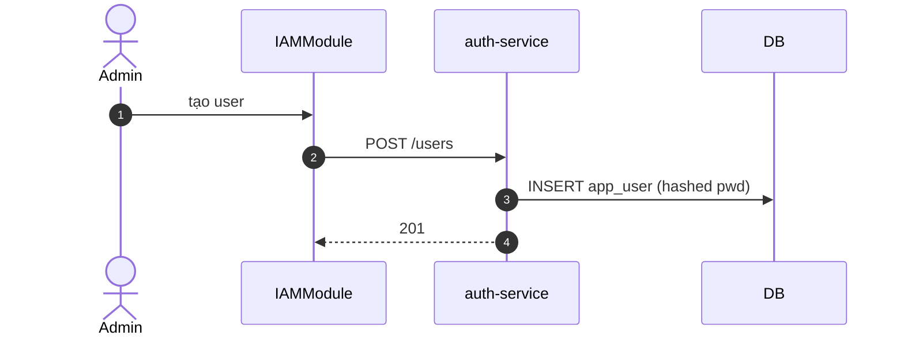

# UC-IAM-002: Quản lý người dùng

**Module:** IAM
**Mô tả ngắn:** Tạo/sửa/deactivate `app_user`; Admin governance scope.
**Phiên bản SRS:** 1.0
**Source code tham chiếu:**

- Backend: [AuthController.java](../../services/auth-service/spring/src/main/java/com/fern/services/auth/spring/api/AuthController.java) (`POST/GET /users`, `PUT /users/{id}/status`)
- Frontend: [IAMModule.tsx](../../frontend/src/components/iam/IAMModule.tsx)

## 1. Actors & quyền

| Actor | Role | Permission |
|-------|------|------------|
| Admin | `admin` | `auth.user.write` |
| Superadmin | `superadmin` | inherit |

## 2. Điều kiện

- **Tiền điều kiện:** Actor có `auth.user.write`.
- **Hậu điều kiện (thành công):** `app_user` record ghi/cập nhật status.

## 3. API endpoints

| Method | Path | Handler |
|--------|------|---------|
| POST | `/api/v1/auth/users` | `AuthController#createUser` |
| GET | `/api/v1/auth/users` | `#listUsers` |
| PUT | `/api/v1/auth/users/{userId}/status` | `#updateUserStatus` |

## 4. Luồng chính (MAIN)

1. Admin mở IAM → Users → New.
2. Nhập `{ username, email, fullName, employeeCode, initialPassword }`.
3. `POST /users` → 201.
4. Admin deactivate/reactivate: `PUT /users/{id}/status` `{ status: active|disabled }`.

## 5. Lỗi

- **EXC-1 Trùng username/email** → `409 USER_CONFLICT`.
- **EXC-2 Password yếu** → `422 PASSWORD_POLICY`.
- **EXC-3 Không permission** → `403`.

## 6. Quy tắc nghiệp vụ

- **BR-1** — `username` unique.
- **BR-2** — `employeeCode` unique nếu set.
- **BR-3** — Deactivate user revoke tất cả session đang mở.
- **BR-4** — Password lưu hash HMAC có salt; không plain.

## 7. Sequence diagram

## 8. Ghi chú

- Gán role/scope: xem UC-IAM-003, UC-IAM-004.
- Audit: `auth.user.*`.
