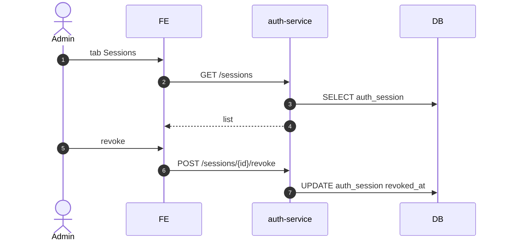

# UC-IAM-006: Quản lý phiên (session browser)

**Module:** IAM
**Mô tả ngắn:** Xem danh sách phiên đang mở, revoke phiên để force logout.
**Phiên bản SRS:** 1.0
**Source code tham chiếu:**

- Backend: [AuthController.java](../../services/auth-service/spring/src/main/java/com/fern/services/auth/spring/api/AuthController.java) (`GET /sessions`, `POST /sessions/{id}/revoke`)
- Frontend: [IAMModule.tsx](../../frontend/src/components/iam/IAMModule.tsx) (tab Sessions)

## 1. Actors & quyền

| Actor | Role | Permission |
|-------|------|------------|
| Admin | `admin` | `auth.user.write` |
| Superadmin | `superadmin` | inherit |
| User (self) | any | read own sessions |

## 2. API endpoints

| Method | Path | Handler |
|--------|------|---------|
| GET | `/api/v1/auth/sessions` | `AuthController#listSessions` |
| POST | `/api/v1/auth/sessions/{id}/revoke` | `#revokeSession` |

## 3. Luồng chính (MAIN)

1. Admin mở tab Sessions.
2. `GET /sessions?userId=&status=active&page=`.
3. FE render list `{ sessionId, userId, createdAt, lastSeenAt, ip, userAgent, revokedAt? }`.
4. Admin chọn session → `POST /sessions/{id}/revoke` → UPDATE `auth_session.revoked_at = now()`.
5. JWT next request sẽ fail authentication.

## 4. Lỗi

- **EXC-1** Session không tồn tại → `404`.
- **EXC-2** Session đã revoked → `409`.
- **EXC-3** Tự revoke session đang dùng → OK, user bị đá ra login.

## 5. Quy tắc nghiệp vụ

- **BR-1** — Revoke session persist tức thì; gateway check `auth_session.revoked_at IS NULL`.
- **BR-2** — User thường chỉ thấy session của mình; Admin thấy toàn hệ thống theo scope.

## 6. Sequence diagram

## 7. Ghi chú

- Audit: `auth.session.revoked`.
