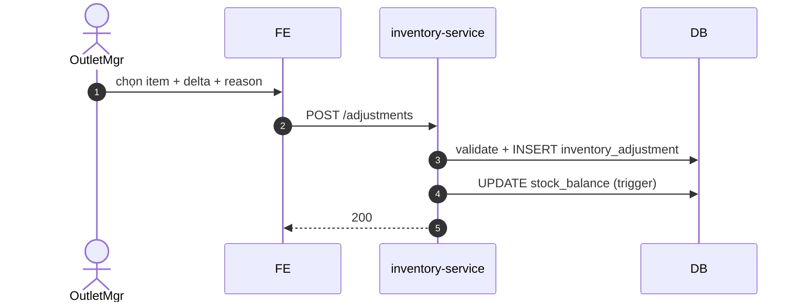

# UC-INV-003: Điều chỉnh kho thủ công

**Module:** Kho tại outlet
**Mô tả ngắn:** Ghi `inventory_adjustment` để tăng/giảm `stock_balance` với lý do xác định (hao hụt, nhập thiếu, ...).
**Phiên bản SRS:** 1.0
**Source code tham chiếu:**

- Backend: [InventoryController.java](../../services/inventory-service/src/main/java/com/fern/services/inventory/api/InventoryController.java) (adjustment ghi qua stock-count post hoặc endpoint adjust — kiểm lại service layer)
- Frontend: [InventoryModule.tsx](../../frontend/src/components/inventory/InventoryModule.tsx)

## 1. Actors & quyền

| Actor | Role | Permission |
|-------|------|------------|
| Outlet Manager | `outlet_manager` | `inventory.adjust` |
| Admin | `admin` | (governance) |

## 2. Điều kiện

- **Tiền điều kiện:** `stock_balance` hiện tại đủ nếu adjust giảm; `outlet` active.
- **Hậu điều kiện (thành công):** Bản ghi `inventory_adjustment` + update `stock_balance`; audit log.
- **Hậu điều kiện (thất bại):** Không thay đổi.

## 3. Thực thể dữ liệu

| Entity | Bảng |
|--------|------|
| Adjustment | `inventory_adjustment` |
| Stock Balance | `stock_balance` |
| Inventory Transaction | `inventory_transaction` |

## 4. API endpoints (tham khảo — kiểm code để xác nhận path)

| Method | Path | Handler |
|--------|------|---------|
| POST | `/api/v1/inventory/adjustments` *(nếu có endpoint riêng)* | `InventoryController#createAdjustment` |
| POST | `/api/v1/inventory/waste` | `InventoryController#createWaste` |

> Nếu flow hiện tại gói adjustment trong `/stock-count-sessions/.../post`, UC này mô tả reason-code manual adjust qua stock count 1 line.

## 5. Luồng chính (MAIN)

1. Actor chọn item + outlet + `deltaQty` (âm/dương) + `reasonCode`.
2. FE gọi adjustment endpoint.
3. Service validate:
   - `stock_balance.quantity + deltaQty ≥ 0`.
   - `reasonCode ∈ enum`.
   - `|deltaQty|` ≤ threshold (nếu cần approval).
4. BEGIN txn → INSERT `inventory_adjustment` + `inventory_transaction` → UPDATE `stock_balance` (trigger).
5. COMMIT + event `inventory.adjustment.created`.

## 6. Reason codes (enum đề xuất)

| Code | Mô tả |
|------|-------|
| `DAMAGED` | Hàng hỏng vỡ |
| `EXPIRED` | Hết hạn |
| `LOST` | Mất mát không rõ |
| `FOUND` | Phát hiện dư |
| `STOCK_COUNT` | Chênh lệch từ kiểm kê |
| `MANUAL_CORRECTION` | Sửa tay có lý do |
| `TRANSFER_IN` | Nhận từ kho khác |
| `TRANSFER_OUT` | Chuyển sang kho khác |

## 7. Luồng thay thế / lỗi

- **EXC-1 Stock âm** → `409 STOCK_NEGATIVE_DENIED` (guard `V7/V8`).
- **EXC-2 Thiếu reason** → `400 REASON_REQUIRED`.
- **EXC-3 Vượt ngưỡng approve** → `422 NEEDS_APPROVAL` (OutletMgr/RegionMgr).
- **EXC-4 Không permission** → `403 MISSING_PERMISSION_INVENTORY_ADJUST`.

## 8. Quy tắc nghiệp vụ

- **BR-1** — `deltaQty != 0`.
- **BR-2** — Reason code bắt buộc, từ enum cho phép.
- **BR-3** — Mọi adjustment ghi audit với `actor_id`, `reason`, `delta`.
- **BR-4** — Approval threshold config per outlet/region.

## 9. Sequence diagram

## 10. Ghi chú liên module

- Audit: `inventory.adjustment.*` (scope outlet).
- GR damage (UC-PROC-002) có thể tự gọi adjustment với reason `DAMAGED`.
