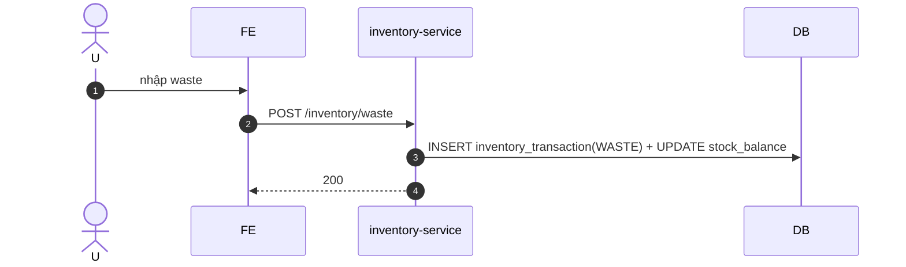

# UC-INV-004: Ghi nhận lãng phí (waste)

**Module:** Kho tại outlet
**Mô tả ngắn:** Ghi sự kiện lãng phí (đổ bỏ, hỏng, thử món) làm `inventory_transaction` âm có `reason = WASTE`.
**Phiên bản SRS:** 1.0
**Source code tham chiếu:**

- Backend: [InventoryController.java](../../services/inventory-service/src/main/java/com/fern/services/inventory/api/InventoryController.java) (`POST /api/v1/inventory/waste`)
- Frontend: [InventoryModule.tsx](../../frontend/src/components/inventory/InventoryModule.tsx) (tab Waste)

## 1. Actors & quyền

| Actor | Role | Permission |
|-------|------|------------|
| Staff | `cashier` | `inventory.write` |
| Outlet Manager | `outlet_manager` | `inventory.write` |

## 2. Điều kiện

- **Tiền điều kiện:** Stock còn ≥ qty waste; user scope outlet.
- **Hậu điều kiện:** `inventory_transaction` với `reason = WASTE`; `stock_balance` giảm tương ứng.

## 3. Thực thể dữ liệu

| Entity | Bảng |
|--------|------|
| Waste Transaction | `inventory_transaction` (type=WASTE) |
| Stock Balance | `stock_balance` |

## 4. API endpoints

| Method | Path | Handler |
|--------|------|---------|
| POST | `/api/v1/inventory/waste` | `InventoryController#recordWaste` |

## 5. Luồng chính (MAIN)

1. Actor chọn item + qty + reason note.
2. FE gọi `POST /inventory/waste`.
3. Service ghi transaction âm, cập nhật balance.
4. Event `inventory.waste.recorded`.

## 6. Lỗi

- **EXC-1 Stock không đủ** → `409 INSUFFICIENT_STOCK`.
- **EXC-2 Ngoài scope** → `403`.

## 7. Quy tắc nghiệp vụ

- **BR-1** — `qty > 0`.
- **BR-2** — Waste cộng dồn ảnh hưởng báo cáo `Prime Cost` (finance).
- **BR-3** — Không dùng waste thay cho kiểm kê chênh lệch (dùng UC-INV-002).

## 8. Sequence diagram

## 9. Ghi chú liên module

- Finance: cộng dồn sang COGS/prime cost report khi tab Prime Cost bật (hiện còn tạm ẩn).
- Audit: `inventory.waste.recorded`.
