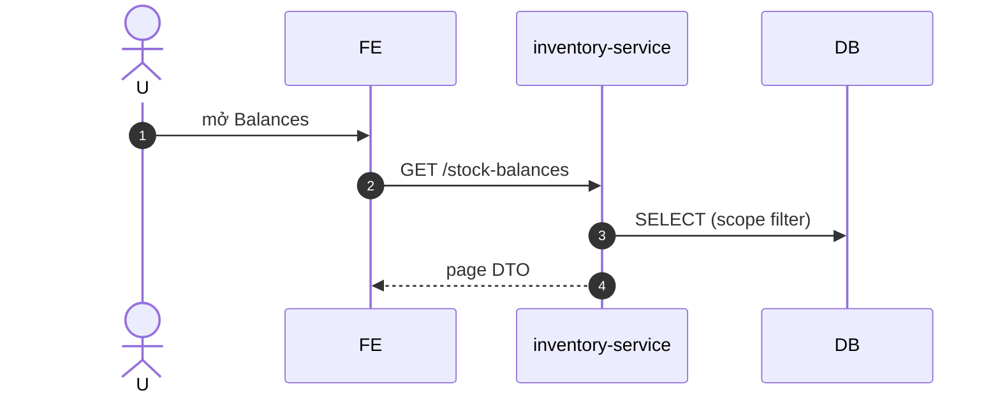

# UC-INV-001: Xem tồn kho & ledger

**Module:** Kho tại outlet
**Mô tả ngắn:** Xem `stock_balance` hiện tại + lịch sử giao dịch (`inventory_transaction`) cho item/outlet.
**Phiên bản SRS:** 1.0
**Source code tham chiếu:**

- Backend: [InventoryController.java](../../services/inventory-service/src/main/java/com/fern/services/inventory/api/InventoryController.java)
- Frontend: [InventoryModule.tsx](../../frontend/src/components/inventory/InventoryModule.tsx)

## 1. Actors & quyền

| Actor | Role | Permission |
|-------|------|------------|
| Outlet Manager | `outlet_manager` | (scope outlet) |
| Staff | `cashier` | (scope outlet) |
| Region Manager | `region_manager` | (scope region) |

## 2. Điều kiện

- **Tiền điều kiện:** User có scope outlet.
- **Hậu điều kiện:** Read-only — không thay đổi dữ liệu.

## 3. Thực thể dữ liệu

| Entity | Bảng |
|--------|------|
| Stock Balance | `stock_balance` |
| Inventory Transaction | `inventory_transaction` |

## 4. API endpoints

| Method | Path | Handler |
|--------|------|---------|
| GET | `/api/v1/inventory/stock-balances` | `InventoryController#listBalances` |
| GET | `/api/v1/inventory/stock-balances/{outletId}/{itemId}` | `#getBalance` |
| GET | `/api/v1/inventory/transactions` | `#listTransactions` |

## 5. Luồng chính (MAIN)

1. User vào tab Balances/Ledger.
2. FE gọi `GET /stock-balances?outletId=&itemId=&page=&limit=`.
3. Service trả danh sách + tổng; FE paginate.
4. User mở Ledger → `GET /transactions?outletId=&itemId=&from=&to=`.

## 6. Lỗi

- **EXC-1** Ngoài scope → `403 SCOPE_DENIED`.
- **EXC-2** Limit vượt max → `400`.

## 7. Quy tắc nghiệp vụ

- **BR-1** — `stock_balance.quantity ≥ 0` luôn được đảm bảo bởi guard (xem `V7`, `V8`).
- **BR-2** — Ledger sort theo `occurred_at DESC` mặc định.

## 8. Sequence diagram

## 9. Ghi chú liên module

- Read-only view dùng chung cho POS/HR reports.
