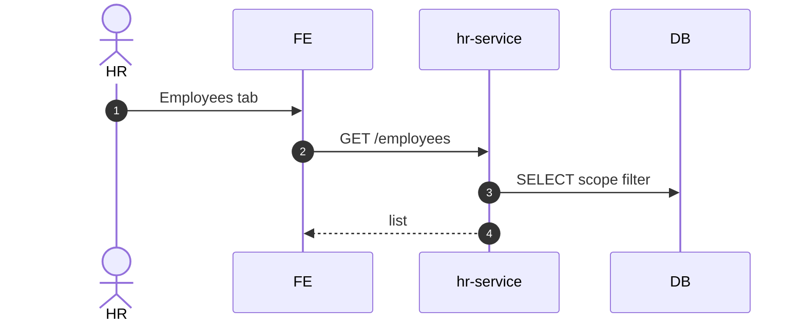

# UC-HR-001: Hồ sơ nhân viên

**Module:** Nhân sự & Chấm công
**Mô tả ngắn:** Xem và quản trị hồ sơ nhân viên (`hr_employee`) — base record gắn với `app_user`.
**Phiên bản SRS:** 1.0
**Source code tham chiếu:**

- Backend: [HrController.java](../../services/hr-service/src/main/java/com/fern/services/hr/api/HrController.java) (`/employees`, `/outlet/{id}/staff`)
- Frontend: [HRModule.tsx](../../frontend/src/components/hr/HRModule.tsx)

## 1. Actors & quyền

| Actor | Role | Permission |
|-------|------|------------|
| HR | `hr` | `hr.write` |
| Outlet Manager | `outlet_manager` | `hr.write` (scope outlet) |

## 2. Điều kiện

- **Tiền điều kiện:** `app_user` đã tồn tại; có scope phù hợp.
- **Hậu điều kiện (thành công):** `hr_employee` record ghi/đồng bộ.

## 3. Thực thể dữ liệu

| Entity | Bảng |
|--------|------|
| HR Employee | `hr_employee` |
| App User | `app_user` (auth-service) |

## 4. API endpoints

| Method | Path | Handler |
|--------|------|---------|
| GET | `/api/v1/hr/employees` | `HrController#listEmployees` |
| GET | `/api/v1/hr/employees/{userId}` | `HrController#getEmployee` |
| GET | `/api/v1/hr/outlet/{outletId}/staff` | `HrController#listOutletStaff` |

## 5. Luồng chính (MAIN)

1. HR mở tab Employees.
2. FE `GET /employees` — list theo scope.
3. HR mở chi tiết nhân viên `GET /employees/{userId}` — xem hồ sơ + contracts active + shifts sắp tới.

## 6. Lỗi

- **EXC-1** Ngoài scope → `403`.
- **EXC-2** User không tồn tại → `404`.

## 7. Quy tắc nghiệp vụ

- **BR-1** — 1 `app_user` gắn tối đa 1 `hr_employee`.
- **BR-2** — HR của region xem được nhân viên tất cả outlet trong region.

## 8. Sequence diagram

## 9. Ghi chú liên module

- IAM: tạo user trước (UC-IAM-002) rồi gán hồ sơ HR.
