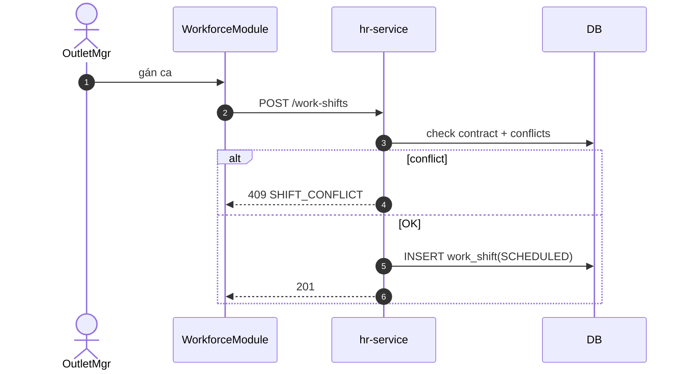

# UC-HR-002: Phân ca làm việc

**Module:** Nhân sự & Chấm công
**Mô tả ngắn:** Tạo `shift` (mẫu ca) và `work_shift` (gán ca cho nhân viên theo ngày); chặn xung đột ca cùng user/outlet.
**Phiên bản SRS:** 1.0
**Source code tham chiếu:**

- Backend: [HrController.java](../../services/hr-service/src/main/java/com/fern/services/hr/api/HrController.java) (`/shifts`, `/work-shifts`)
- Frontend: [WorkforceModule.tsx](../../frontend/src/components/workforce/WorkforceModule.tsx)
- DB: `V17__workforce_enhancements.sql`

## 1. Actors & quyền

| Actor | Role | Permission |
|-------|------|------------|
| Outlet Manager | `outlet_manager` | `hr.write` |
| HR | `hr` | `hr.write` |

## 2. Điều kiện

- **Tiền điều kiện:** Nhân viên có contract `ACTIVE` tại outlet đích; shift template có `startTime`, `endTime`, `breakMinutes`.
- **Hậu điều kiện (thành công):** `work_shift` tạo trạng thái `SCHEDULED`.
- **Hậu điều kiện (thất bại):** Không ghi.

## 3. Thực thể dữ liệu

| Entity | Bảng |
|--------|------|
| Shift (template) | `shift` |
| Work Shift (assignment) | `work_shift` |
| Role Requirement | `shift_role_requirement` |

## 4. API endpoints

### Shift template

| Method | Path | Handler |
|--------|------|---------|
| POST / GET / PUT / DELETE | `/api/v1/hr/shifts` | `HrController#shifts*` |
| GET / PUT | `/api/v1/hr/shifts/{id}/roles` | `#getRoles / setRoles` |

### Work shift assignment

| Method | Path | Handler |
|--------|------|---------|
| POST | `/api/v1/hr/work-shifts` | `HrController#createWorkShift` |
| GET | `/api/v1/hr/work-shifts` | `#listWorkShifts` |
| GET | `/api/v1/hr/work-shifts/outlet/{outletId}/date/{date}` | `#listByDate` |

## 5. Luồng chính (MAIN)

1. OutletMgr định nghĩa `shift` template (nếu chưa có).
2. Mở Workforce, chọn ngày + outlet.
3. Tạo assignment: `POST /work-shifts` với `{ userId, shiftId, outletId, date }`.
4. Service validate:
   - Contract active cho user × outlet.
   - Không xung đột time range với work_shift hiện có cùng userId.
   - `shift_role_requirement` khớp role của user (nếu bắt buộc).
5. INSERT `work_shift(SCHEDULED)`.
6. Event `hr.shift.assigned`.

## 6. Luồng thay thế / lỗi

- **ALT-1 Time-off** — user có time-off khớp ngày → cảnh báo (policy cho phép override hay không).
- **EXC-1 Xung đột ca** → `409 SHIFT_CONFLICT`.
- **EXC-2 Contract không active** → `422 NO_ACTIVE_CONTRACT`.
- **EXC-3 Ngoài scope outlet** → `403`.
- **EXC-4 Role không match shift requirement** → `422 ROLE_REQUIREMENT_UNMET`.

## 7. Quy tắc nghiệp vụ

- **BR-1** — 1 user không có 2 `work_shift` SCHEDULED/IN_PROGRESS chồng thời gian.
- **BR-2** — `shift.breakMinutes ≥ 0`; `endTime > startTime` (hoặc qua đêm xử lý bằng `endTime + 24h`).
- **BR-3** — Role requirement: mỗi shift có thể có min/max count theo role (via `shift_role_requirement`).
- **BR-4** — Đã `WORKED` thì không xoá, chỉ `terminate/adjust`.

## 8. Sequence diagram

## 9. Ghi chú liên module

- Attendance: UC-HR-003.
- Contract check: UC-HR-004.
- Audit: `hr.shift.*`.
