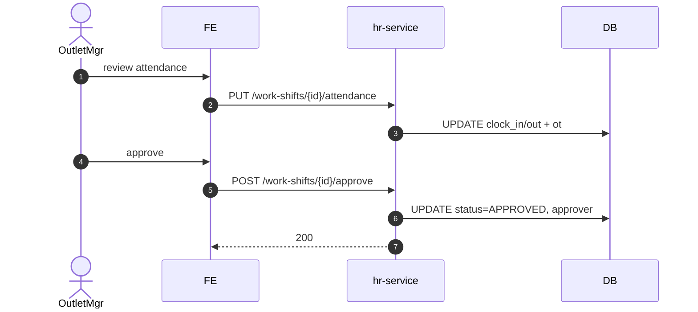

# UC-HR-003: Phê duyệt chấm công

**Module:** Nhân sự & Chấm công
**Mô tả ngắn:** Outlet Manager rà soát `work_shift.attendance` (giờ in/out, late, OT), phê duyệt làm input cho payroll; dữ liệu approved khóa sửa.
**Phiên bản SRS:** 1.0
**Source code tham chiếu:**

- Backend: [HrController.java](../../services/hr-service/src/main/java/com/fern/services/hr/api/HrController.java) (`PUT /work-shifts/{id}/attendance`, `/work-shifts/{id}/approve|reject`)
- Frontend: [HRModule.tsx](../../frontend/src/components/hr/HRModule.tsx) (tab Attendance)

## 1. Actors & quyền

| Actor | Role | Permission |
|-------|------|------------|
| Outlet Manager | `outlet_manager` | `hr.write` |
| HR | `hr` | `hr.write` (override region) |

## 2. Điều kiện

- **Tiền điều kiện:** `work_shift` đã có `clock_in_at` và/hoặc `clock_out_at`; chưa được approve.
- **Hậu điều kiện (thành công):** `work_shift.status = APPROVED`, `approved_by`, `approved_at` ghi; dữ liệu khóa sửa; chảy xuống payroll.
- **Hậu điều kiện (thất bại):** Giữ nguyên hoặc `REJECTED` (với lý do).

## 3. Thực thể dữ liệu

| Entity | Bảng |
|--------|------|
| Work Shift | `work_shift` |

## 4. API endpoints

| Method | Path | Handler |
|--------|------|---------|
| PUT | `/api/v1/hr/work-shifts/{id}/attendance` | `HrController#updateAttendance` |
| POST | `/api/v1/hr/work-shifts/{id}/approve` | `#approveAttendance` |
| POST | `/api/v1/hr/work-shifts/{id}/reject` | `#rejectAttendance` |

## 5. Luồng chính (MAIN)

1. Outlet Manager mở tab Attendance.
2. Chỉnh `clock_in_at`, `clock_out_at`, `break_minutes`, `ot_minutes`, `note` qua `PUT /attendance`.
3. Tính `workedMinutes = (out - in) - break`; `lateMinutes`, `earlyLeaveMinutes` từ shift template.
4. Approve: `POST /approve` → `APPROVED`.
5. Reject: `POST /reject` với `reason` → `REJECTED`.

## 6. Luồng thay thế / lỗi

- **ALT-1 Quên chấm** — thiếu clock_in/out → chặn approve, yêu cầu nhập manual.
- **ALT-2 OT phát sinh** — `ot_minutes > 0` cần thêm approval nếu vượt ngưỡng policy (ví dụ >120 phút/ngày).
- **EXC-1 Thiếu clock** → `422 ATTENDANCE_INCOMPLETE`.
- **EXC-2 Đã APPROVED** → `409 ALREADY_APPROVED`.
- **EXC-3 Ngoài scope** → `403`.

## 7. Quy tắc nghiệp vụ

- **BR-1** — Không approve khi thiếu clock_in hoặc clock_out (trừ trường hợp "absent" rõ ràng).
- **BR-2** — Chỉ `APPROVED` chảy sang payroll (UC-FIN-002).
- **BR-3** — Approve bởi user khác outlet cần role `hr`/`region_manager`.
- **BR-4** — Mọi sửa đổi attendance sau APPROVED → chặn; phải reopen (policy riêng).

## 8. Sequence diagram

## 9. Ghi chú liên module

- Payroll: `payroll_timesheet` nạp từ approved work_shift (UC-FIN-002).
- Audit: `hr.attendance.*`.
