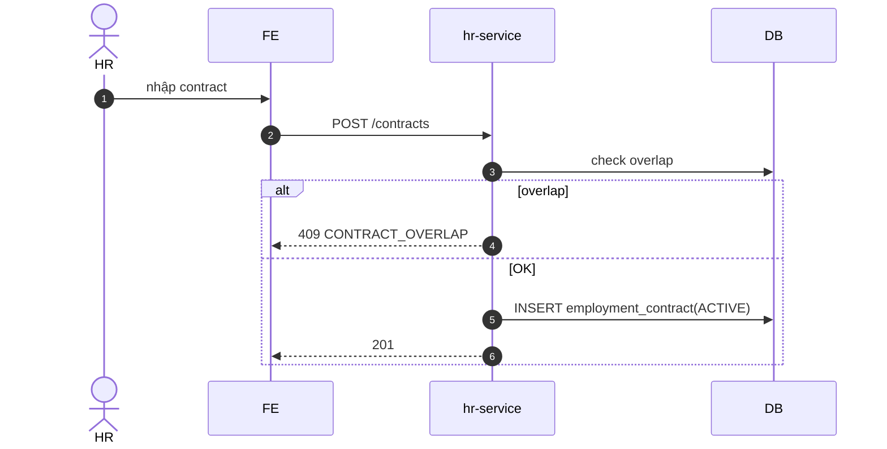

# UC-HR-004: Tạo hợp đồng lao động

**Module:** Nhân sự & Chấm công
**Mô tả ngắn:** Tạo/cập nhật `employment_contract` cho nhân viên; quản lý lifecycle DRAFT → ACTIVE → TERMINATED; chặn overlap hợp đồng active.
**Phiên bản SRS:** 1.0
**Source code tham chiếu:**

- Backend: [HrController.java](../../services/hr-service/src/main/java/com/fern/services/hr/api/HrController.java) (`/contracts/*`)
- Frontend: [HRModule.tsx](../../frontend/src/components/hr/HRModule.tsx) (tab Contracts)

## 1. Actors & quyền

| Actor | Role | Permission |
|-------|------|------------|
| HR | `hr` | `hr.write` |
| Admin | `admin` | (governance) |

## 2. Điều kiện

- **Tiền điều kiện:** Nhân viên tồn tại (`hr_employee`); không có contract active overlap.
- **Hậu điều kiện (thành công):** `employment_contract` `ACTIVE` với thông tin đầy đủ.
- **Hậu điều kiện (thất bại):** Không thay đổi.

## 3. Thực thể dữ liệu

| Entity | Bảng |
|--------|------|
| Employment Contract | `employment_contract` |
| HR Employee | `hr_employee` |

## 4. API endpoints

| Method | Path | Handler |
|--------|------|---------|
| POST | `/api/v1/hr/contracts` | `HrController#createContract` |
| GET | `/api/v1/hr/contracts` | `#listContracts` |
| GET | `/api/v1/hr/contracts/{id}` | `#getContract` |
| GET | `/api/v1/hr/contracts/user/{userId}` | `#listByUser` |
| GET | `/api/v1/hr/contracts/user/{userId}/latest` | `#latestByUser` |
| GET | `/api/v1/hr/contracts/active` | `#listActive` |
| PUT | `/api/v1/hr/contracts/{id}` | `#updateContract` |
| POST | `/api/v1/hr/contracts/{id}/terminate` | `#terminateContract` |

## 5. Luồng chính (MAIN)

1. HR mở tab Contracts → New.
2. Nhập `{ userId, outletId, contractType, payType (hourly/monthly), baseSalary, currency, effectiveFrom, effectiveTo?, terms }`.
3. `POST /contracts` → DRAFT (nếu business cần bước nháp) hoặc trực tiếp ACTIVE (tùy logic service).
4. Service check:
   - Không overlap với contract ACTIVE khác của user.
   - `effectiveFrom ≤ effectiveTo` nếu có.
   - `baseSalary ≥ 0`.
5. INSERT + audit event `hr.contract.created`.
6. Terminate: `POST /contracts/{id}/terminate` với `{ terminationDate, reason }` → status `TERMINATED`.

## 6. Luồng thay thế / lỗi

- **ALT-1 Amend** — cần đổi lương/loại HĐ → tạo contract mới nối tiếp `effectiveFrom`; chốt cũ bằng `effectiveTo = newFrom - 1`.
- **EXC-1 Overlap** → `409 CONTRACT_OVERLAP`.
- **EXC-2 Thiếu field bắt buộc** → `400`.
- **EXC-3 Terminate contract đã TERMINATED** → `409 CONTRACT_ALREADY_TERMINATED`.

## 7. Quy tắc nghiệp vụ

- **BR-1** — 1 user không có 2 contract ACTIVE overlap.
- **BR-2** — Contract phải đủ: type, pay type, base salary, currency, effectiveFrom.
- **BR-3** — Currency = `outlet.currency_code` của outlet gắn với contract.
- **BR-4** — TERMINATED → không chỉnh field khác ngoài note.

## 8. State machine

Xem [STATE-MACHINES.md §8](../STATE-MACHINES.md#8-employment-contract).

## 9. Sequence diagram

## 10. Ghi chú liên module

- Contract ACTIVE là điều kiện phân ca (UC-HR-002).
- Payroll dùng `baseSalary`, `payType` (UC-FIN-002).
- Audit: `hr.contract.*`.
