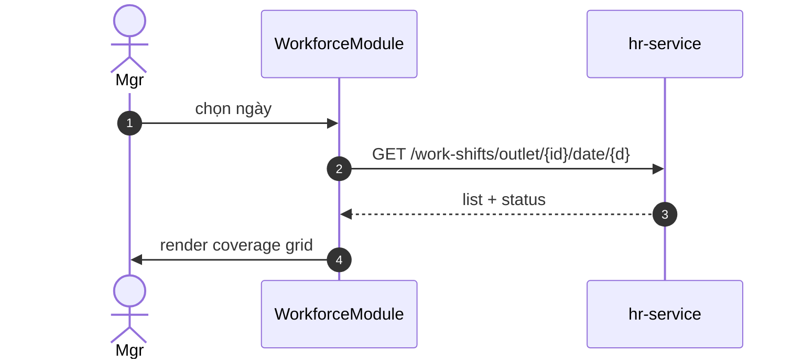

# UC-HR-005: Xem lịch ca live (workforce)

**Module:** Nhân sự & Chấm công
**Mô tả ngắn:** Dashboard xem coverage ca theo ngày × daypart × role; live status nhân viên; exception (vắng, đến trễ).
**Phiên bản SRS:** 1.0
**Source code tham chiếu:**

- Backend: [HrController.java](../../services/hr-service/src/main/java/com/fern/services/hr/api/HrController.java) (`/work-shifts/outlet/{outletId}/date/{date}`, `/time-off`)
- Frontend: [WorkforceModule.tsx](../../frontend/src/components/workforce/WorkforceModule.tsx)

## 1. Actors & quyền

| Actor | Role |
|-------|------|
| Outlet Manager | `outlet_manager` |
| HR | `hr` |
| Region Manager | `region_manager` |

## 2. Điều kiện

- **Tiền điều kiện:** Có work_shift trong phạm vi ngày/outlet được chọn.
- **Hậu điều kiện:** Read-only.

## 3. API endpoints

| Method | Path | Handler |
|--------|------|---------|
| GET | `/api/v1/hr/work-shifts/outlet/{outletId}/date/{date}` | `HrController#listByDate` |
| GET | `/api/v1/hr/time-off` | `#listTimeOff` |

## 4. Luồng chính (MAIN)

1. Actor chọn outlet + ngày/tuần.
2. FE gọi endpoint date → hiển thị grid ca × daypart.
3. Hiển thị counts vs `shift_role_requirement` để thấy under/over-staffed.
4. Indicator live: SCHEDULED / IN_PROGRESS / WORKED / NO_SHOW.

## 5. Quy tắc nghiệp vụ

- **BR-1** — Under-staff highlight đỏ; over-staff vàng.
- **BR-2** — Time-off hiển thị overlay thay cho slot trống.

## 6. Sequence diagram

## 7. Ghi chú

- Phân ca: UC-HR-002.
- Attendance: UC-HR-003.
