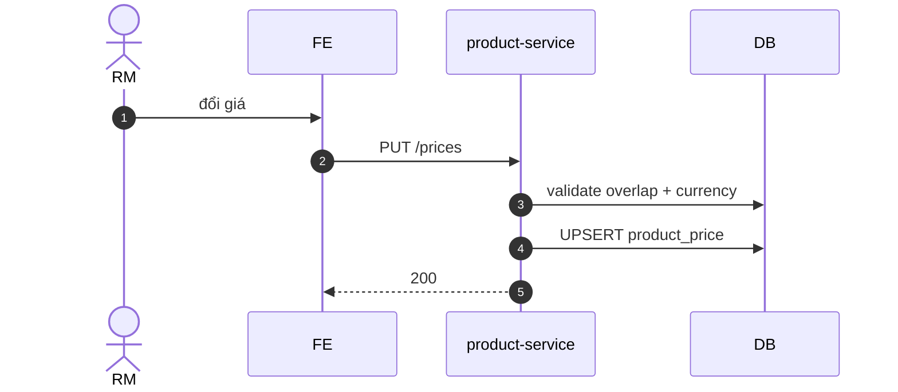

# UC-CAT-003: Định giá bán

**Module:** Sản phẩm, Công thức & Định giá
**Mô tả ngắn:** Set `product_price` theo scope (product × outlet/region × ngày hiệu lực × currency).
**Phiên bản SRS:** 1.0
**Source code tham chiếu:**

- Backend: [ProductController.java](../../services/product-service/src/main/java/com/fern/services/product/api/ProductController.java) (`GET/PUT /api/v1/product/prices`)
- Frontend: [CatalogModule.tsx](../../frontend/src/components/catalog/CatalogModule.tsx)
- DB: `V12__backfill_missing_outlet_product_pricing.sql`

## 1. Actors & quyền

| Actor | Role | Permission |
|-------|------|------------|
| Region Manager | `region_manager` | `product.catalog.write` |

## 2. Điều kiện

- **Tiền điều kiện:** Product tồn tại; outlet/region trong scope user; currency tồn tại.
- **Hậu điều kiện (thành công):** `product_price` insert/upsert kèm `effective_from`.
- **Hậu điều kiện (thất bại):** Không thay đổi.

## 3. Thực thể dữ liệu

| Entity | Bảng |
|--------|------|
| Product Price | `product_price` |
| Product | `product` |
| Outlet / Region | `outlet`, `region` |

## 4. API endpoints

| Method | Path | Handler |
|--------|------|---------|
| GET | `/api/v1/product/prices/{productId}` | `ProductController#getPrices` |
| GET | `/api/v1/product/prices` | `ProductController#listPrices` |
| PUT | `/api/v1/product/prices` | `ProductController#upsertPrice` |

## 5. Luồng chính (MAIN)

1. Actor mở tab Pricing, chọn product.
2. FE lấy `GET /prices/{productId}` — hiện list price theo outlet/region + effective range.
3. Actor nhập `{ productId, scope: OUTLET|REGION, scopeId, amount, currencyCode, effectiveFrom, effectiveTo? }`.
4. `PUT /prices` — service validate `amount > 0`, currency match `outlet.currency_code`/`region.currency_code`, không overlap effective range.
5. Upsert → audit event `catalog.price.changed`.

## 6. Luồng thay thế / lỗi

- **ALT-1 Promotion áp dụng** — Promotion là lớp trên, không thay `product_price` mà áp lên sale_item (xem module Promotions).
- **EXC-1 `amount ≤ 0`** → `422 PRICE_INVALID`.
- **EXC-2 Currency mismatch** → `422 CURRENCY_SCOPE_MISMATCH`.
- **EXC-3 Overlap range** → `409 PRICE_EFFECTIVE_OVERLAP`.
- **EXC-4 Ngoài scope** → `403`.

## 7. Quy tắc nghiệp vụ

- **BR-1** — Ưu tiên OUTLET > REGION > GLOBAL khi POS lookup giá.
- **BR-2** — Không xóa price cũ; kết thúc bằng `effective_to` (soft close).
- **BR-3** — `effective_from` ≤ `effective_to` (nếu có).
- **BR-4** — Đổi giá phải publish version mới để POS ăn (xem UC-CAT-004).

## 8. Sequence diagram

## 9. Ghi chú liên module

- POS lấy giá snapshot vào `sale_item.unit_price` khi tạo order (UC-POS-002).
- Audit: `catalog.price.changed`.
