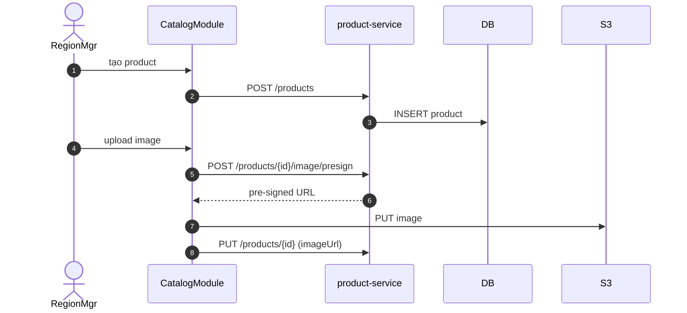

# UC-CAT-001: Quản lý danh mục sản phẩm & nguyên liệu

**Module:** Sản phẩm, Công thức & Định giá
**Mô tả ngắn:** CRUD `product` (bán), `item` (nguyên liệu), `product_variant`, `modifier_group/option`, category, availability theo outlet.
**Phiên bản SRS:** 1.0
**Source code tham chiếu:**

- Backend: [ProductController.java](../../services/product-service/src/main/java/com/fern/services/product/api/ProductController.java)
- Frontend: [CatalogModule.tsx](../../frontend/src/components/catalog/CatalogModule.tsx)

## 1. Actors & quyền

| Actor | Role | Permission |
|-------|------|------------|
| Region Manager | `region_manager` | `product.catalog.write` |
| Superadmin | `superadmin` | inherit |

## 2. Điều kiện

- **Tiền điều kiện:** Category cha tồn tại; UoM hợp lệ cho `item`.
- **Hậu điều kiện (thành công):** Bản ghi product/item/variant ghi vào DB, xuất hiện trên frontend.
- **Hậu điều kiện (thất bại):** Không thay đổi.

## 3. Thực thể dữ liệu

| Entity | Bảng |
|--------|------|
| Product (bán) | `product` |
| Item (nguyên liệu) | `item` |
| Variant | `product_variant` |
| Category | `product_category`, `item_category` |
| Modifier | `modifier_group`, `modifier_option` |
| Outlet availability | `product_outlet_availability` |

## 4. API endpoints (chính)

| Method | Path | Handler |
|--------|------|---------|
| GET / POST | `/api/v1/product/products` | `ProductController#listProducts / createProduct` |
| PUT | `/api/v1/product/products/{id}` | `#updateProduct` |
| POST | `/api/v1/product/products/{id}/image/presign` | `#presignImage` |
| GET / POST | `/api/v1/product/items` | `#listItems / createItem` |
| PUT | `/api/v1/product/items/{id}` | `#updateItem` |
| GET / POST / PUT | `/api/v1/product/categories` | `#listCategories / createCategory / updateCategory` |
| GET / POST | `/api/v1/product/item-categories` | `#listItemCategories / createItemCategory` |
| GET / POST / DELETE | `/api/v1/product/variants` | `#listVariants / createVariant / deleteVariant` |
| GET / POST | `/api/v1/product/modifier-groups` | `#listModifierGroups / createModifierGroup` |
| POST | `/api/v1/product/modifier-groups/{id}/options` | `#addModifierOption` |
| DELETE | `/api/v1/product/modifier-options/{id}` | `#deleteModifierOption` |
| GET / PUT | `/api/v1/product/availability` | `#getAvailability / setAvailability` |

## 5. Luồng chính (MAIN)

1. Actor mở tab Products/Ingredients.
2. Tạo mới: điền `{ code, name, categoryCode, uom?, description, imageUrl? }`.
3. POST endpoint tương ứng; service validate code unique, category tồn tại.
4. Variant/modifier: tạo con → gắn parent productId.
5. Availability: `PUT /availability` set `product_outlet_availability` cho outlet (ẩn/hiện).

## 6. Luồng thay thế / lỗi

- **EXC-1 Trùng code** → `409 CODE_DUPLICATE`.
- **EXC-2 Category không tồn tại** → `422 CATEGORY_NOT_FOUND`.
- **EXC-3 UoM không hợp lệ** (item) → `422 UOM_INVALID`.
- **EXC-4 Product đang có sale_item POSTED** khi xóa variant → `409 VARIANT_IN_USE`.
- **EXC-5 Ngoài scope region_manager** → `403`.

## 7. Quy tắc nghiệp vụ

- **BR-1** — `code` unique toàn hệ (global).
- **BR-2** — Giá bán quản lý riêng ở UC-CAT-003, không nhúng vào product.
- **BR-3** — Xóa mềm (deactivate) ưu tiên so với hard-delete.
- **BR-4** — Image upload qua pre-signed URL (S3-compatible) bước 1 → PUT trực tiếp S3 bước 2.
- **BR-5** — `product.active = false` không xuất hiện trong menu publish mới.

## 8. Sequence diagram

## 9. Ghi chú liên module

- Audit: `catalog.product.*` (ghi `catalog_audit_log`).
- Inventory: `item.uom` đồng bộ `uom_conversion` khi tính recipe consumption.
- Publish: thay đổi product/variant → phải publish version mới để có hiệu lực POS.
