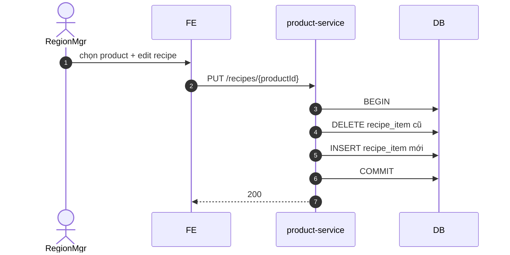

# UC-CAT-002: Thiết lập công thức (Recipe)

**Module:** Sản phẩm, Công thức & Định giá
**Mô tả ngắn:** Gắn `recipe_item` (item + qty) vào `product` để hệ thống trừ tồn khi bán.
**Phiên bản SRS:** 1.0
**Source code tham chiếu:**

- Backend: [ProductController.java](../../services/product-service/src/main/java/com/fern/services/product/api/ProductController.java) (`GET / PUT /api/v1/product/recipes/{productId}`)
- Frontend: [CatalogModule.tsx](../../frontend/src/components/catalog/CatalogModule.tsx)

## 1. Actors & quyền

| Actor | Role | Permission |
|-------|------|------------|
| Region Manager | `region_manager` | `product.catalog.write` |

## 2. Điều kiện

- **Tiền điều kiện:** Product tồn tại; tất cả `itemId` trong lines tồn tại trong `item`.
- **Hậu điều kiện (thành công):** `recipe` upsert + `recipe_item` rows replace.
- **Hậu điều kiện (thất bại):** Giữ nguyên recipe cũ.

## 3. Thực thể dữ liệu

| Entity | Bảng |
|--------|------|
| Recipe | `recipe` |
| Recipe Item | `recipe_item` |
| Product | `product` |
| Item | `item` |

## 4. API endpoints

| Method | Path | Handler |
|--------|------|---------|
| GET | `/api/v1/product/recipes/{productId}` | `ProductController#getRecipe` |
| PUT | `/api/v1/product/recipes/{productId}` | `ProductController#upsertRecipe` |

## 5. Luồng chính (MAIN)

1. Actor chọn product → tab Recipe.
2. FE load `GET /recipes/{productId}` — hiển thị lines hiện có (nếu có).
3. Actor thêm/xoá/sửa lines: `{ itemId, quantity, uomCode }`.
4. PUT `/recipes/{productId}` với full list lines.
5. Service validate qty > 0, UoM hợp lệ, `itemId` active.
6. Service transaction: DELETE recipe_item cũ + INSERT lines mới.
7. Event `catalog.recipe.updated`.

## 6. Luồng thay thế / lỗi

- **EXC-1 qty ≤ 0** → `422 RECIPE_QTY_INVALID`.
- **EXC-2 Item không tồn tại** → `422 ITEM_NOT_FOUND`.
- **EXC-3 UoM không chuyển đổi được** sang UoM item (via `uom_conversion`) → `422 UOM_CONVERSION_UNAVAILABLE`.
- **EXC-4 Product không bán** (không cần recipe) — chỉ cảnh báo, không chặn.

## 7. Quy tắc nghiệp vụ

- **BR-1** — Mỗi product có **1** recipe active tại một thời điểm.
- **BR-2** — `quantity > 0`.
- **BR-3** — Cost product = Σ(recipe_item.quantity × item.unit_cost) quy đổi UoM — dùng cho prime cost report.
- **BR-4** — Cập nhật recipe không hồi tố vào sale_item đã POSTED (snapshot cost ở thời điểm bán).

## 8. Sequence diagram

## 9. Ghi chú liên module

- POS: recipe dùng để trừ tồn khi sale_item POSTED.
- Finance: COGS/prime cost report dựa trên recipe.
- Audit: `catalog.recipe.updated`.
