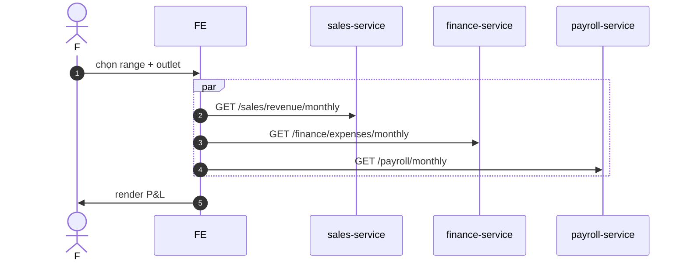

# UC-FIN-004: Báo cáo P&L

**Module:** Tài chính & Lương
**Mô tả ngắn:** Tính P&L theo tháng/quý cho outlet/region: doanh thu (sale_record) − chi phí (expense_* + COGS khi có).
**Phiên bản SRS:** 1.0
**Source code tham chiếu:**

- Backend: [FinanceController.java](../../services/finance-service/src/main/java/com/fern/services/finance/api/FinanceController.java) (`GET /expenses/monthly`)
- Sales revenue: [SalesController.java](../../services/sales-service/src/main/java/com/fern/services/sales/api/SalesController.java) (`GET /revenue/monthly|daily`)
- Frontend: [FinanceModule.tsx](../../frontend/src/components/finance/FinanceModule.tsx) (tab Overview, Revenue, Labor, Expenses, P&L)

## 1. Actors & quyền

| Actor | Role |
|-------|------|
| Finance | `finance` |
| Region Manager | `region_manager` |
| Outlet Manager | `outlet_manager` (read scope outlet) |

## 2. API endpoints liên quan

| Method | Path | Handler |
|--------|------|---------|
| GET | `/api/v1/sales/revenue/monthly` | `SalesController#monthlyRevenue` |
| GET | `/api/v1/sales/revenue/daily` | `SalesController#dailyRevenue` |
| GET | `/api/v1/finance/expenses/monthly` | `FinanceController#monthlyExpenses` |
| GET | `/api/v1/finance/expenses` | `FinanceController#listExpenses` |
| GET | `/api/v1/payroll/monthly` | `PayrollController#monthlyTotals` |

## 3. Luồng chính (MAIN)

1. Actor chọn range + scope.
2. FE song song fetch revenue + expense + payroll totals.
3. Tính:
   - `Revenue = Σ sale_record.total (POSTED)` trong range × scope.
   - `COGS = Σ (sale_item.qty × item_cost)` — hiện TODO (Prime Cost tab tạm ẩn).
   - `Labor = Σ expense_payroll`.
   - `Operating = Σ expense_operating + expense_other`.
   - `Inventory Purchase = Σ expense_inventory_purchase`.
   - `P&L = Revenue − COGS − Labor − Operating − Inventory Purchase` (theo method COA đang cấu hình).
4. FE render charts + export.

## 4. Quy tắc nghiệp vụ

- **BR-1** — Tiền tệ báo cáo = `outlet.currency_code` hoặc region default; cross-currency quy đổi `exchange_rate` vào ngày đóng kỳ.
- **BR-2** — Số liệu kỳ CLOSED là bất biến (snapshot).
- **BR-3** — Prime cost/COGS tab giữ ẩn cho đến khi pipeline procurement→inventory→recipe hoàn chỉnh (comment trong `FinanceModule.tsx`).

## 5. Sequence diagram

## 6. Ghi chú

- Phụ thuộc: close period (UC-FIN-003) cho số final.
- Tab Prime Cost chờ procurement/COGS integration (`FinanceModule.tsx`).
