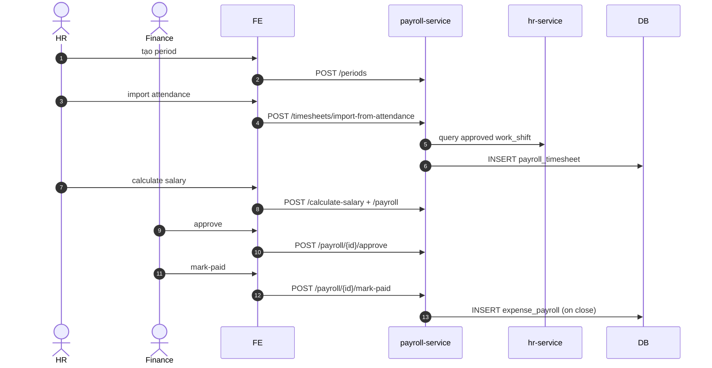

# UC-FIN-002: Chạy bảng lương (payroll period)

**Module:** Tài chính & Lương
**Mô tả ngắn:** Tạo `payroll_period`, import timesheet từ attendance approved, tính lương, approve và trả lương.
**Phiên bản SRS:** 1.0
**Source code tham chiếu:**

- Backend: [PayrollController.java](../../services/payroll-service/src/main/java/com/fern/services/payroll/api/PayrollController.java)
- Frontend: [PayrollModule.tsx](../../frontend/src/components/hr/PayrollModule.tsx)

## 1. Actors & quyền

| Actor | Role | Permission |
|-------|------|------------|
| HR | `hr` | `hr.write` (prep) |
| Finance | `finance` | `finance.write` (approve + mark paid) |

## 2. Điều kiện

- **Tiền điều kiện:** Attendance approved (UC-HR-003) trong khoảng kỳ; contract active cho từng nhân viên.
- **Hậu điều kiện (thành công):** `payroll_period` CLOSED; mỗi employee có `payroll` slip PAID; `expense_payroll` sinh.
- **Hậu điều kiện (thất bại):** Period giữ trạng thái đang xử lý.

## 3. Thực thể dữ liệu

| Entity | Bảng |
|--------|------|
| Payroll Period | `payroll_period` |
| Timesheet | `payroll_timesheet` |
| Payroll slip | `payroll` |
| Expense payroll | `expense_payroll` |

## 4. API endpoints

### Period & timesheet

| Method | Path | Handler |
|--------|------|---------|
| POST | `/api/v1/payroll/periods` | `PayrollController#createPeriod` |
| GET  | `/api/v1/payroll/periods` | `#listPeriods` |
| GET  | `/api/v1/payroll/periods/{id}` | `#getPeriod` |
| POST | `/api/v1/payroll/timesheets` | `#createTimesheet` |
| GET  | `/api/v1/payroll/timesheets` | `#listTimesheets` |
| GET  | `/api/v1/payroll/timesheets/{id}` | `#getTimesheet` |
| POST | `/api/v1/payroll/timesheets/import-from-attendance` | `#importAttendance` |

### Payroll slip

| Method | Path | Handler |
|--------|------|---------|
| POST | `/api/v1/payroll/calculate-salary` | `PayrollController#calculateSalary` |
| POST | `/api/v1/payroll` | `#createPayroll` |
| GET  | `/api/v1/payroll` | `#listPayrolls` |
| GET  | `/api/v1/payroll/{id}` | `#getPayroll` |
| GET  | `/api/v1/payroll/monthly` | `#monthlyTotals` |
| POST | `/api/v1/payroll/{id}/approve` | `#approve` |
| POST | `/api/v1/payroll/{id}/reject` | `#reject` |
| POST | `/api/v1/payroll/{id}/mark-paid` | `#markPaid` |

## 5. Luồng chính (MAIN)

1. HR tạo period `POST /periods` `{ name, startDate, endDate, outletIds/regionId }` → status `OPEN`.
2. HR import attendance: `POST /timesheets/import-from-attendance` — service query approved `work_shift` trong range → insert `payroll_timesheet`.
3. HR/Finance `POST /calculate-salary` cho từng timesheet → áp rule: base + OT × multiplier - deductions.
4. `POST /payroll` tạo slip cho từng employee.
5. Finance review & `POST /payroll/{id}/approve` → APPROVED.
6. Xử lý payout (chuyển khoản ngoài hệ thống) rồi `POST /payroll/{id}/mark-paid` → `PAID`.
7. Khi mọi slip `PAID` → period `CLOSED`; insert `expense_payroll` aggregate.
8. Event `payroll.period.closed`.

## 6. Luồng thay thế / lỗi

- **ALT-1 Reject slip** — Finance reject → HR sửa → re-approve.
- **EXC-1 Period overlap** → `409 PERIOD_OVERLAP`.
- **EXC-2 Thiếu attendance approved** → cảnh báo; có thể bỏ qua employee đó.
- **EXC-3 Contract inactive trong kỳ** → xử lý theo policy (bỏ qua/thông báo).
- **EXC-4 Mark-paid slip chưa approved** → `409 NOT_APPROVED`.

## 7. Quy tắc nghiệp vụ

- **BR-1** — Period không overlap cùng scope (outlet/region).
- **BR-2** — OT multiplier, tax, deductions config per region.
- **BR-3** — `payroll.net_pay ≥ 0`.
- **BR-4** — Một lần `PAID` không revert; nếu sai phải adjust ở period sau hoặc reverse manual (audit trail).

## 8. State machine

Xem [STATE-MACHINES.md §9](../STATE-MACHINES.md#9-payroll-period).

## 9. Sequence diagram

## 10. Ghi chú liên module

- HR (UC-HR-003) cung cấp attendance input.
- Finance P&L (UC-FIN-004) lấy `expense_payroll`.
- Audit: `payroll.*`.
