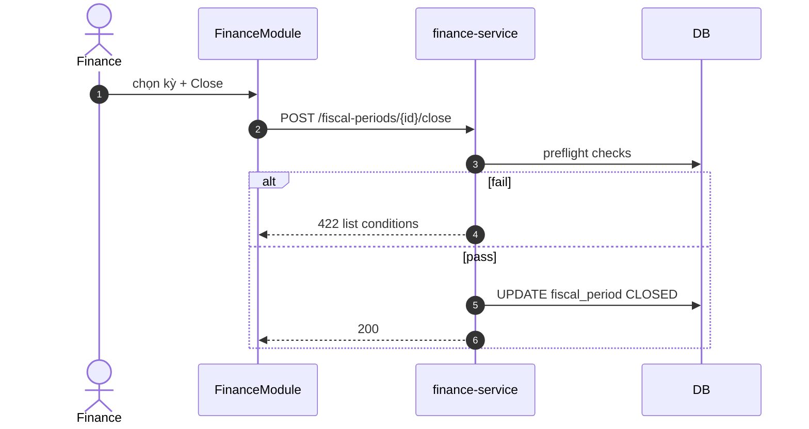

# UC-FIN-003: Đóng kỳ tài chính

**Module:** Tài chính & Lương
**Mô tả ngắn:** Chốt số liệu tài chính cho kỳ (tháng/quý), khoá sổ, không cho phép sửa ngược (retroactive).
**Phiên bản SRS:** 1.0
**Source code tham chiếu:**

- Frontend: [FinanceModule.tsx](../../frontend/src/components/finance/FinanceModule.tsx) (tab Close)
- Frontend submodule: [FiscalPeriodsModule.tsx](../../frontend/src/components/finance/FiscalPeriodsModule.tsx)
- Backend: cần xác minh endpoint close (có thể trong `FinanceController` hoặc phụ trợ).

## 1. Actors & quyền

| Actor | Role | Permission |
|-------|------|------------|
| Finance | `finance` | `finance.write` |
| Superadmin | `superadmin` | inherit |

## 2. Điều kiện

- **Tiền điều kiện:** Mọi payroll period trong kỳ `CLOSED`; mọi supplier_payment đã post; không còn DRAFT expense cần duyệt.
- **Hậu điều kiện (thành công):** `fiscal_period.status = CLOSED`, khoá sửa dữ liệu finance thuộc kỳ.
- **Hậu điều kiện (thất bại):** Period giữ `OPEN`.

## 3. Thực thể dữ liệu

| Entity | Bảng |
|--------|------|
| Fiscal Period | `fiscal_period` (verify) |
| Expense (các loại) | `expense_operating`, `expense_other`, `expense_payroll`, `expense_inventory_purchase` |

## 4. Luồng chính (MAIN)

1. Finance chọn kỳ (ví dụ 2026-03).
2. System chạy preflight: check mọi payroll CLOSED, mọi invoice liên quan PAID, expense approved.
3. Finance confirm → API close period.
4. System set `fiscal_period.closed_at`, lock write vào expenses thuộc kỳ.
5. Event `finance.period.closed`.

## 5. Luồng thay thế / lỗi

- **ALT-1 Reopen** — superadmin có thể reopen (policy strict: log chi tiết).
- **EXC-1 Preflight fail** → `422 PERIOD_CLOSE_PREFLIGHT_FAILED` với list điều kiện chưa đạt.
- **EXC-2 Period đã CLOSED** → `409`.

## 6. Quy tắc nghiệp vụ

- **BR-1** — Không cho phép INSERT/UPDATE vào `expense_*` với `recorded_at` thuộc kỳ đã CLOSED.
- **BR-2** — Reopen yêu cầu audit entry + lý do.

## 7. Sequence diagram

## 8. Ghi chú

- Báo cáo P&L (UC-FIN-004) sinh snapshot sau close.
- Audit: `finance.period.closed|reopened`.
