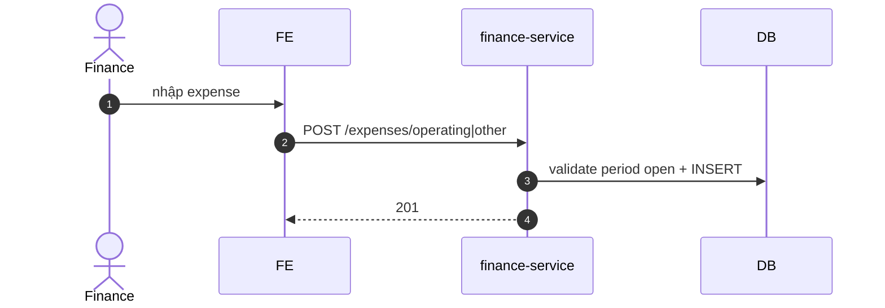

# UC-FIN-005: Quản lý chi phí vận hành

**Module:** Tài chính & Lương
**Mô tả ngắn:** Ghi nhận chi phí vận hành (operating) và chi phí khác (other) cho outlet/region.
**Phiên bản SRS:** 1.0
**Source code tham chiếu:**

- Backend: [FinanceController.java](../../services/finance-service/src/main/java/com/fern/services/finance/api/FinanceController.java)
- Frontend: [FinanceModule.tsx](../../frontend/src/components/finance/FinanceModule.tsx) (tab Expenses)

## 1. Actors & quyền

| Actor | Role | Permission |
|-------|------|------------|
| Finance | `finance` | `finance.write` |
| Outlet Manager | `outlet_manager` | submit (nếu policy cho phép) |

## 2. Điều kiện

- **Tiền điều kiện:** Outlet active; kỳ chưa CLOSED.
- **Hậu điều kiện (thành công):** Expense ghi vào bảng tương ứng.

## 3. Thực thể dữ liệu

| Entity | Bảng |
|--------|------|
| Operating Expense | `expense_operating` |
| Other Expense | `expense_other` |
| Payroll Expense | `expense_payroll` (ghi tự động từ payroll) |
| Inventory Purchase Expense | `expense_inventory_purchase` (ghi tự động từ supplier_payment post) |

## 4. API endpoints

| Method | Path | Handler |
|--------|------|---------|
| POST | `/api/v1/finance/expenses/operating` | `FinanceController#createOperating` |
| POST | `/api/v1/finance/expenses/other` | `FinanceController#createOther` |
| GET | `/api/v1/finance/expenses/{id}` | `#get` |
| GET | `/api/v1/finance/expenses` | `#list` |
| GET | `/api/v1/finance/expenses/monthly` | `#monthly` |

## 5. Luồng chính (MAIN)

1. Finance mở tab Expenses.
2. Nhập `{ outletId, categoryCode, amount, currency, recordedAt, description, receiptUrl? }`.
3. POST endpoint tương ứng → insert.
4. Event `finance.expense.recorded`.

## 6. Luồng thay thế / lỗi

- **EXC-1 Kỳ đã CLOSED** → `409 FISCAL_PERIOD_CLOSED`.
- **EXC-2 `amount ≤ 0`** → `400`.
- **EXC-3 Currency mismatch** → `422`.

## 7. Quy tắc nghiệp vụ

- **BR-1** — `amount > 0`.
- **BR-2** — `recordedAt` thuộc kỳ OPEN của outlet/region.
- **BR-3** — Category enum (rent, utilities, marketing, misc, ...) cấu hình tại `chart_of_accounts` (tab CoA).
- **BR-4** — `expense_payroll` / `expense_inventory_purchase` chỉ sinh tự động, không tạo tay.

## 8. Sequence diagram

## 9. Ghi chú liên module

- P&L (UC-FIN-004) tổng hợp các expense.
- Audit: `finance.expense.*`.
