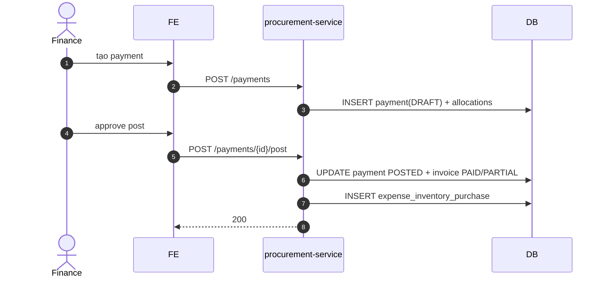

# UC-FIN-001: Thanh toán nhà cung cấp

**Module:** Tài chính & Lương
**Mô tả ngắn:** Tạo `supplier_payment` cấp phát cho 1 hoặc nhiều `supplier_invoice` đã APPROVED; hỗ trợ partial payment, post, cancel, reverse.
**Phiên bản SRS:** 1.0
**Source code tham chiếu:**

- Backend: [SupplierPaymentController.java](../../services/procurement-service/src/main/java/com/fern/services/procurement/api/SupplierPaymentController.java)
- Frontend: [ProcurementModule.tsx](../../frontend/src/components/procurement/ProcurementModule.tsx) (tab Payments)

## 1. Actors & quyền

| Actor | Role | Permission |
|-------|------|------------|
| Finance | `finance` | `finance.write` |
| Procurement | `procurement_officer` | `purchase.write` (tạo DRAFT) |

## 2. Điều kiện

- **Tiền điều kiện:** Invoice `APPROVED`, số tiền còn lại (`invoice.total - allocated`) > 0.
- **Hậu điều kiện (thành công):** `supplier_payment` `POSTED`; `supplier_payment_allocation` tạo với số đã trả; invoice `PAID`/`PARTIAL` tương ứng; `expense_inventory_purchase` ghi nhận.
- **Hậu điều kiện (thất bại):** State nguyên.

## 3. Thực thể dữ liệu

| Entity | Bảng |
|--------|------|
| Supplier Payment | `supplier_payment` |
| Payment Allocation | `supplier_payment_allocation` |
| Invoice | `supplier_invoice` |

## 4. API endpoints

| Method | Path | Handler |
|--------|------|---------|
| POST | `/api/v1/procurement/payments` | `SupplierPaymentController#create` |
| GET  | `/api/v1/procurement/payments` | `#list` |
| GET  | `/api/v1/procurement/payments/{id}` | `#get` |
| POST | `/api/v1/procurement/payments/{id}/post` | `#post` |
| POST | `/api/v1/procurement/payments/{id}/cancel` | `#cancel` |
| POST | `/api/v1/procurement/payments/{id}/reverse` | `#reverse` |

## 5. Luồng chính (MAIN)

1. Finance xem danh sách invoices APPROVED còn nợ.
2. Tạo payment: `POST /payments` body `{ supplierId, amount, currency, paymentMethod, paymentDate, allocations: [{invoiceId, amount}] }` → DRAFT.
3. Validate: Σ `allocations.amount == amount`; mỗi allocation ≤ `invoice.outstanding`.
4. Approve & post: `POST /payments/{id}/post`:
   - UPDATE payment `POSTED`.
   - UPDATE `supplier_invoice.status` → `PAID`/`PARTIAL`.
   - INSERT `expense_inventory_purchase`.
5. Event `finance.supplier_payment.posted`.

## 6. Luồng thay thế / lỗi

- **ALT-1 Partial payment** — tổng allocations < invoice.outstanding → invoice `PARTIAL`.
- **ALT-2 Advance payment** — tạo payment không allocation (hoặc allocation sau) → tồn quỹ tạm ứng cho supplier.
- **EXC-1 Vượt outstanding** → `422 ALLOCATION_EXCEEDS_OUTSTANDING`.
- **EXC-2 Currency mismatch** → `422 CURRENCY_MISMATCH`.
- **EXC-3 Invoice không APPROVED** → `409 INVOICE_NOT_APPROVED`.
- **EXC-4 Đã POSTED** → `409 PAYMENT_ALREADY_POSTED`.

## 7. Quy tắc nghiệp vụ

- **BR-1** — `amount > 0`.
- **BR-2** — Currency payment = currency invoice; khác → convert qua `exchange_rate` (tùy policy).
- **BR-3** — Reverse chỉ cho payment `POSTED` và chưa được bù trừ thêm; insert allocation âm.
- **BR-4** — Audit mọi create/post/cancel/reverse.

## 8. State machine

Xem [STATE-MACHINES.md §4](../STATE-MACHINES.md#4-supplier-payment).

## 9. Sequence diagram

## 10. Ghi chú liên module

- Procurement: invoice state (UC-PROC-003).
- Finance P&L (UC-FIN-004) dùng `expense_inventory_purchase`.
- Audit: `finance.supplier_payment.*`.
