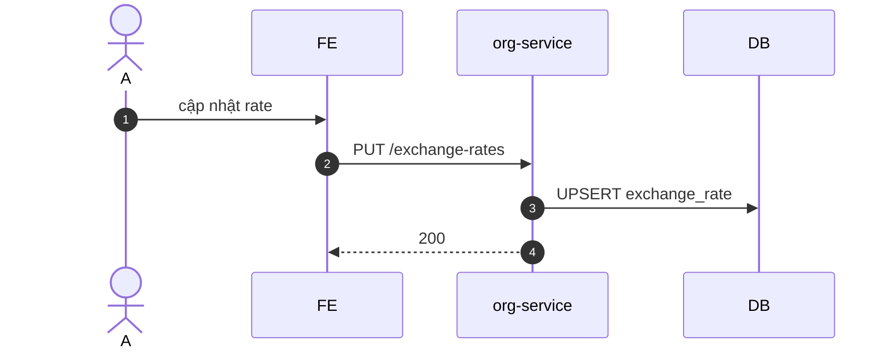

# UC-ORG-003: Cấu hình tiền tệ & tỷ giá

**Module:** Tham chiếu & Tổ chức
**Mô tả ngắn:** Quản lý `currency` reference và `exchange_rate` theo khoảng hiệu lực.
**Phiên bản SRS:** 1.0
**Source code tham chiếu:**

- Backend: [OrgController.java](../../services/org-service/src/main/java/com/fern/services/org/api/OrgController.java) (`GET /exchange-rates`, `PUT /exchange-rates`)
- Frontend: [OrgModule.tsx](../../frontend/src/components/org/OrgModule.tsx) (tab Settings)

## 1. Actors & quyền

| Actor | Role | Permission |
|-------|------|------------|
| Admin | `admin` | `org.write` |
| Finance | `finance` | `finance.write` (tỷ giá thường) |

## 2. API endpoints

| Method | Path | Handler |
|--------|------|---------|
| GET | `/api/v1/org/exchange-rates` | `OrgController#listExchangeRates` |
| PUT | `/api/v1/org/exchange-rates` | `OrgController#upsertExchangeRate` |

## 3. Luồng chính (MAIN)

1. Actor nhập `{ fromCurrency, toCurrency, rate, effectiveFrom, effectiveTo? }`.
2. `PUT /exchange-rates` → upsert `exchange_rate`.
3. Service validate `rate > 0`, không overlap.

## 4. Lỗi

- **EXC-1 Currency không tồn tại** → `422`.
- **EXC-2 Rate ≤ 0** → `422`.
- **EXC-3 Overlap** → `409 EXCHANGE_RATE_OVERLAP`.

## 5. Quy tắc nghiệp vụ

- **BR-1** — Key `(from, to, effectiveFrom)` unique.
- **BR-2** — Lookup: chọn row có `effective_from ≤ date < effective_to` (hoặc null).
- **BR-3** — Currency `decimal_places` dùng khi format số (VND = 0, USD/EUR = 2).

## 6. Sequence diagram

## 7. Ghi chú

- Baseline currencies USD/EUR/VND (seed 000).
- Audit: `org.exchange_rate.*`.
