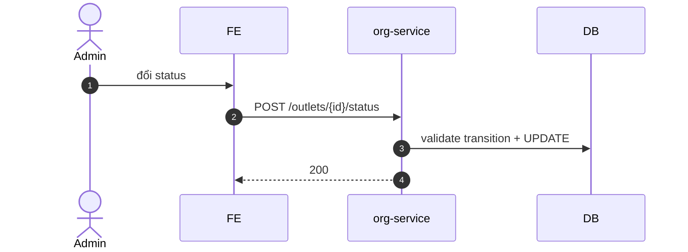

# UC-ORG-002: Quản lý outlet

**Module:** Tham chiếu & Tổ chức
**Mô tả ngắn:** CRUD `outlet` và lifecycle `ACTIVE → INACTIVE → CLOSED → ARCHIVED`.
**Phiên bản SRS:** 1.0
**Source code tham chiếu:**

- Backend: [OrgController.java](../../services/org-service/src/main/java/com/fern/services/org/api/OrgController.java) (`/outlets/*`)
- Frontend: [OrgModule.tsx](../../frontend/src/components/org/OrgModule.tsx) (tab Outlets)

## 1. Actors & quyền

| Actor | Role | Permission |
|-------|------|------------|
| Admin | `admin` | `org.write` |
| Superadmin | `superadmin` | inherit |

## 2. API endpoints

| Method | Path | Handler |
|--------|------|---------|
| GET | `/api/v1/org/outlets` | `OrgController#listOutlets` |
| GET | `/api/v1/org/outlets/{id}` | `#getOutlet` |
| POST | `/api/v1/org/outlets` | `#createOutlet` |
| PUT | `/api/v1/org/outlets/{id}` | `#updateOutlet` |
| POST | `/api/v1/org/outlets/{id}/status` | `#updateStatus` |

## 3. Luồng chính (MAIN)

### Tạo outlet

1. Admin nhập `{ code, name, regionCode, address, timezoneName?, currencyCode }`.
2. `POST /outlets` → 201 `status = ACTIVE`.

### Đổi trạng thái

1. `POST /outlets/{id}/status` body `{ status: active|inactive|closed|archived, reason }`.
2. Service validate transition hợp lệ.

## 4. Luồng thay thế / lỗi

- **EXC-1 Trùng code** → `409`.
- **EXC-2 Region không tồn tại** → `422`.
- **EXC-3 Transition không hợp lệ** (ví dụ ARCHIVED → ACTIVE) → `409 INVALID_STATUS_TRANSITION`.
- **EXC-4 Đóng outlet còn pos_session OPEN** → `409 OPEN_SESSIONS_EXIST`.

## 5. Quy tắc nghiệp vụ

- **BR-1** — `code` unique toàn chuỗi.
- **BR-2** — Currency outlet kế thừa region nếu không set.
- **BR-3** — Lifecycle ACTIVE → INACTIVE (có thể quay lại) → CLOSED (một chiều) → ARCHIVED.
- **BR-4** — Archived outlet ẩn khỏi báo cáo mặc định.

## 6. State machine

Xem [STATE-MACHINES.md §10](../STATE-MACHINES.md#10-outlet-lifecycle).

## 7. Sequence diagram

## 8. Ghi chú

- Audit: `org.outlet.*`.
