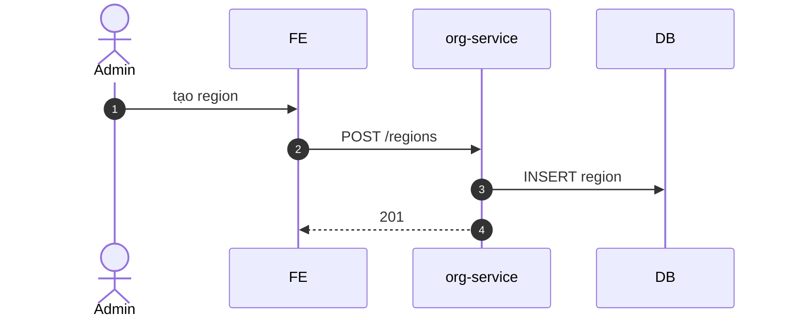

# UC-ORG-001: Quản lý vùng (region)

**Module:** Tham chiếu & Tổ chức
**Mô tả ngắn:** CRUD `region` với hierarchy parent-child, gắn currency mặc định, tax code, timezone.
**Phiên bản SRS:** 1.0
**Source code tham chiếu:**

- Backend: [OrgController.java](../../services/org-service/src/main/java/com/fern/services/org/api/OrgController.java) (`/regions/*`, `/hierarchy`)
- Frontend: [OrgModule.tsx](../../frontend/src/components/org/OrgModule.tsx)

## 1. Actors & quyền

| Actor | Role | Permission |
|-------|------|------------|
| Admin | `admin` | `org.write` |
| Superadmin | `superadmin` | inherit |

## 2. Điều kiện

- **Tiền điều kiện:** Parent region tồn tại (nếu có); currency tồn tại.
- **Hậu điều kiện (thành công):** `region` record ghi.

## 3. API endpoints

| Method | Path | Handler |
|--------|------|---------|
| GET | `/api/v1/org/regions` | `OrgController#listRegions` |
| GET | `/api/v1/org/regions/{code}` | `#getRegion` |
| POST | `/api/v1/org/regions` | `#createRegion` |
| PUT | `/api/v1/org/regions/{code}` | `#updateRegion` |
| GET | `/api/v1/org/hierarchy` | `#getHierarchy` |

## 4. Luồng chính (MAIN)

1. Admin mở Org → Regions.
2. Nhập `{ code, name, parentCode?, currencyCode, taxCode?, timezoneName }`.
3. `POST /regions` → 201.
4. `GET /hierarchy` trả tree `region → outlet`.

## 5. Lỗi

- **EXC-1 Trùng code** → `409`.
- **EXC-2 Parent không tồn tại** → `422`.
- **EXC-3 Tạo vòng (cycle)** → `422 REGION_HIERARCHY_CYCLE`.
- **EXC-4 Currency sai** → `422`.

## 6. Quy tắc nghiệp vụ

- **BR-1** — `code` unique.
- **BR-2** — Timezone = IANA name (vd `Asia/Ho_Chi_Minh`).
- **BR-3** — Đổi `currencyCode` chỉ khi không còn outlet active.

## 7. Sequence diagram

## 8. Ghi chú

- Audit: `org.region.*`.
