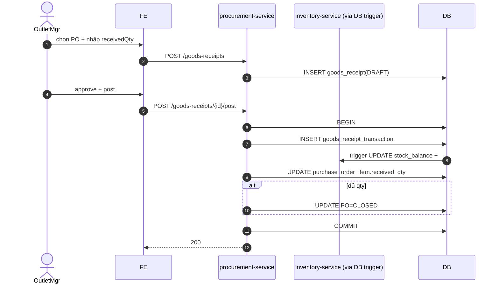

# UC-PROC-002: Ghi nhận hàng nhập (GR)

**Module:** Thu mua
**Mô tả ngắn:** Tại outlet, nhận hàng từ NCC theo PO đã duyệt, ghi `goods_receipt` kèm `goods_receipt_item`, khi post sẽ ghi `goods_receipt_transaction` cập nhật `stock_balance`.
**Phiên bản SRS:** 1.0
**Source code tham chiếu:**

- Backend: [GoodsReceiptController.java](../../services/procurement-service/src/main/java/com/fern/services/procurement/api/GoodsReceiptController.java)
- Frontend: [ProcurementModule.tsx](../../frontend/src/components/procurement/ProcurementModule.tsx)

## 1. Actors & quyền

| Actor | Role | Permission |
|-------|------|------------|
| Outlet Manager | `outlet_manager` | `purchase.write` + `purchase.approve` |
| Procurement | `procurement_officer` | `purchase.write` |

## 2. Điều kiện

- **Tiền điều kiện:** PO `APPROVED`, cùng outlet với GR; supplier còn `active`.
- **Hậu điều kiện (thành công):** GR ghi `APPROVED`/`POSTED`; khi `POSTED`: `goods_receipt_transaction` insert, `stock_balance` tăng tương ứng, PO cập nhật số đã nhận.
- **Hậu điều kiện (thất bại):** Trạng thái GR/PO/stock giữ nguyên.

## 3. Thực thể dữ liệu

| Entity | Bảng |
|--------|------|
| Goods Receipt | `goods_receipt` |
| GR Item | `goods_receipt_item` |
| GR Transaction | `goods_receipt_transaction` |
| Purchase Order | `purchase_order` |
| Stock Balance | `stock_balance` |

## 4. API endpoints

| Method | Path | Handler |
|--------|------|---------|
| POST | `/api/v1/procurement/goods-receipts` | `GoodsReceiptController#create` |
| GET  | `/api/v1/procurement/goods-receipts` | `#list` |
| GET  | `/api/v1/procurement/goods-receipts/{id}` | `#get` |
| POST | `/api/v1/procurement/goods-receipts/{id}/approve` | `#approve` |
| POST | `/api/v1/procurement/goods-receipts/{id}/post` | `#post` |

## 5. Luồng chính (MAIN)

1. Outlet Manager chọn PO APPROVED, tạo GR với `receivedQty` từng line.
2. FE gọi `POST /goods-receipts` → GR `DRAFT`.
3. Review → `POST /goods-receipts/{id}/approve` → `APPROVED`.
4. Khi hàng thực tế tới kho → `POST /goods-receipts/{id}/post`:
   - INSERT `goods_receipt_transaction`.
   - UPDATE `stock_balance` (tăng).
   - UPDATE `purchase_order_item.received_qty += receivedQty`.
   - Nếu tổng đã nhận ≥ order qty → PO `CLOSED`.
5. Event `procurement.gr.posted`.

## 6. Luồng thay thế / lỗi

- **ALT-1 Over-receipt** — `receivedQty > orderedQty - alreadyReceivedQty` → cảnh báo; cho phép nếu `receivedQty ≤ orderedQty × (1 + OVER_RECEIPT_TOLERANCE)` (tham số policy, mặc định 5%). Vượt tolerance → EXC-2.
- **ALT-2 Hàng hỏng** — khai báo line damage qty → tự động tạo `inventory_adjustment` reason `DAMAGED` sau khi post (hoặc chặn nhập tùy policy).
- **EXC-1 PO chưa APPROVED** → `409 PO_NOT_APPROVED`.
- **EXC-2 Over-receipt vượt tolerance** → `422 OVER_RECEIPT_EXCEEDED`.
- **EXC-3 Outlet mismatch** → `403 SCOPE_DENIED`.
- **EXC-4 GR đã POSTED** → `409 GR_ALREADY_POSTED`.

## 7. Quy tắc nghiệp vụ

- **BR-1** — `receivedQty ≥ 0`.
- **BR-2** — GR phải neo đúng `outlet_id` của PO.
- **BR-3** — Unit cost snapshot từ PO (không cho phép overwrite ở GR trừ khi có permission cost override).
- **BR-4** — Post GR là atomic: transaction + update stock + update PO; fail 1 → rollback tất cả.
- **BR-5** — Tolerance over-receipt cấu hình `region`/`outlet` level.

## 8. State machine

Xem [STATE-MACHINES.md §2](../STATE-MACHINES.md#2-goods-receipt).

## 9. Sequence diagram

## 10. Ghi chú liên module

- Invoice (UC-PROC-003) match GR này.
- Audit: `procurement.gr.created|approved|posted`.
- Inventory: `stock_balance` tăng thông qua trigger ghi `goods_receipt_transaction`.
